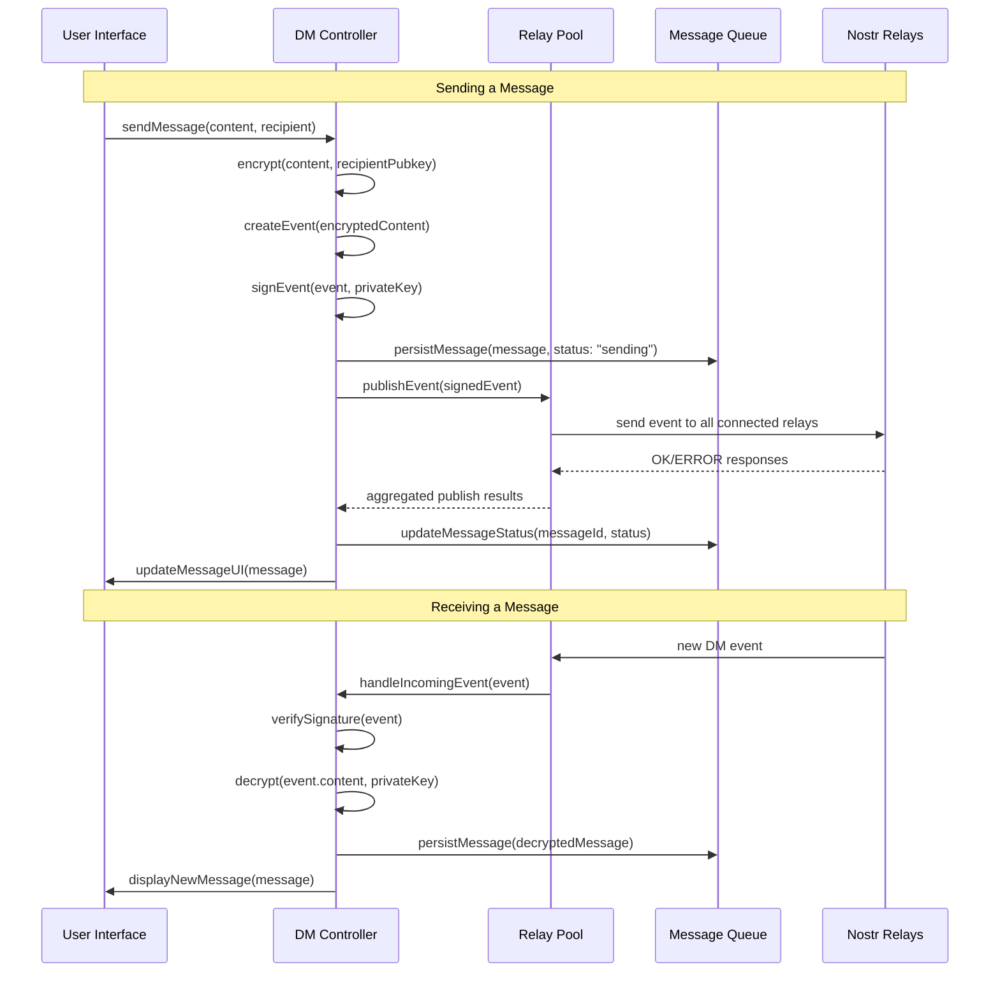
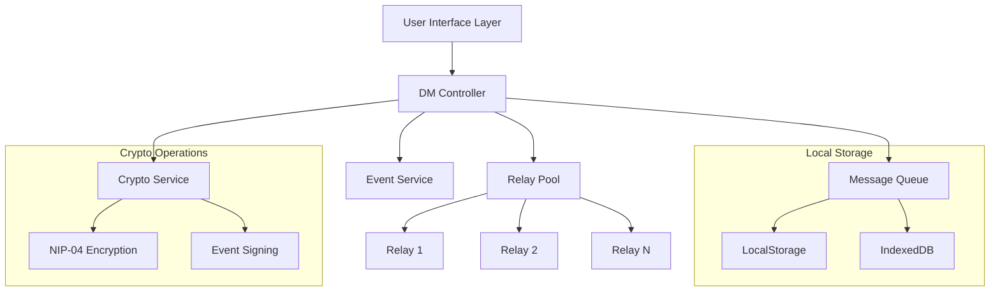

# Design Document

## Overview

This design implements reliable message delivery for Obscur by enhancing the existing DM controller and relay pool infrastructure. The current implementation has the UI components and basic Nostr integration but lacks functional message sending/receiving through relays. This design bridges that gap by implementing proper event publishing, subscription management, message persistence, and error handling.

The solution builds on the existing architecture while adding the missing pieces for production-ready messaging. It maintains the local-first approach and per-identity storage boundaries that are core to Obscur's design philosophy.

## Architecture

### High-Level Message Flow



### Component Architecture



## Components and Interfaces

### Enhanced DM Controller

The DM controller will be enhanced to handle the complete message lifecycle:

```typescript
interface EnhancedDMController {
  // Message Operations
  sendDm(params: {
    peerPublicKeyInput: string;
    plaintext: string;
    replyTo?: string;
  }): Promise<SendResult>;
  
  // Subscription Management
  subscribeToIncomingDMs(): void;
  unsubscribeFromDMs(): void;
  
  // Message Sync
  syncMissedMessages(since?: Date): Promise<void>;
  
  // Status Management
  getMessageStatus(messageId: string): MessageStatus;
  retryFailedMessage(messageId: string): Promise<void>;
  
  // State
  state: {
    status: 'initializing' | 'ready' | 'error';
    messages: Message[];
    subscriptions: Subscription[];
    syncProgress?: SyncProgress;
  };
}

interface SendResult {
  success: boolean;
  messageId: string;
  relayResults: RelayResult[];
  error?: string;
}

interface RelayResult {
  relayUrl: string;
  success: boolean;
  error?: string;
  latency?: number;
}
```

### Message Queue Service

A new service for reliable message persistence and queuing:

```typescript
interface MessageQueue {
  // Persistence
  persistMessage(message: Message): Promise<void>;
  updateMessageStatus(messageId: string, status: MessageStatus): Promise<void>;
  getMessage(messageId: string): Promise<Message | null>;
  getMessages(conversationId: string, options?: PaginationOptions): Promise<Message[]>;
  
  // Queue Management
  queueOutgoingMessage(message: OutgoingMessage): Promise<void>;
  getQueuedMessages(): Promise<OutgoingMessage[]>;
  removeFromQueue(messageId: string): Promise<void>;
  
  // Sync Support
  getLastMessageTimestamp(conversationId: string): Promise<Date | null>;
  markMessagesSynced(messageIds: string[]): Promise<void>;
  
  // Cleanup
  cleanupOldMessages(olderThan: Date): Promise<void>;
  getStorageUsage(): Promise<StorageStats>;
}

interface OutgoingMessage {
  id: string;
  conversationId: string;
  content: string;
  recipientPubkey: string;
  createdAt: Date;
  retryCount: number;
  nextRetryAt: Date;
  signedEvent?: NostrEvent;
}
```

### Enhanced Relay Pool

Improvements to the existing relay pool for better reliability:

```typescript
interface EnhancedRelayPool {
  // Connection Management
  connect(): Promise<void>;
  disconnect(): Promise<void>;
  reconnectRelay(relayUrl: string): Promise<void>;
  
  // Publishing
  publishEvent(event: NostrEvent): Promise<PublishResult>;
  publishToRelay(relayUrl: string, event: NostrEvent): Promise<RelayResult>;
  
  // Subscriptions
  subscribe(filter: NostrFilter): Subscription;
  unsubscribe(subscriptionId: string): void;
  
  // Health Monitoring
  getRelayHealth(): RelayHealthMap;
  getConnectionStats(): ConnectionStats;
  
  // State
  connections: RelayConnection[];
  subscriptions: Map<string, Subscription>;
  publishQueue: PublishQueueItem[];
}

interface PublishResult {
  messageId: string;
  successCount: number;
  totalRelays: number;
  results: RelayResult[];
  overallSuccess: boolean;
}

interface RelayHealthMap {
  [relayUrl: string]: {
    status: 'connected' | 'connecting' | 'disconnected' | 'error';
    latency: number;
    successRate: number;
    lastError?: string;
    lastSeen: Date;
  };
}
```

### Crypto Service

A dedicated service for all cryptographic operations:

```typescript
interface CryptoService {
  // NIP-04 Operations
  encryptDM(plaintext: string, recipientPubkey: string, senderPrivkey: string): Promise<string>;
  decryptDM(ciphertext: string, senderPubkey: string, recipientPrivkey: string): Promise<string>;
  
  // Event Operations
  signEvent(event: UnsignedNostrEvent, privateKey: string): Promise<NostrEvent>;
  verifyEventSignature(event: NostrEvent): Promise<boolean>;
  
  // Key Operations
  generateKeyPair(): Promise<{ publicKey: string; privateKey: string }>;
  deriveSharedSecret(privateKey: string, publicKey: string): Promise<Uint8Array>;
  
  // Utilities
  isValidPubkey(pubkey: string): boolean;
  normalizeKey(key: string): string;
}
```

## Data Models

### Enhanced Message Model

```typescript
interface Message {
  id: string;
  conversationId: string;
  content: string;
  timestamp: Date;
  isOutgoing: boolean;
  status: MessageStatus;
  
  // Nostr-specific fields
  eventId?: string;
  eventCreatedAt?: Date;
  senderPubkey: string;
  recipientPubkey: string;
  
  // Metadata
  encryptedContent?: string;
  relayResults?: RelayResult[];
  syncedAt?: Date;
  retryCount?: number;
  
  // Optional features
  attachment?: Attachment;
  replyTo?: ReplyTo;
  reactions?: ReactionsByEmoji;
  deletedAt?: Date;
}

type MessageStatus = 
  | 'sending'      // Being sent to relays
  | 'queued'       // Queued for retry
  | 'accepted'     // Accepted by at least one relay
  | 'rejected'     // Rejected by all relays
  | 'delivered'    // Confirmed delivered to recipient
  | 'failed';      // Permanently failed
```

### Subscription Management

```typescript
interface Subscription {
  id: string;
  filter: NostrFilter;
  relayUrls: string[];
  isActive: boolean;
  createdAt: Date;
  lastEventAt?: Date;
  eventCount: number;
}

interface NostrFilter {
  kinds: number[];
  authors?: string[];
  '#p'?: string[];
  since?: number;
  until?: number;
  limit?: number;
}
```

### Sync State Management

```typescript
interface SyncState {
  conversationId: string;
  lastSyncAt: Date;
  lastEventTimestamp: Date;
  issyncing: boolean;
  syncProgress?: {
    total: number;
    completed: number;
    errors: number;
  };
}
```

## Implementation Strategy

### Phase 1: Core Message Sending (Week 1)

1. **Enhance DM Controller**
   - Implement proper event creation and signing
   - Add NIP-04 encryption integration
   - Connect to relay pool for publishing

2. **Message Queue Implementation**
   - Create persistent storage for messages
   - Implement retry queue for failed sends
   - Add status tracking and updates

3. **Crypto Service**
   - Implement NIP-04 encryption/decryption
   - Add event signing and verification
   - Ensure secure key handling

### Phase 2: Message Receiving (Week 2)

1. **Subscription Management**
   - Implement DM event subscriptions
   - Add event filtering and validation
   - Handle incoming message processing

2. **Message Sync**
   - Implement missed message retrieval
   - Add deduplication logic
   - Handle out-of-order messages

3. **UI Integration**
   - Connect enhanced controller to existing UI
   - Update message status indicators
   - Add real-time message updates

### Phase 3: Reliability & Performance (Week 3)

1. **Error Handling**
   - Implement retry logic with exponential backoff
   - Add circuit breakers for failing relays
   - Handle network connectivity changes

2. **Performance Optimization**
   - Implement message batching
   - Add efficient pagination
   - Optimize memory usage

3. **Connection Management**
   - Enhance relay health monitoring
   - Implement smart relay selection
   - Add connection recovery logic

### Phase 4: Testing & Polish (Week 4)

1. **Testing Infrastructure**
   - Add unit tests for all components
   - Implement integration tests with mock relays
   - Add property-based tests for crypto operations

2. **Monitoring & Debugging**
   - Add comprehensive logging
   - Implement error reporting
   - Add performance metrics

3. **User Experience**
   - Polish message status indicators
   - Add connection status feedback
   - Implement retry UI controls

## Error Handling

### Connection Failures

```typescript
class ConnectionManager {
  private retryAttempts = new Map<string, number>();
  private backoffDelays = [1000, 2000, 5000, 10000, 30000]; // ms
  
  async handleConnectionFailure(relayUrl: string, error: Error): Promise<void> {
    const attempts = this.retryAttempts.get(relayUrl) || 0;
    const delay = this.backoffDelays[Math.min(attempts, this.backoffDelays.length - 1)];
    
    this.retryAttempts.set(relayUrl, attempts + 1);
    
    setTimeout(() => {
      this.attemptReconnection(relayUrl);
    }, delay);
  }
}
```

### Message Delivery Failures

```typescript
class MessageRetryManager {
  private maxRetries = 5;
  private retryQueue = new Map<string, OutgoingMessage>();
  
  async handleSendFailure(message: OutgoingMessage, error: Error): Promise<void> {
    if (message.retryCount >= this.maxRetries) {
      await this.markMessageFailed(message.id, error);
      return;
    }
    
    message.retryCount++;
    message.nextRetryAt = new Date(Date.now() + this.calculateBackoff(message.retryCount));
    
    this.retryQueue.set(message.id, message);
    this.scheduleRetry(message);
  }
}
```

## Correctness Properties

*A property is a characteristic or behavior that should hold true across all valid executions of a system-essentially, a formal statement about what the system should do. Properties serve as the bridge between human-readable specifications and machine-verifiable correctness guarantees.*

### Message Sending Properties

**Property 1: Message encryption consistency**
*For any* valid message content and recipient public key, the DM_Controller should encrypt the message using NIP-04 encryption before creating the Nostr event
**Validates: Requirements 1.1**

**Property 2: Event creation completeness**
*For any* encrypted message, the DM_Controller should create a properly formatted Nostr event containing the encrypted content in the correct field
**Validates: Requirements 1.2**

**Property 3: Event signing integrity**
*For any* created Nostr event, the DM_Controller should sign it with the user's private key and the signature should be verifiable
**Validates: Requirements 1.3**

**Property 4: Multi-relay publishing**
*For any* signed event, the DM_Controller should attempt to publish it to all currently connected relays
**Validates: Requirements 1.4**

**Property 5: Graceful relay failure handling**
*For any* relay connection failure during publishing, the DM_Controller should continue attempting to publish to other available relays
**Validates: Requirements 1.5**

**Property 6: Status update on acceptance**
*For any* message that receives an acceptance response from at least one relay, the DM_Controller should update the message status to "accepted"
**Validates: Requirements 1.6**

**Property 7: Status update on rejection**
*For any* message that receives rejection responses from all relays, the DM_Controller should update the message status to "rejected"
**Validates: Requirements 1.7**

**Property 8: Retry queue on total failure**
*For any* message where all relay publishing attempts fail, the DM_Controller should add the message to the retry queue
**Validates: Requirements 1.8**

### Message Receiving Properties

**Property 9: Subscription establishment**
*For any* successful relay connection, the DM_Controller should establish subscriptions for direct message events targeting the user's public key
**Validates: Requirements 2.1**

**Property 10: Signature verification requirement**
*For any* incoming DM event, the DM_Controller should verify the event signature before processing the message content
**Validates: Requirements 2.2**

**Property 11: Decryption on valid signature**
*For any* incoming event with a valid signature, the DM_Controller should attempt to decrypt the message content using NIP-04
**Validates: Requirements 2.3**

**Property 12: Message storage on successful decryption**
*For any* successfully decrypted message, the DM_Controller should add it to the local message store
**Validates: Requirements 2.4**

**Property 13: Graceful decryption failure handling**
*For any* message that fails decryption, the DM_Controller should log the error and continue processing without crashing
**Validates: Requirements 2.5**

**Property 14: UI update trigger**
*For any* message added to the local store, the DM_Controller should trigger appropriate UI updates
**Validates: Requirements 2.6**

**Property 15: Blocked sender filtering**
*For any* message from a sender marked as blocked, the DM_Controller should not display the message in the main conversation view
**Validates: Requirements 2.7**

**Property 16: Unknown sender routing**
*For any* message from an unknown sender (not in accepted contacts), the DM_Controller should route it to the requests inbox
**Validates: Requirements 2.8**

### Message Persistence Properties

**Property 17: Immediate persistence**
*For any* message that is sent or received, the Message_Queue should persist it to local storage immediately upon processing
**Validates: Requirements 3.1**

**Property 18: Startup message loading**
*For any* application startup, the Message_Queue should load all previously persisted messages from local storage
**Validates: Requirements 3.2**

**Property 19: Storage limit enforcement**
*For any* storage operation that would exceed the configured message limit, the Message_Queue should remove the oldest messages to maintain the limit
**Validates: Requirements 3.3**

**Property 20: Soft deletion preservation**
*For any* user-deleted message, the Message_Queue should mark it as deleted while preserving the message record for audit purposes
**Validates: Requirements 3.4**

**Property 21: At-rest encryption**
*For any* sensitive message data stored locally, the Message_Queue should encrypt it using the user's key before writing to storage
**Validates: Requirements 3.5**

**Property 22: Timestamp ordering maintenance**
*For any* set of messages in a conversation, the Message_Queue should maintain chronological ordering based on message timestamps
**Validates: Requirements 3.6**

**Property 23: Storage error resilience**
*For any* storage operation failure, the Message_Queue should handle the error gracefully without losing message data
**Validates: Requirements 3.7**

### Relay Connection Properties

**Property 24: Startup connection establishment**
*For any* application startup with enabled relays in the user's relay list, the Relay_Pool should attempt to connect to all enabled relays
**Validates: Requirements 4.1**

**Property 25: Exponential backoff reconnection**
*For any* relay connection failure, the Relay_Pool should implement exponential backoff when attempting to reconnect
**Validates: Requirements 4.2**

**Property 26: Failover continuation**
*For any* relay that becomes unreachable, the Relay_Pool should mark it as offline and continue operations with remaining connected relays
**Validates: Requirements 4.3**

**Property 27: Total failure queuing**
*For any* scenario where all relays are offline, the Relay_Pool should queue outgoing messages and continue attempting to reconnect
**Validates: Requirements 4.4**

**Property 28: Reconnection sync**
*For any* relay that comes back online after being offline, the Relay_Pool should sync any messages that were missed during the disconnection
**Validates: Requirements 4.5**

### Message Status Properties

**Property 29: Initial sending status**
*For any* newly created outgoing message, the DM_Controller should set the initial status to "sending"
**Validates: Requirements 5.1**

**Property 30: Retry status maintenance**
*For any* message queued for retry, the DM_Controller should maintain the "sending" status until final resolution
**Validates: Requirements 5.2**

**Property 31: Acceptance status update**
*For any* message accepted by at least one relay, the DM_Controller should update the status to "accepted"
**Validates: Requirements 5.3**

**Property 32: Rejection status update**
*For any* message rejected by all attempted relays, the DM_Controller should update the status to "rejected"
**Validates: Requirements 5.4**

### Synchronization Properties

**Property 33: Missed message sync**
*For any* transition from offline to online state, the DM_Controller should request missed messages from relays using the timestamp of the last received message
**Validates: Requirements 6.1, 6.2**

**Property 34: Message deduplication**
*For any* duplicate messages received (same event ID), the DM_Controller should deduplicate them and store only one instance
**Validates: Requirements 6.3**

**Property 35: Out-of-order message sorting**
*For any* messages that arrive out of chronological order, the DM_Controller should sort them by timestamp before displaying
**Validates: Requirements 6.4**

### Security Properties

**Property 36: Universal NIP-04 encryption**
*For any* message content being sent, the DM_Controller should encrypt it using NIP-04 encryption before transmission
**Validates: Requirements 9.1**

**Property 37: Private key protection**
*For any* private key storage operation, the DM_Controller should never store private keys in plaintext format
**Validates: Requirements 9.2**

**Property 38: Signature validation requirement**
*For any* incoming message event, the DM_Controller should validate the event signature before processing the content
**Validates: Requirements 9.3**

**Property 39: Invalid signature rejection**
*For any* message with an invalid or missing signature, the DM_Controller should reject it without processing the content
**Validates: Requirements 9.4**

**Property 40: Encryption roundtrip consistency**
*For any* valid message, encrypting then decrypting with the correct keys should produce the original message content
**Validates: Requirements 1.1, 2.3**

## Testing Strategy

### Unit Testing

- **Crypto Service**: Test encryption/decryption with known test vectors
- **Message Queue**: Test persistence, querying, and cleanup operations
- **DM Controller**: Test message lifecycle and state management
- **Relay Pool**: Test connection management and event publishing

### Integration Testing

- **End-to-End Message Flow**: Test complete send/receive cycle
- **Offline/Online Scenarios**: Test message queuing and sync
- **Multi-Relay Scenarios**: Test failover and redundancy
- **Error Recovery**: Test various failure modes and recovery

### Property-Based Testing

Each correctness property above should be implemented as a property-based test with minimum 100 iterations. Tests should be tagged with the format: **Feature: core-messaging-mvp, Property {number}: {property_text}**

Key property test categories:
- **Encryption Roundtrip**: Verify encrypt/decrypt operations are inverse
- **Event Integrity**: Verify signed events can be verified
- **Message Ordering**: Verify messages maintain chronological order
- **Sync Consistency**: Verify sync operations don't duplicate or lose messages
- **Status Transitions**: Verify message status updates follow correct state machine
- **Error Handling**: Verify system remains stable under various failure conditions