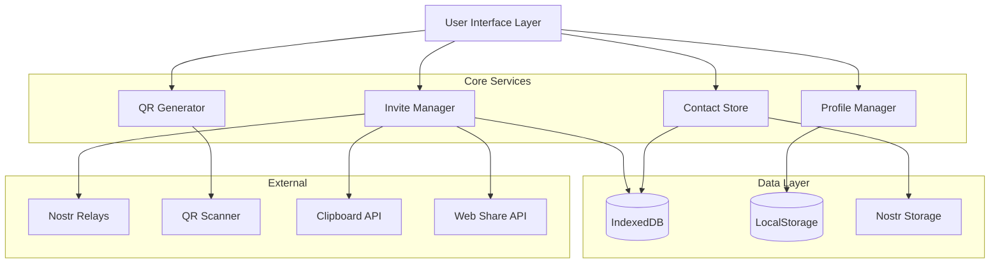

# Design Document

## Overview

The Smart Invite System transforms Obscur's user onboarding and social connection experience by providing intuitive, secure methods for users to connect with each other. The system leverages QR codes, shareable links, and contact management to eliminate the friction of manual public key sharing while maintaining Nostr's decentralized and privacy-first principles.

The design emphasizes security, user experience, and cross-platform compatibility, ensuring that connections are both easy to establish and cryptographically secure.

## Architecture

The Smart Invite System follows a modular architecture with clear separation of concerns:



## Components and Interfaces

### 1. Invite Manager Service

The central orchestrator for all invite-related operations.

```typescript
interface InviteManager {
  // QR Code Operations
  generateQRInvite(options: QRInviteOptions): Promise<QRInvite>;
  processQRInvite(qrData: string): Promise<ContactRequest>;
  
  // Link Operations  
  generateInviteLink(options: InviteLinkOptions): Promise<InviteLink>;
  processInviteLink(linkData: string): Promise<ContactRequest>;
  revokeInviteLink(linkId: string): Promise<void>;
  
  // Contact Request Management
  sendContactRequest(request: OutgoingContactRequest): Promise<void>;
  acceptContactRequest(requestId: string): Promise<Contact>;
  declineContactRequest(requestId: string, block?: boolean): Promise<void>;
  cancelContactRequest(requestId: string): Promise<void>;
  
  // Import/Export
  importContacts(contactData: NostrContactList): Promise<ImportResult>;
  exportContacts(): Promise<NostrContactList>;
}

interface QRInviteOptions {
  displayName?: string;
  avatar?: string;
  message?: string;
  expirationHours?: number;
  includeProfile?: boolean;
}

interface InviteLinkOptions {
  displayName?: string;
  avatar?: string;
  message?: string;
  expirationTime?: Date;
  maxUses?: number;
  includeProfile?: boolean;
}
```

### 2. QR Generator Service

Handles QR code generation and scanning with security features.

```typescript
interface QRGenerator {
  generateQR(data: QRInviteData): Promise<QRCode>;
  scanQR(imageData: ImageData): Promise<QRInviteData>;
  validateQRData(data: string): boolean;
}

interface QRInviteData {
  version: string;
  publicKey: PublicKeyHex;
  displayName?: string;
  avatar?: string;
  message?: string;
  timestamp: number;
  expirationTime: number;
  signature: string;
}

interface QRCode {
  dataUrl: string;
  svgString: string;
  rawData: string;
  size: number;
}
```

### 3. Contact Store Service

Manages contact data, organization, and persistence.

```typescript
interface ContactStore {
  // Contact Management
  addContact(contact: Contact): Promise<void>;
  updateContact(contactId: string, updates: Partial<Contact>): Promise<void>;
  removeContact(contactId: string): Promise<void>;
  getContact(contactId: string): Promise<Contact | null>;
  getAllContacts(): Promise<Contact[]>;
  
  // Contact Organization
  createGroup(group: ContactGroup): Promise<void>;
  addContactToGroup(contactId: string, groupId: string): Promise<void>;
  removeContactFromGroup(contactId: string, groupId: string): Promise<void>;
  getContactsByGroup(groupId: string): Promise<Contact[]>;
  
  // Search and Filtering
  searchContacts(query: string): Promise<Contact[]>;
  filterContacts(filter: ContactFilter): Promise<Contact[]>;
  
  // Trust Management
  setTrustLevel(contactId: string, level: TrustLevel): Promise<void>;
  getTrustedContacts(): Promise<Contact[]>;
  getBlockedContacts(): Promise<Contact[]>;
}

interface Contact {
  id: string;
  publicKey: PublicKeyHex;
  displayName: string;
  avatar?: string;
  bio?: string;
  trustLevel: TrustLevel;
  groups: string[];
  addedAt: Date;
  lastSeen?: Date;
  metadata: ContactMetadata;
}

type TrustLevel = "trusted" | "neutral" | "blocked";

interface ContactGroup {
  id: string;
  name: string;
  description?: string;
  color?: string;
  createdAt: Date;
}
```

### 4. Profile Manager Service

Manages user profile information and privacy settings.

```typescript
interface ProfileManager {
  // Profile Management
  updateProfile(profile: UserProfile): Promise<void>;
  getProfile(): Promise<UserProfile>;
  
  // Privacy Controls
  updatePrivacySettings(settings: PrivacySettings): Promise<void>;
  getPrivacySettings(): Promise<PrivacySettings>;
  
  // Shareable Profile
  getShareableProfile(): Promise<ShareableProfile>;
  validateProfileData(profile: ShareableProfile): boolean;
}

interface UserProfile {
  displayName: string;
  avatar?: string;
  bio?: string;
  website?: string;
  nip05?: string;
  lud16?: string;
}

interface PrivacySettings {
  shareDisplayName: boolean;
  shareAvatar: boolean;
  shareBio: boolean;
  shareWebsite: boolean;
  allowContactRequests: boolean;
  requireMessage: boolean;
  autoAcceptTrusted: boolean;
}

interface ShareableProfile {
  displayName?: string;
  avatar?: string;
  bio?: string;
  publicKey: PublicKeyHex;
  timestamp: number;
  signature: string;
}
```

## Data Models

### Contact Request Flow

```typescript
interface ContactRequest {
  id: string;
  type: "incoming" | "outgoing";
  senderPublicKey: PublicKeyHex;
  recipientPublicKey: PublicKeyHex;
  profile: ShareableProfile;
  message?: string;
  status: ContactRequestStatus;
  createdAt: Date;
  expiresAt?: Date;
}

type ContactRequestStatus = 
  | "pending" 
  | "accepted" 
  | "declined" 
  | "cancelled" 
  | "expired";

interface OutgoingContactRequest {
  recipientPublicKey: PublicKeyHex;
  message?: string;
  includeProfile: boolean;
}
```

### Invite Data Structures

```typescript
interface InviteLink {
  id: string;
  url: string;
  shortCode: string;
  createdBy: PublicKeyHex;
  profile: ShareableProfile;
  message?: string;
  expiresAt?: Date;
  maxUses?: number;
  currentUses: number;
  isActive: boolean;
  createdAt: Date;
}

interface ImportResult {
  totalContacts: number;
  successfulImports: number;
  failedImports: number;
  duplicates: number;
  errors: ImportError[];
}

interface ImportError {
  publicKey: string;
  error: string;
  reason: "invalid_key" | "already_exists" | "network_error" | "validation_failed";
}
```

## Correctness Properties

*A property is a characteristic or behavior that should hold true across all valid executions of a system-essentially, a formal statement about what the system should do. Properties serve as the bridge between human-readable specifications and machine-verifiable correctness guarantees.*

### Property Reflection

After analyzing all acceptance criteria, several properties can be consolidated to eliminate redundancy:
- QR code and invite link expiration handling can be combined into a single expiration property
- Profile data sharing controls apply to both QR codes and invite links
- Contact request processing (accept/decline) can be unified
- Import validation and error handling share common patterns

### Core Properties

**Property 1: QR Code Generation Completeness**
*For any* user profile and connection metadata, generating a QR code should produce a valid QR code containing the user's public key, metadata, and expiration timestamp
**Validates: Requirements 1.1, 1.3, 1.5**

**Property 2: QR Code Scanning Round Trip**
*For any* valid QR code generated by the system, scanning it should extract the exact connection information that was originally encoded
**Validates: Requirements 1.2**

**Property 3: Expiration Enforcement**
*For any* expired invite (QR code or link), processing attempts should be rejected with appropriate error messages
**Validates: Requirements 1.4, 2.4**

**Property 4: Invite Link Uniqueness**
*For any* two invite link generation requests, the system should produce unique URLs even when created by the same user
**Validates: Requirements 2.1**

**Property 5: Invite Link Processing Consistency**
*For any* valid invite link, processing it should correctly pre-populate a contact request with the original sender's information
**Validates: Requirements 2.2**

**Property 6: Cryptographic Validation**
*For any* invite data (QR or link), the system should validate cryptographic signatures and reject any with invalid signatures
**Validates: Requirements 2.5, 7.3**

**Property 7: Contact Request State Management**
*For any* contact request, accepting it should add the contact to the store and enable messaging, while declining should remove it from pending requests
**Validates: Requirements 3.2, 3.3**

**Property 8: Contact Request Message Inclusion**
*For any* contact request created with a personal message, the message should be preserved and available to the recipient
**Validates: Requirements 3.4**

**Property 9: Contact Request Queue Management**
*For any* contact request queue exceeding 50 items, the system should automatically remove the oldest unresponded requests to maintain the limit
**Validates: Requirements 3.6**

**Property 10: Profile Data Privacy Controls**
*For any* invite generation, only profile data explicitly marked as shareable should be included in the invite
**Validates: Requirements 4.3, 7.1**

**Property 11: Profile Fallback Behavior**
*For any* contact with missing profile information, the system should use the public key prefix as the display name
**Validates: Requirements 4.5**

**Property 12: Profile Update Propagation**
*For any* profile update, changes should be reflected in all existing contact records that reference that profile
**Validates: Requirements 4.6**

**Property 13: Contact Import Format Support**
*For any* valid NIP-02 contact list format, the import process should successfully parse and import all valid contacts
**Validates: Requirements 5.1**

**Property 14: Contact Import Validation**
*For any* contact import operation, invalid public keys should be rejected while valid ones are accepted, with detailed error reporting
**Validates: Requirements 5.2, 5.5**

**Property 15: Contact Import Deduplication**
*For any* contact import containing existing contacts, the system should merge data without creating duplicates
**Validates: Requirements 5.3**

**Property 16: Contact Group Management**
*For any* contact, it should be possible to assign it to multiple groups simultaneously, and group deletion should preserve contact data
**Validates: Requirements 6.1, 6.2, 6.6**

**Property 17: Trust Level Assignment**
*For any* contact, setting a trust level should persist the level and affect system behavior (blocking prevents communication)
**Validates: Requirements 6.3, 6.5**

**Property 18: Contact Search and Filtering**
*For any* search query or filter criteria, the system should return only contacts that match the specified criteria
**Validates: Requirements 6.4**

**Property 19: Cryptographic Security**
*For any* invite generation, the system should use cryptographically secure random data and proper encryption for sensitive information
**Validates: Requirements 7.2, 7.4**

**Property 20: Invite Revocation**
*For any* active invite that is revoked, subsequent processing attempts should be immediately rejected
**Validates: Requirements 7.5**

**Property 21: Privacy Setting Application**
*For any* privacy setting change, new settings should apply to future invites without affecting existing connections
**Validates: Requirements 7.6**

**Property 22: Cross-Platform Format Compatibility**
*For any* invite generated by the system, it should conform to standardized Nostr formats compatible with other clients
**Validates: Requirements 8.1, 8.2**

**Property 23: Universal Link Generation**
*For any* invite link, it should be formatted as a universal link that works across web, mobile, and desktop platforms
**Validates: Requirements 8.3**

**Property 24: Deep Link Routing**
*For any* valid deep link, the system should route users to the appropriate application section
**Validates: Requirements 8.5**

## Error Handling

The Smart Invite System implements comprehensive error handling across all components:

### Error Categories

1. **Validation Errors**
   - Invalid public keys
   - Malformed QR codes or invite links
   - Expired invites
   - Invalid cryptographic signatures

2. **Network Errors**
   - Relay connection failures
   - Timeout during contact request transmission
   - Network unavailability during import operations

3. **Storage Errors**
   - IndexedDB quota exceeded
   - Corruption of stored contact data
   - Failed encryption/decryption operations

4. **User Input Errors**
   - Invalid profile data
   - Unsupported file formats for avatars
   - Malformed contact import files

### Error Recovery Strategies

- **Graceful Degradation**: System continues operating with reduced functionality when non-critical components fail
- **Retry Logic**: Automatic retry with exponential backoff for transient network errors
- **Data Integrity**: Validation and checksums to detect and recover from data corruption
- **User Feedback**: Clear, actionable error messages with suggested solutions

## Testing Strategy

The Smart Invite System employs a dual testing approach combining unit tests for specific scenarios and property-based tests for comprehensive coverage.

### Unit Testing Focus

- **Specific Examples**: Test concrete scenarios like generating QR codes with known data
- **Edge Cases**: Test boundary conditions like maximum contact limits and expiration edge cases
- **Error Conditions**: Test specific error scenarios like network failures and invalid input
- **Integration Points**: Test interactions between components like InviteManager and ContactStore

### Property-Based Testing Configuration

- **Test Framework**: Vitest with fast-check for property-based testing
- **Minimum Iterations**: 100 iterations per property test to ensure comprehensive coverage
- **Test Tagging**: Each property test tagged with format: **Feature: smart-invite-system, Property {number}: {property_text}**

### Test Coverage Areas

1. **QR Code Operations**: Generation, scanning, validation, and expiration handling
2. **Invite Link Management**: Creation, processing, revocation, and expiration
3. **Contact Request Workflow**: Sending, receiving, accepting, declining, and cancellation
4. **Contact Management**: Adding, updating, organizing, and searching contacts
5. **Profile Management**: Updates, privacy controls, and data sharing
6. **Import/Export**: Contact list processing, validation, and error handling
7. **Security**: Cryptographic operations, signature validation, and data encryption
8. **Cross-Platform**: Format compatibility and universal link handling

### Testing Data Generation

Property-based tests will use intelligent generators that:
- Create valid Nostr public keys and signatures
- Generate realistic profile data within system constraints
- Produce both valid and invalid QR codes and invite links
- Create contact lists with various sizes and compositions
- Generate edge cases like expired invites and malformed data

The testing strategy ensures that all correctness properties are validated through automated tests, providing confidence in the system's reliability and security.

<function_calls>
<invoke name="prework">
<parameter name="featureName">smart-invite-system