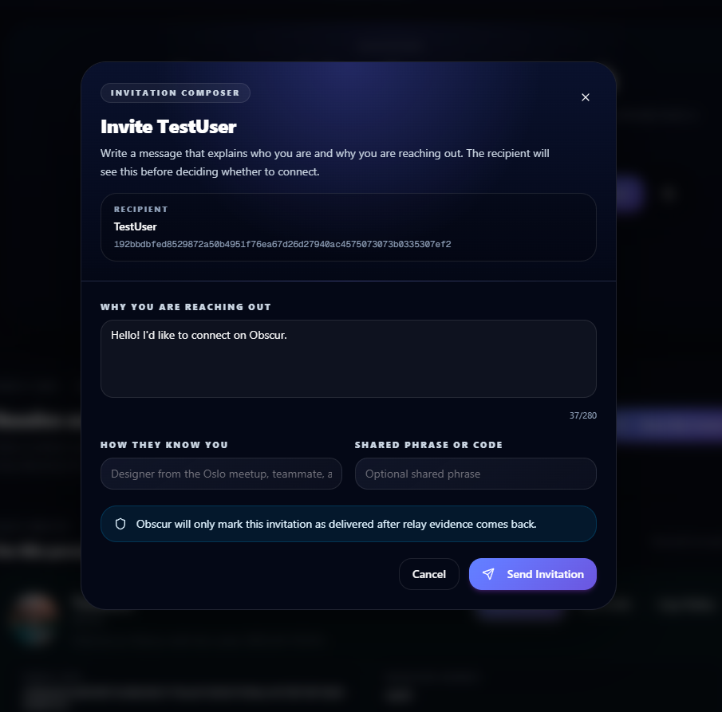

# Obscur Agent Rules

## Scope

These rules apply to all agent work in this repository.

The repository is a monorepo for a privacy-first communication product with:

- PWA/web runtime,
- Tauri desktop runtime,
- shared TS packages,
- Rust/native runtime integrations,
- ongoing recovery work around identity, relay transport, messaging, and profile isolation.

Agents working here must optimize for correctness, explicit contracts, and long-term maintainability over speed-by-patch.

## Operating Principles

1. Preserve architectural clarity.
   - Do not add a second owner for the same lifecycle, state, or transport path.
   - If a responsibility already has multiple owners, reduce them instead of adding another layer.

2. Prefer explicit contracts over ambient behavior.
   - Pass `profileId`, `publicKeyHex`, runtime capability, and ownership context explicitly where ambiguity could cause drift.
   - Avoid hidden globals, singleton assumptions, and "current active user/profile" fallbacks in shared code.

3. Local state is not network truth.
   - Do not treat sender-local optimistic state as proof of delivery, acceptance, or sync completion.
   - UI success states for requests/messages must require evidence-backed outcomes.

4. One user action should map to one canonical path.
   - Especially for auth, request sending, direct messaging, profile publish, and relay recovery.
   - Avoid parallel legacy and modern execution paths mutating the same live state.

5. Fix by subtraction where possible.
   - If a bug exists because two systems overlap, remove or quarantine one path instead of compensating in UI.

6. Release claims must follow runtime truth.
   - Do not describe a flow as working unless desktop/PWA runtime behavior and tests both support that claim.

## Monorepo Standards

1. Keep boundaries clear.
   - `apps/*` should compose behavior.
   - `packages/*` should hold reusable contracts, primitives, and runtime-independent logic.
   - Rust/Tauri code should expose typed native boundaries, not product logic leaks.

2. Shared logic belongs in typed modules.
   - Prefer moving repeat logic into focused services/contracts instead of duplicating controller logic across app surfaces.

3. Avoid cross-feature reach-through.
   - A feature should not import deep internals from another feature when a contract/service boundary can be introduced.

4. Keep files single-purpose.
   - If a file owns more than one lifecycle or more than one domain concern, split it.

## Runtime and State Rules

1. One runtime owner per window.
   - Startup, auth, activation, degradation, and teardown should be owned by one supervisor/controller path.

2. Signed-out windows stay light.
   - Do not start relay sync, account rehydrate, messaging subscriptions, or heavy recovery work before identity is actually available.

3. Profile binding must be resolved before account-scoped services mount.
   - No store or runtime should read/write account state before knowing which profile owns the window.

4. Storage keys must be scoped deliberately.
   - Any account/profile-scoped persistence must derive from explicit scope at access time, not module-load time.

5. Sync bookkeeping must be evidence-based.
   - Never advance checkpoints or mark recovery complete on timeout alone.

## Messaging and Relay Rules

1. Treat transport as a system, not a widget.
   - Request send/receive bugs are usually transport, identity, or lifecycle bugs before they are UI bugs.

2. Request transport must converge on recipient evidence.
   - Sender-local pending is provisional.
   - Receipt ACK, accept, or confirmed relay evidence are the durable state transitions.

3. Publish scope must be explicit.
   - Recipient relay resolution must flow into the actual publish contract.
   - Do not rely on side effects on a shared relay pool to imply target scope.

4. Incoming routing must be diagnosable.
   - For request/DM receive paths, capture:
     - subscription ownership,
     - recipient filter,
     - decrypt result,
     - routing result,
     - final state mutation.

5. Unsupported runtime paths must fail deterministically.
   - Do not silently degrade into optimistic success when publish evidence is unavailable.

## Auth and Identity Rules

1. Import/create/unlock should succeed locally first.
   - Relay/account-sync work may enrich the session later but must not redefine the local success decision.

2. Remember-me and native session restore must reflect actual ownership.
   - Never show a stale authenticated identity chip when the runtime is locked or auth-required.

3. Identity mismatches should surface explicitly.
   - If stored identity, native session, and bound profile disagree, fail visibly instead of silently switching.

## Testing and Validation Rules

1. Validate at the narrowest useful level first.
   - unit test,
   - focused integration test,
   - typecheck,
   - then runtime/manual instructions.

2. Every fix in critical paths should leave behind one of:
   - a new test,
   - a typed contract,
   - a diagnostics surface,
   - or a doc update explaining the gate/risk.

3. Core communication work is not done without two-user reasoning.
   - For identity, request, DM, relay, and multi-profile work, always reason about sender and receiver states separately.

## Documentation Rules

1. Update docs when architecture meaningfully changes.
   - Especially `CHANGELOG.md` and `/docs` recovery/status docs for v0.9 work.

2. Write docs for future triage, not marketing.
   - Record what is true, what is unstable, and what is blocked.

3. Prefer recovery handoffs over vague TODOs.
   - If a system is not fixed, document:
     - landed changes,
     - remaining blockers,
     - likely root causes,
     - next investigation order.

## Context Continuity Rules

1. Canonical continuity state lives in files, not chat history.
   - Always use `docs/handoffs/current-session.md` as the single source of ongoing progress.

2. Start every substantial Codex thread with continuity replay.
   - Read `AGENTS.md`, `docs/08-maintainer-playbook.md`, and `docs/handoffs/current-session.md` first.
   - Resume from `Next Atomic Step` before broad re-exploration.

3. Checkpoint progress whenever runtime truth changes.
   - Required checkpoint triggers:
     - owner/contract decision changed,
     - new evidence from tests/typecheck/runtime diagnostics,
     - blocker discovered or unresolved risk changed,
     - thread close is likely.
   - Use `pnpm context:checkpoint -- --summary "..." --next "..."` when possible.

4. Close every substantial thread with a durable handoff.
   - Update `Last Updated`, `Session Status`, `Open Risks Or Blockers`, and `Next Atomic Step`.
   - Append one final checkpoint entry before ending the thread.

5. Continuity workflow and skill are mandatory references.
   - Workflow: `.agent/workflows/context-continuity.md`
   - Skill: `.agent/skills/obscur-context-continuity/SKILL.md`

## Anti-Patterns

Do not:
](image.png)
- add another compatibility bridge to avoid understanding an existing one,
- mark delivery success from local UI state alone,
- create new hidden singleton state,
- patch over lifecycle races by adding more `useEffect` layers,
- mix legacy and new paths in one user action without naming a canonical owner,
- claim a release blocker is resolved because tests pass while runtime behavior is still divergent.

## Default Recovery Heuristic

When a core flow is broken:

1. identify the canonical owner,
2. list all parallel paths touching that state,
3. remove or isolate non-canonical mutations,
4. add diagnostics at the canonical boundary,
5. only then repair the product behavior.
