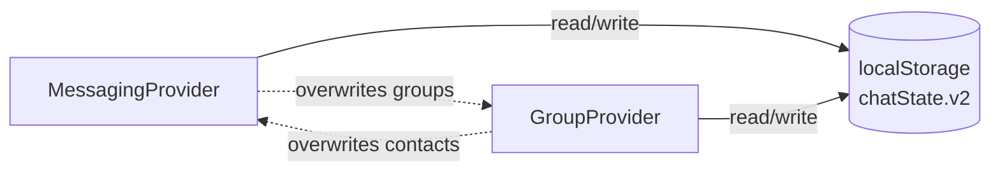
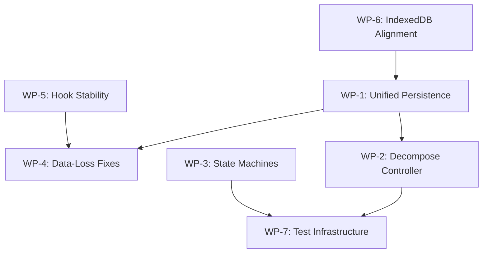

# Phase 1: Stabilization & Decoupling — Technical Specification

> **Parent Document:** [Native Architecture Roadmap](./NATIVE_ARCHITECTURE_ROADMAP.md)
> **Status:** Draft — Pending Review
> **Target:** Pre-v1.0 Foundation

---

## 1. Executive Summary

Phase 1 prepares the Obscur codebase for the transition to a shared Rust core (`libobscur`) by eliminating data-loss bugs, decoupling business logic from React rendering, and establishing a unified persistence layer. No new features are added. The sole objective is to make the existing protocol implementation rock-solid and structurally portable.

---

## 2. Current Architecture Audit

### 2.1 Critical Files & Sizes

| File | Lines | Role |
|---|---|---|
| [enhanced-dm-controller.ts](file:///e:/Web%20Project/experimental-workspace/newstart/apps/pwa/app/features/messaging/controllers/enhanced-dm-controller.ts) | 1988 | Monolithic hook: crypto, relay I/O, subscriptions, event parsing, retry, offline queue |
| [main-shell.tsx](file:///e:/Web%20Project/experimental-workspace/newstart/apps/pwa/app/features/main-shell/main-shell.tsx) | 503 | Top-level orchestrator wiring 15+ hooks together |
| [messaging-provider.tsx](file:///e:/Web%20Project/experimental-workspace/newstart/apps/pwa/app/features/messaging/providers/messaging-provider.tsx) | 310 | Context provider for DM state, contacts, unread counts, persistence |
| [group-provider.tsx](file:///e:/Web%20Project/experimental-workspace/newstart/apps/pwa/app/features/groups/providers/group-provider.tsx) | 156 | Context provider for Sealed Community state and persistence |
| [use-sealed-community.ts](file:///e:/Web%20Project/experimental-workspace/newstart/apps/pwa/app/features/groups/hooks/use-sealed-community.ts) | 526 | Manages group encryption, consensus, event parsing |
| [persistence.ts](file:///e:/Web%20Project/experimental-workspace/newstart/apps/pwa/app/features/messaging/utils/persistence.ts) | 470 | localStorage serialization/deserialization for all chat state |
| [use-requests-inbox.ts](file:///e:/Web%20Project/experimental-workspace/newstart/apps/pwa/app/features/messaging/hooks/use-requests-inbox.ts) | 340 | Connection request state machine with independent localStorage |
| [types/index.ts](file:///e:/Web%20Project/experimental-workspace/newstart/apps/pwa/app/features/messaging/types/index.ts) | 257 | All domain models (Message, Conversation, Persisted types) |

### 2.2 Identified Architectural Problems

#### Problem 1: Dual Persistence Conflict
`MessagingProvider` and `GroupProvider` **both** read and write to the same `localStorage` key (`dweb.nostr.pwa.chatState.v2.<pubkey>`). They each call `loadPersistedChatState()` independently, merge their own slice, and call `savePersistedChatState()`. This creates **race conditions** where one provider can overwrite data written by the other.

#### Problem 2: Monolithic Controller Hook
`EnhancedDMController` (1988 lines) is a single `useCallback`/`useEffect` monolith that handles:
- Nostr event encryption/decryption (NIP-04, NIP-17)
- WebSocket subscription management
- Message queue persistence (IndexedDB)
- Relay OK/NOTICE parsing
- Offline queue processing
- Network state monitoring
- NIP-65 gossip relay resolution

This makes the logic untestable, un-portable (to Rust), and prone to stale closure bugs.

#### Problem 3: Unstable Hook References
Hooks like `useRequestsInbox` and `useRelayList` returned new object references on every render, causing infinite re-render cascades in consumers. This was recently patched with `useMemo`, but the pattern is systemic — any hook returning an un-memoized object will trigger the same issue.

#### Problem 4: React-Coupled State Machines
The connection handshake state, message delivery status, and community membership status are all managed inside React `useState`/`useEffect` cycles. This means:
- State transitions cannot be unit-tested without rendering React components.
- The exact same logic would need to be rewritten entirely for Rust.

#### Problem 5: localStorage as Primary Store
All persistent data (contacts, messages, groups, unread counts) lives in `localStorage`, which is:
- Synchronous and blocks the main thread on large payloads.
- Limited to ~5-10MB per origin.
- Not queryable (no indexes, no range queries).
- Vulnerable to accidental clearing by the browser/OS.

> [!IMPORTANT]
> `IndexedDB` is used separately by `MessageQueue` for the raw Nostr event cache, creating a **second source of truth** that can diverge from the `localStorage`-based `messagesByConversationId`.

---

## 3. Specification: Work Packages

### WP-1: Unified Persistence Service

**Goal:** Eliminate the dual-persistence race condition and create a single, well-defined persistence boundary.

**Changes:**
1. Create a new class `ChatStateStore` in `messaging/services/chat-state-store.ts`.
2. This class owns **all** reads and writes to the `chatState.v2` localStorage key.
3. It exposes atomic methods: `updateContacts()`, `updateGroups()`, `updateMessages()`, `updateUnread()`, etc.
4. Each method performs a **read-modify-write** cycle internally, holding a lock (simple boolean flag) to prevent concurrent writes.
5. `MessagingProvider` and `GroupProvider` both inject `ChatStateStore` via a shared React Context instead of calling `loadPersistedChatState`/`savePersistedChatState` directly.

**Files Affected:**

| Action | File |
|---|---|
| NEW | `messaging/services/chat-state-store.ts` |
| MODIFY | `messaging/providers/messaging-provider.tsx` |
| MODIFY | `groups/providers/group-provider.tsx` |
| MODIFY | `messaging/utils/persistence.ts` (internal use only) |

---

### WP-2: Decompose EnhancedDMController

**Goal:** Break the 1988-line monolith into focused, testable service modules.

**Decomposition Map:**

| New Module | Responsibility | Approx. Lines |
|---|---|---|
| `messaging/services/dm-encryption-service.ts` | NIP-04/NIP-17 encrypt & decrypt, gift-wrap handling | ~200 |
| `messaging/services/dm-subscription-service.ts` | REQ/CLOSE management, event routing, deduplication | ~250 |
| `messaging/services/dm-send-service.ts` | Event building, signing, multi-relay publishing | ~300 |
| `messaging/services/dm-event-processor.ts` | Incoming event parsing, signature verification, blocked sender filtering, request routing | ~300 |
| `messaging/services/message-status-machine.ts` | Status transitions (sending → accepted → delivered), retry decisions | ~100 |

The remaining `useEnhancedDMController` hook becomes a thin ~200-line **wiring layer** that instantiates the services and connects them to React state.

**Key Design Rule:** Each service module must be a **pure TypeScript class** with no React imports. It receives dependencies (crypto, relay pool, message queue) via constructor injection. This makes every service directly portable to Rust in Phase 3.

---

### WP-3: State Machine Extraction

**Goal:** Extract connection handshake, message delivery, and community membership logic into framework-agnostic state machines.

**Approach:**
1. Define each state machine as a pure function: `(currentState, event) → nextState`.
2. Use a `StateTransition<S, E>` generic type to enforce valid transitions at the type level.
3. State machines live in `messaging/state-machines/` and have zero React dependencies.

**State Machines to Extract:**

| Machine | Current Location | States |
|---|---|---|
| Message Delivery | `enhanced-dm-controller.ts` L231-242 | `sending → accepted → delivered`, `sending → rejected → queued → sending`, `sending → failed` |
| Connection Handshake | `use-requests-inbox.ts` | `none → pending → accepted/declined/canceled` |
| Community Membership | `use-sealed-community.ts` | `idle → loading → ready/error`, `joined → left → expelled` |

---

### WP-4: Resolve Known Data-Loss Bugs

**Goal:** Fix the critical bugs documented in `ISSUES.md` sections 1, 3, and 4.

| Bug | Root Cause | Fix |
|---|---|---|
| Contacts disappear after restart | `MessagingProvider` hydration depends on `selectedConversation` changes triggering re-persistence, and `GroupProvider` overwrites contact data | Resolved by WP-1 (unified persistence) |
| One-way visibility after acceptance | Acceptance handshake DM is ephemeral and not re-fetched on restart | Persist accepted peer pubkeys in `ChatStateStore` as a first-class `acceptedPeers: Set<PublicKeyHex>` field |
| UI freezes on Contacts/Settings | Synchronous `localStorage.getItem()` on large JSON blobs blocks the main thread | Move hot-path reads to a pre-parsed in-memory cache within `ChatStateStore`; lazy-write with `requestIdleCallback` |
| Settings lost on reload | Language preference stored in React state only | Persist `i18n.language` to `localStorage` on change, hydrate on startup |

---

### WP-5: Hook Stability Audit

**Goal:** Ensure every custom hook returns a referentially stable object using `useMemo`.

**Audit Checklist:**

| Hook | Status |
|---|---|
| `useRequestsInbox` | ✅ Fixed (memoized) |
| `useRelayList` | ✅ Fixed (memoized) |
| `usePeerTrust` | ⬜ Needs audit |
| `useBlocklist` | ⬜ Needs audit |
| `useIdentity` | ⬜ Needs audit |
| `useGroups` | ⬜ Needs audit |
| `useMessaging` | ⬜ Needs audit |
| `useRelay` | ⬜ Needs audit |
| `useSealedCommunity` | ⬜ Needs audit |
| `useAutoLock` | ⬜ Needs audit |

**Rule:** Every hook that returns an object or array MUST wrap it in `useMemo` (or `useCallback` for functions) with correct dependency arrays. This will be enforced by adding an ESLint rule or review checklist item.

---

### WP-6: IndexedDB Schema Alignment

**Goal:** Consolidate the dual-database situation (Invites DB vs. MessageQueue DB) and prepare schemas for future SQLite migration.

**Changes:**
1. Increment the Invites DB version to force re-creation of missing object stores (already done: v1 → v2).
2. Document the canonical schema for both databases.
3. Add a migration utility that can detect and repair schema mismatches without data loss.
4. Standardize all IndexedDB access behind a `DbService` interface so the backing store can be swapped to SQLCipher in Phase 3 without changing any consumer code.

---

### WP-7: Test Infrastructure

**Goal:** Make critical business logic testable without React rendering.

**Approach:**
1. The service modules from WP-2 are pure classes → test with Vitest directly (no `@testing-library/react`).
2. State machines from WP-3 are pure functions → test with property-based testing (`fast-check`).
3. Replace the brittle `enhanced-dm-controller.test.ts` mock setup with integration tests that use the new service layer.

**Minimum Coverage Targets:**

| Module | Target |
|---|---|
| `dm-encryption-service.ts` | 90% |
| `message-status-machine.ts` | 100% |
| `chat-state-store.ts` | 85% |
| State machines | 100% (property-based) |

---

## 4. Dependency Graph

Work packages should be executed in this order:

**Recommended execution order:** WP-6 → WP-1 → WP-5 → WP-2 → WP-3 → WP-4 → WP-7

---

## 5. Success Criteria

Phase 1 is complete when:

1. **No data loss:** Contacts, messages, and groups survive unlimited app restarts without any disappearing data.
2. **No infinite loops:** Zero occurrences of "Maximum update depth exceeded" in any code path.
3. **Controller decomposed:** `EnhancedDMController` is < 300 lines. All business logic lives in injectable services.
4. **State machines are pure:** Message delivery, connection handshake, and community membership can be tested with `fast-check` without any React imports.
5. **Unified persistence:** A single `ChatStateStore` class owns all localStorage I/O. No direct `loadPersistedChatState`/`savePersistedChatState` calls elsewhere.
6. **Tests pass:** All extracted services have ≥ 85% coverage. State machines have 100% coverage via property-based tests.

---

## 6. What Phase 1 Does NOT Include

- No new features or UI changes.
- No Rust code or `libobscur` scaffolding.
- No monorepo restructuring (`apps/website`, `packages/ui-kit`).
- No migration from localStorage/IndexedDB to SQLite.
- These belong to Phases 2–4 as defined in the [Roadmap](./NATIVE_ARCHITECTURE_ROADMAP.md).
