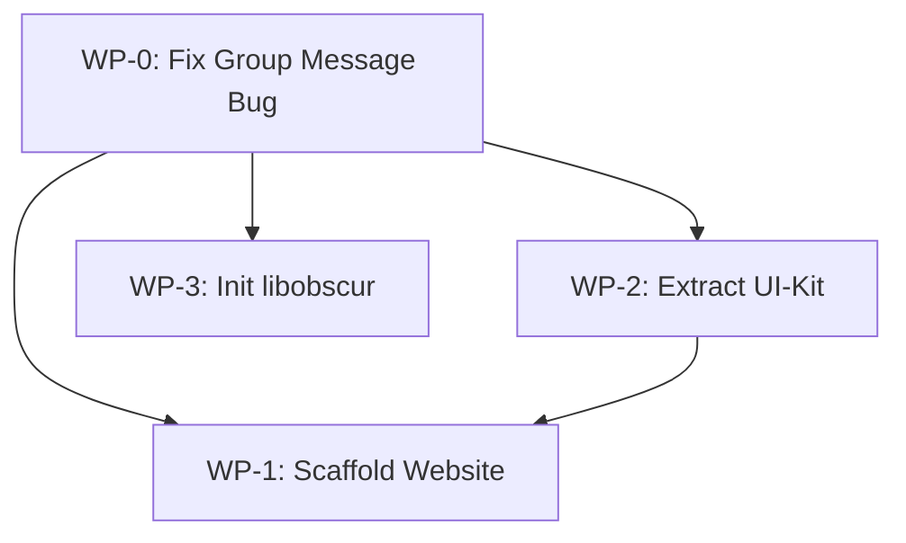

# Phase 2: Monorepo Restructuring — Technical Specification

> **Parent Document:** [Native Architecture Roadmap](./NATIVE_ARCHITECTURE_ROADMAP.md)
> **Prerequisite:** [Phase 1: Stabilization & Decoupling](./PHASE_1_STABILIZATION_SPEC.md) ✅ Complete
> **Status:** Draft — Pending Review
> **Target:** Pre-v1.0 Monorepo Foundation

---

## 1. Executive Summary

Phase 2 transforms the current flat monorepo into a scalable, cross-platform workspace. The goals are:

1. **Fix the critical group message bug** (Issue #9) before any restructuring.
2. **Scaffold `apps/website`** — The official download/marketing portal.
3. **Extract `packages/ui-kit`** — Shared React components and design tokens.
4. **Initialize `packages/libobscur`** — The Rust shared core crate (empty scaffold for Phase 3).

No business logic is added or changed beyond the bug fix. This phase is purely structural.

---

## 2. Pre-Restructuring: Critical Bug Fix (WP-0)

> [!CAUTION]
> Group messages are neither visible to other participants nor persisted across page refreshes. This is a **blocking data-loss regression** that must be fixed before reorganizing code.

### 2.1 Symptoms

| # | Symptom | Severity |
|---|---------|----------|
| 1 | Messages sent in community/group chats are not visible to other users | Critical |
| 2 | All group messages disappear after refresh/restart | Critical |
| 3 | Group conversation metadata (name, members) persists correctly | OK |

### 2.2 Investigation Plan

1. **Trace `sendGroupMessage`** in `use-sealed-community.ts` — verify events are encrypted with the room key and published to the group relay.
2. **Trace incoming group message ingestion** — verify the `messagesByConversationId` key matches between send and receive paths.
3. **Verify `conversationId` stability** — group IDs must be deterministic (e.g., `group:<groupId>:<relayUrl>`) and identical across all participants.
4. **Verify persistence** — confirm `ChatStateStore` writes include group messages and that hydration correctly restores them.

### 2.3 Deliverables

- [ ] Root-cause analysis documented
- [ ] Fix applied and verified with two-user simulation
- [ ] `ISSUES.md` section #9 marked as resolved

---

## 3. Work Package 1: Scaffold `apps/website`

### 3.1 Purpose

A static marketing and download portal for the official Obscur release. This is **not** the web client — it is a separate, lightweight site.

### 3.2 Technical Decisions

| Decision | Choice | Rationale |
|----------|--------|-----------|
| Framework | Next.js (SSG) | Already used in `apps/pwa`; shared tooling |
| Styling | Tailwind CSS 4 | Consistent with existing design system |
| Deployment | Vercel (or static export) | Free tier, no server needed |
| Content | Static pages | No CMS initially |

### 3.3 Proposed Pages

1. **Landing** — Hero, value props, download CTA
2. **Download** — Platform-specific download links (Desktop: Windows/macOS/Linux)
3. **Features** — Privacy, encryption, decentralization highlights
4. **Changelog** — Auto-generated from `CHANGELOG.md`

### 3.4 Tasks

- [ ] `npx create-next-app` in `apps/website`
- [ ] Configure in `pnpm-workspace.yaml`
- [ ] Create landing page layout
- [ ] Create download page with platform detection
- [ ] Add SEO metadata and Open Graph tags

---

## 4. Work Package 2: Extract `packages/ui-kit`

### 4.1 Purpose

Move shared React components (Button, Card, Avatar, Dialog, DropdownMenu, Input, etc.) from `apps/pwa/app/components/ui/` into a dedicated package so both `apps/website` and `apps/pwa` can import from `@obscur/ui-kit`.

### 4.2 Scope

**Include (immediate):**
- All files under `apps/pwa/app/components/ui/` (button, card, input, dropdown-menu, avatar, checkbox, etc.)
- `lib/utils.ts` (the `cn()` helper)
- Shared Tailwind config / design tokens

**Exclude (deferred):**
- Feature-specific components (message-list, sidebar, composer, etc.)
- Business logic hooks

### 4.3 Tasks

- [ ] Create `packages/ui-kit` with `package.json` (`@obscur/ui-kit`)
- [ ] Move UI primitives from `apps/pwa/app/components/ui/`
- [ ] Update all imports in `apps/pwa` to `@obscur/ui-kit`
- [ ] Verify build and type-check
- [ ] Consume from `apps/website`

---

## 5. Work Package 3: Initialize `packages/libobscur`

### 5.1 Purpose

Create the Rust crate scaffold that will become the shared core in Phase 3. In Phase 2 it is **empty** — the goal is to establish the build pipeline and workspace integration.

### 5.2 Tasks

- [ ] Run `cargo init --lib packages/libobscur`
- [ ] Add `Cargo.toml` with initial metadata
- [ ] Create a `src/lib.rs` with a placeholder public function
- [ ] Add `uniffi` dependency stub in `Cargo.toml`
- [ ] Verify `cargo build` succeeds
- [ ] Document the crate purpose in `packages/libobscur/README.md`

---

## 6. Verification Plan

### Automated

| Check | Command | Expected |
|-------|---------|----------|
| PWA type-check | `pnpm --filter pwa tsc --noEmit` | 0 errors |
| Website build | `pnpm --filter website build` | Clean SSG output |
| UI-kit build | `pnpm --filter @obscur/ui-kit build` | Clean output |
| Rust crate | `cargo build -p libobscur` | Clean compile |

### Manual

1. Verify group messages persist after page refresh (WP-0 fix).
2. Verify the website runs locally and displays landing/download pages.
3. Verify `apps/pwa` still renders correctly after the UI-kit extraction.

---

## 7. Dependency Order



> WP-0 is the prerequisite for everything. WP-1 depends on WP-2 (to consume shared components). WP-3 is independent and can run in parallel with WP-1/WP-2.

---

## 8. Post-Phase 2 State

After completion, the workspace will look like:

```text
obscur/
├── apps/
│   ├── api/              # Existing
│   ├── coordination/     # Existing
│   ├── desktop/          # Existing Tauri V2 wrapper
│   ├── pwa/              # Existing web client (imports @obscur/ui-kit)
│   └── website/          # NEW: Official download portal
├── packages/
│   ├── dweb-core/        # Existing
│   ├── dweb-crypto/      # Existing
│   ├── dweb-nostr/       # Existing
│   ├── dweb-storage/     # Existing
│   ├── ui-kit/           # NEW: Shared React components
│   └── libobscur/        # NEW: Rust shared core (scaffold)
```

This structure directly maps to the [Native Architecture Roadmap](./NATIVE_ARCHITECTURE_ROADMAP.md) target layout and sets the stage for Phase 3 (the Rust migration).
