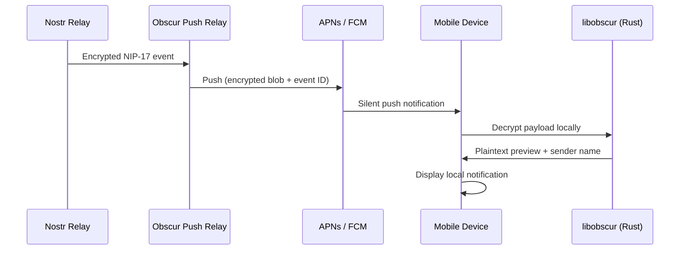
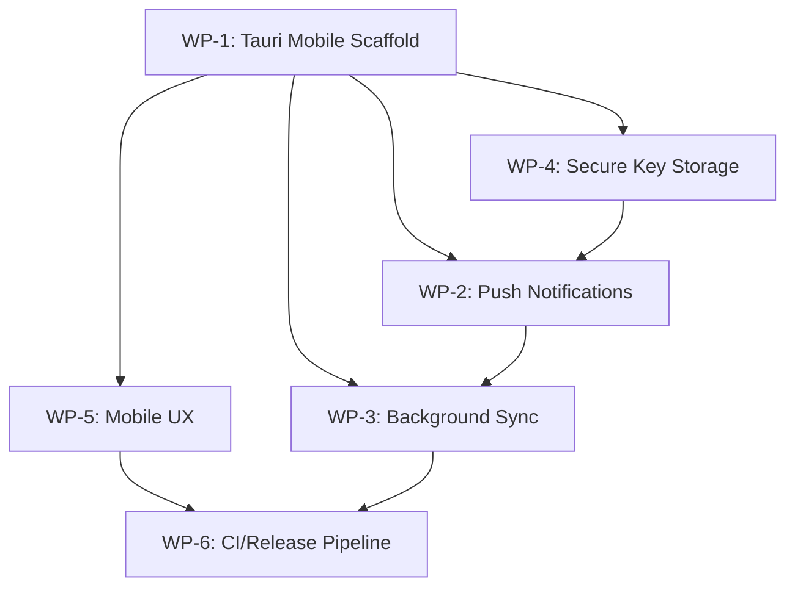

# Phase 4: Native Mobile Implementation — Technical Specification

> **Parent Document:** [Native Architecture Roadmap](./NATIVE_ARCHITECTURE_ROADMAP.md)
> **Prerequisite:** [Phase 3: The `libobscur` Shared Core](./PHASE_3_RUST_CORE_SPEC.md) ✅ Complete
> **Status:** Draft — Pending Review
> **Target:** Native Mobile Launch (iOS & Android)

---

## 1. Executive Summary

Phase 4 delivers Obscur to iOS and Android using **Tauri V2 Mobile**, leveraging the same `libobscur` Rust core and Next.js frontend that powers the desktop app. Rather than building separate Swift/Kotlin UI layers, this approach maximizes code reuse — the React UI from `apps/pwa` and the Rust business logic from `packages/libobscur` are both shared across desktop and mobile. The mobile-specific work focuses on four areas: **project scaffolding**, **native platform integration** (push notifications, background sync, biometric/Secure Enclave), **mobile UX adaptation**, and **build/release CI pipelines**.

---

## 2. Objectives

- **Unified Codebase:** Ship iOS & Android from the same Tauri V2 project that powers Desktop, minimizing maintenance surface.
- **Native Performance:** All crypto, networking, and storage operations run in-process via `libobscur` — no JS bridge overhead for hot paths.
- **Platform Integration:** Deep integration with push notifications, background tasks, Secure Enclave / Android Keystore, and biometric unlock.
- **Privacy-Preserving Notifications:** Incoming push payloads contain only encrypted data; decryption happens locally in `libobscur`.
- **Offline-First:** Full functionality without network; messages queue and sync when connectivity restores.

---

## 3. Technology Decision: Tauri V2 Mobile

| Alternative | Pros | Cons | Verdict |
|---|---|---|---|
| **Tauri V2 Mobile** | Reuse existing Tauri desktop project; shared Rust core; single build system | WebView perf ceiling; limited native UI widgets | ✅ **Selected** |
| React Native + `libobscur` | Native UI components; large ecosystem | Requires new UI layer; duplicate navigation/state management | ❌ Deferred |
| SwiftUI / Jetpack Compose | Maximum native fidelity | Separate codebases per platform; doubles UI maintenance | ❌ Deferred |

**Rationale:** Tauri V2 already supports Android and iOS targets. The existing desktop app (`apps/desktop`) already consumes `libobscur` via Tauri IPC commands. Extending to mobile is the lowest-friction path. If WebView performance becomes a bottleneck for specific screens (e.g., message list virtualization), those views can be replaced with native components in future iterations.

---

## 4. Work Packages

### WP-1: Tauri V2 Mobile Project Scaffold

**Goal:** Extend the existing `apps/desktop` Tauri project to build for Android and iOS targets.

**Tasks:**

- [x] Run `pnpm tauri android init` and `pnpm tauri ios init` inside `apps/desktop` to generate the native project shells (`gen/android/`, `gen/apple/`).
- [x] Configure `tauri.conf.json` with mobile-specific settings:
  - `identifier`: `app.obscur.desktop` (using the universal app identifier for both desktop and mobile).
  - Android: `minSdkVersion: 24` (Android 7.0+), target SDK 35.
  - iOS: `minimumOSVersion: "16.0"` (iOS 16+).
- [/] Verify `pnpm tauri android dev` and `pnpm tauri ios dev` launch the existing PWA UI in mobile emulators.
- [x] Configure `Cargo.toml` target-specific dependencies:
  - `[target.'cfg(target_os = "android")'.dependencies]` — Android Keystore access.
  - `[target.'cfg(target_os = "ios")'.dependencies]` — iOS Keychain/Secure Enclave access.
- [ ] Add mobile icon assets (`icons/android/`, `icons/ios/`) and splash screens.
- [ ] Document the mobile dev environment setup (Android Studio, Xcode, NDK) in `docs/DEVELOPER_GUIDE.md`.

**Files Affected:**

| Action | Path |
|---|---|
| MODIFY | `apps/desktop/src-tauri/tauri.conf.json` |
| MODIFY | `apps/desktop/src-tauri/Cargo.toml` |
| NEW | `apps/desktop/src-tauri/gen/android/` (auto-generated) |
| NEW | `apps/desktop/src-tauri/gen/apple/` (auto-generated) |
| MODIFY | `docs/DEVELOPER_GUIDE.md` |

---

### WP-2: Native Push Notifications (Privacy-Preserving)

**Goal:** Deliver real-time message notifications on mobile while preserving end-to-end encryption. Push payloads contain only encrypted ciphertext; decryption occurs locally.

**Architecture:**



**Privacy Guarantees:**
- The Push Relay never sees plaintext. It forwards the encrypted NIP-17 gift-wrap verbatim.
- The push payload includes only: `event_id`, `sender_pubkey`, and `encrypted_content`.
- Decryption happens in `libobscur` on-device using the locally stored private key.
- The displayed notification is constructed locally after decryption.

**Tasks:**

- [/] **Push Relay Integration**: Investigating existing push relay infrastructure and registration endpoints.
- [ ] **Device Token Registration:** Add a Tauri command `register_push_token` in `src-tauri/src/lib.rs`:
  - Accepts the OS push token (from `tauri-plugin-notification`).
  - Sends it to the existing backend/push relay along with the user's public key using the shared API.
- [ ] **Notification Service Extension (iOS):** Create an iOS Notification Service Extension that:
  - Intercepts the silent push before display.
  - Calls `libobscur` to decrypt the payload.
  - Mutates the notification content to show the plaintext preview.
- [ ] **FCM Handler (Android):** Create a `FirebaseMessagingService` subclass that:
  - Receives the data-only FCM message.
  - Calls `libobscur` via JNI to decrypt.
  - Posts a local notification with the plaintext preview.
- [ ] Add `tauri-plugin-notification` to mobile capabilities in `tauri.conf.json`.

**Files Affected:**

| Action | Path |
|---|---|
| MODIFY | `apps/desktop/src-tauri/src/lib.rs` (add `register_push_token` command) |
| NEW | `apps/desktop/src-tauri/gen/apple/NotificationServiceExtension/` |
| NEW | `apps/desktop/src-tauri/gen/android/.../ObscurFirebaseMessagingService.kt` |
| MODIFY | `apps/desktop/src-tauri/tauri.conf.json` |

---

### WP-3: Background Sync & Message Processing

**Goal:** Process incoming encrypted messages while the app is suspended or closed, ensuring users see new messages immediately upon reopening.

**Platform Strategies:**

| Platform | Mechanism | Constraint |
|---|---|---|
| iOS | Background App Refresh + Silent Push | Max 30s execution; system throttled |
| Android | WorkManager (Periodic + OneTime) | Battery-optimized; ~15min minimum interval |

**Tasks:**

- [ ] **Rust Background Sync Engine:** Extend `libobscur::net` with a `background_sync()` function:
  - Connects to configured relays.
  - Fetches events since the last known timestamp.
  - Decrypts and persists new messages to SQLCipher.
  - Returns a count of new messages per conversation.
- [ ] **iOS Background Task:** Register a `BGAppRefreshTask` in the iOS project:
  - Calls `libobscur::background_sync()` via the uniffi Swift bindings.
  - Schedules the next refresh.
- [ ] **Android WorkManager:** Register a periodic `Worker`:
  - Calls `libobscur::background_sync()` via the uniffi Kotlin bindings.
  - Adjusts next interval based on new message frequency (adaptive).
- [ ] **Silent Push Trigger:** When a silent push arrives (from WP-2), trigger an immediate background sync to fetch and decrypt the full message.
- [ ] Add battery/network awareness: skip sync when battery is critical or on metered connections (configurable in Settings).

**Files Affected:**

| Action | Path |
|---|---|
| MODIFY | `packages/libobscur/src/net/` (add `background_sync` function) |
| MODIFY | `packages/libobscur/src/ffi.rs` (expose `background_sync` via uniffi) |
| NEW | `apps/desktop/src-tauri/gen/apple/.../BackgroundSyncTask.swift` |
| NEW | `apps/desktop/src-tauri/gen/android/.../BackgroundSyncWorker.kt` |

---

### WP-4: Secure Key Storage (Secure Enclave / Keystore)

**Goal:** Store the user's Nostr private key in the most secure hardware-backed storage available on each platform, replacing the current OS Keyring approach for mobile.

**Platform Mapping:**

| Platform | Storage | Protection |
|---|---|---|
| iOS | Secure Enclave (SE) via Keychain with `kSecAttrAccessibleWhenUnlockedThisDeviceOnly` | Hardware-backed; never leaves device |
| Android | Android Keystore (StrongBox if available) | Hardware-backed TEE or StrongBox |
| Desktop (existing) | `keyring` crate (OS Keychain) | No change needed |

**Tasks:**

- [ ] **Rust `SecureKeyStore` Trait:** Define a platform-abstracted trait in `libobscur`:
  ```rust
  pub trait SecureKeyStore: Send + Sync {
      fn store_key(&self, key_id: &str, secret: &[u8]) -> Result<(), ObscurError>;
      fn load_key(&self, key_id: &str) -> Result<Vec<u8>, ObscurError>;
      fn delete_key(&self, key_id: &str) -> Result<(), ObscurError>;
      fn has_key(&self, key_id: &str) -> Result<bool, ObscurError>;
  }
  ```
- [ ] **iOS Implementation:** Implement `SecureKeyStore` using `security-framework` crate:
  - Store the nsec in the Keychain with Secure Enclave protection class.
  - Require biometric (Face ID / Touch ID) or passcode for key access.
- [ ] **Android Implementation:** Implement `SecureKeyStore` using Android Keystore:
  - Use `AndroidKeyStore` provider with `PURPOSE_ENCRYPT | PURPOSE_DECRYPT`.
  - Require `setUserAuthenticationRequired(true)` for biometric gating.
- [ ] **Biometric Unlock:** Add a Tauri command `authenticate_biometric` that:
  - Triggers Face ID / Touch ID (iOS) or BiometricPrompt (Android).
  - On success, unlocks the `SecureKeyStore` for the current session.
  - Falls back to device passcode if biometrics are unavailable.
- [ ] **FFI Exposure:** Export `store_key`, `load_key`, `delete_key`, `authenticate_biometric` via uniffi.
- [ ] **Settings UI:** Add a "Biometric Lock" toggle in the Security settings tab.

**Files Affected:**

| Action | Path |
|---|---|
| NEW | `packages/libobscur/src/keystore/mod.rs` (trait + platform dispatching) |
| NEW | `packages/libobscur/src/keystore/ios.rs` |
| NEW | `packages/libobscur/src/keystore/android.rs` |
| MODIFY | `packages/libobscur/src/ffi.rs` (expose keystore functions) |
| MODIFY | `apps/desktop/src-tauri/src/lib.rs` (add `authenticate_biometric` command) |
| MODIFY | `apps/pwa/app/settings/page.tsx` (add Biometric Lock toggle) |

---

### WP-5: Mobile UX Adaptation

**Goal:** Ensure the existing React UI renders beautifully and is usable on mobile form factors.

**Tasks:**

- [x] **Viewport & Safe Areas:** Add `viewport-fit=cover` meta tag and CSS `env(safe-area-inset-*)` padding for notch/dynamic island devices.
- [x] **Touch Targets:** Audit all interactive elements to meet the 44×44pt minimum touch target size (WCAG 2.5.5).
- [x] **Navigation:** Implement a mobile bottom tab bar (Messages, Groups, Contacts, Settings) that replaces the desktop sidebar when `window.innerWidth < 768px`.
- [x] **Gesture Support:** Add swipe-to-reply on message bubbles using the existing Framer Motion setup.
- [x] **Keyboard Handling:** Ensure the composer input correctly resizes when the software keyboard appears (use `visualViewport` API).
- [x] **Status Bar:** Configure the native status bar style (light/dark) to match the current theme via Tauri's window API.
- [x] **Pull-to-Refresh:** Add a pull-to-refresh gesture on the message list to trigger re-sync.

**Files Affected:**

| Action | Path |
|---|---|
| MODIFY | `apps/pwa/app/layout.tsx` (viewport meta, safe areas) |
| NEW | `apps/pwa/app/components/mobile-tab-bar.tsx` |
| MODIFY | `apps/pwa/app/features/messaging/components/message-list.tsx` (swipe gestures, pull-to-refresh) |
| MODIFY | `apps/pwa/app/features/messaging/components/composer.tsx` (keyboard handling) |
| MODIFY | `apps/pwa/app/globals.css` (safe area insets, touch targets) |

---

### WP-6: Build, CI & Release Pipeline

**Goal:** Automate building, signing, and distributing mobile binaries.

**Tasks:**

- [ ] **Android CI:** Add a GitHub Actions workflow (`.github/workflows/build-android.yml`):
  - Install Rust, Android NDK, Java 17.
  - Run `pnpm tauri android build --target aarch64 --target armv7 --target x86_64`.
  - Sign the APK/AAB with the release keystore.
  - Upload to GitHub Releases.
- [ ] **iOS CI:** Add a GitHub Actions workflow (`.github/workflows/build-ios.yml`):
  - Use a macOS runner with Xcode 16+.
  - Run `pnpm tauri ios build`.
  - Sign with Apple Developer certificates (stored in GitHub Secrets).
  - Upload to TestFlight via `xcrun altool` or Fastlane.
- [ ] **Release Keystore Management:**
  - Android: Generate a release `.jks` keystore; store password in GitHub Secrets.
  - iOS: Provision signing certificates and profiles; store in GitHub Secrets.
- [ ] **TestFlight / Internal Track:** Configure initial distribution:
  - iOS: TestFlight for beta testers.
  - Android: Google Play Internal Testing track.
- [ ] **Version Synchronization:** Ensure `version.json`, `tauri.conf.json`, and `package.json` versions stay in sync via a pre-release script.

**Files Affected:**

| Action | Path |
|---|---|
| NEW | `.github/workflows/build-android.yml` |
| NEW | `.github/workflows/build-ios.yml` |
| MODIFY | `scripts/` (add version sync script) |
| MODIFY | `.github/workflows/` (update existing desktop workflow if applicable) |

---

## 5. Dependency Graph



**Recommended execution order:** WP-1 → WP-4 → WP-5 → WP-2 → WP-3 → WP-6

---

## 6. Verification Plan

### Automated Tests

| Check | Command | Expected |
|---|---|---|
| Rust compile (Android) | `cargo build -p libobscur --target aarch64-linux-android` | Clean compile |
| Rust compile (iOS) | `cargo build -p libobscur --target aarch64-apple-ios` | Clean compile |
| Android app build | `pnpm tauri android build` | Signed APK/AAB produced |
| iOS app build | `pnpm tauri ios build` | Signed IPA produced |
| PWA type check | `pnpm --filter pwa tsc --noEmit` | 0 errors |
| libobscur unit tests | `cargo test -p libobscur` | All pass |
| Uniffi binding gen | `cargo run -p libobscur --bin uniffi-bindgen` | Clean generation |

### Manual Verification (by user on dev device)

1. **Android Emulator / Device:**
   - Launch app via `pnpm tauri android dev`.
   - Log in with existing nsec.
   - Send and receive a DM — verify E2EE roundtrip.
   - Lock the app, send a message from the desktop app → verify push notification appears.
   - Verify biometric prompt appears on app resume (if enabled).
   - Verify message list scrolls smoothly and composer keyboard interaction is correct.

2. **iOS Simulator / Device:**
   - Launch app via `pnpm tauri ios dev`.
   - Repeat the same verification steps as Android.
   - Verify Face ID / Touch ID prompt for key access.
   - Verify safe area insets on notch/dynamic island devices.

---

## 7. Success Criteria

Phase 4 is complete when:

1. **Mobile Scaffold:** `pnpm tauri android dev` and `pnpm tauri ios dev` launch the app successfully in emulators.
2. **Full DM Roundtrip:** Users can send and receive NIP-17 encrypted DMs on mobile, with messages persisted in SQLCipher and surviving app restarts.
3. **Push Notifications:** A push notification is displayed within 30 seconds of a message being sent, with the content decrypted locally.
4. **Background Sync:** After backgrounding the app for 15+ minutes, returning shows all new messages without manual refresh.
5. **Secure Key Storage:** Private keys are stored in Secure Enclave (iOS) or Android Keystore, protected by biometric authentication.
6. **Mobile UX:** All interactive elements meet 44×44pt touch targets; safe areas are respected; the mobile tab bar is functional; swipe-to-reply works.
7. **CI Pipeline:** GitHub Actions can produce signed APK/AAB and IPA artifacts on push to `main`.

---

## 8. What Phase 4 Does NOT Include

- No React Native or SwiftUI/Jetpack Compose native UI rewrites.
- No desktop app changes beyond those needed for mobile compatibility.
- No app store public release (only internal/beta distribution).
- No group chat (Sealed Communities) on mobile (deferred to a Phase 4.1 follow-up once DMs are stable).
- No Tor integration on mobile (deferred — relies on Phase 3 WP-3 being fully operational).

---

## 9. Risk Assessment

| Risk | Probability | Impact | Mitigation |
|---|---|---|---|
| WebView performance on low-end Android | Medium | High | Profile early on a budget device; defer to native views for message list if needed |
| iOS Notification Service Extension memory limit (24MB) | Low | Medium | Keep `libobscur` decryption path lean; lazy-load only crypto module |
| Android background task restrictions (Doze mode) | Medium | Medium | Use high-priority FCM data messages to trigger immediate sync |
| Apple App Store review rejection (WebView-based app) | Low | High | Ensure meaningful native functionality (push, biometrics, background sync) to pass review guidelines |
| Cross-compilation toolchain complexity | Medium | Medium | Dockerize Android NDK build; use GitHub Actions macOS runners for iOS |
