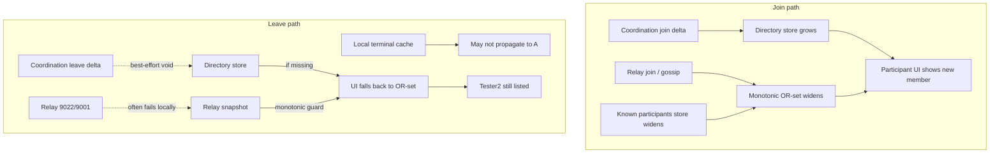

# Community membership truth — research & rewrite plan (2026-05)

**Status:** Research complete · **Roster/ghost path:** shipped on `main` (2026-05-27) · **Relay join after accept:** parked → v1.8.4 (not blocking v1.8.3 tag)  
**Audience:** Maintainers deciding v1.8.4+ community module rewrite

---

## Executive summary

The participant list does not update on leave because **membership truth is still fragmented** across six layers (coordination directory, monotonic OR-set roster, relay NIP-29 hints, known-participants store, terminal cache, presence). Join “works” because every layer **widens** on `join`; leave fails because most layers **refuse to shrink** without perfect relay evidence, and coordination `leave` is **best-effort fire-and-forget** from the leaver’s client.

This is the same class of problem as **v1.3.15 Nostr-only communities**, not a regression in presence. **Do not create a new group** as a workaround; fix or rewrite the membership truth owner.

**Recommended path:** Path B from [community-fork-decision-2026-05.md](./community-fork-decision-2026-05.md) — coordination directory is the **only** roster authority for `managed_workspace`; relay/Nostr is chat transport + hints only.

---

## External research (Nostr / NIP-29)

Sources: [NIP-29](https://github.com/nostr-protocol/nips/blob/master/29.md), [Nostrbook Kind 39002](https://nostrbook.dev/kinds/39002), [Nostr Compass NIP-29](https://nostrcompass.org/en/topics/nip-29/).

| NIP-29 fact | Product impact |
|-------------|----------------|
| Kind **39002** (group members) is **optional**; relay may omit or subset | Roster cannot be authoritative on public relays |
| Relays “might choose not to publish” member lists | Explains frozen / incomplete lists |
| **9022** leave → relay may emit **9001** remove — not guaranteed | Peer may never learn leave via relay |
| Correct per-member check: latest **9000** vs **9001** in timeline | Requires event-level reconstruction, not snapshot OR-set |
| Relay is **not trustless** for group state | Aligns with Path B: stop treating relay as membership owner |

**Conclusion:** Any design that treats relay roster (39002) or gossip as **membership truth** inherits Nostr’s drawbacks. Obscur’s pivot doc ([platform-pivot-private-trust-2026-05.md](./platform-pivot-private-trust-2026-05.md)) already states this; the **UI still behaved like NIP-29** (monotonic widen-only participant session).

---

## What the repo already decided (internal)

| Document | Decision |
|----------|----------|
| [community-fork-decision-2026-05.md](./community-fork-decision-2026-05.md) | Path B: coordination mandatory for workspace; public relay membership **infeasible** |
| [platform-pivot-private-trust-2026-05.md](./platform-pivot-private-trust-2026-05.md) | Membership = coordination head/deltas; Nostr = optional adapter |
| [community-directory-materialization-policy.ts](../../apps/pwa/app/features/groups/services/community-directory-materialization-policy.ts) | UI copy: “Join and leave applied from coordination directory” |

**Gap:** Implementation still merged relay snapshots and known-participants into a **monotonic OR-set** (`group-provider` `upsertCommunityRosterProjection`, `useCommunityParticipantRosterReadModel` with `applyTerminalMembershipExclusions: false` on discovery paths). Presence (online/offline) uses a **separate** network layer — so lists can show “Tester2 OFFLINE” forever while coordination never recorded `leave`.

---

## Why join updates but leave does not (asymmetric pipeline)

| Step | Join | Leave |
|------|------|-------|
| Coordination publish | `publishWorkspaceMemberJoin` (awaited on accept) | `publishCoordinationMembershipDelta` in `leaveGroup` — **void**, errors only logged |
| Directory on peer A | Poll / reconcile applies delta | Only if B’s delta reached server **and** A refreshed directory |
| Monotonic roster | Always merges new pubkey | **Refuses** to drop without leave evidence in same layer |
| Participant modal | Widens | Used `applyTerminalMembershipExclusions: false` until recent fix; still falls back if `headSeq === 0` |

---

## Why recent patches did not fix the screenshot

Observed: **both** Tester1 and Tester2 under **Online**, DIRECTORY badge, after B left.

Plausible causes (check in order on maintainer machine):

1. **Coordination never received B’s `leave`** — desktop WebView cannot POST to `127.0.0.1:8787` (G6-4 deferred in handoff); B’s leave is local-only.
2. **A’s directory never refreshed** — incremental fetch failed; `headSeq === 0` → UI **falls back** to monotonic roster (still contains B).
3. **Directory materialization still has B active** — only `join` deltas in DB; reconcile not run on A after B left.
4. **`communityId` mismatch** — leave published under `groupId` but directory keyed differently (less likely; code uses `communityId ?? groupId` consistently).

**Not the cause:** Presence — online/offline is independent and working.

---

## Rewrite: one module, three consumers

Replace parallel roster owners with **`community-membership-truth`** (name TBD):

| Export | Consumer | Rule |
|--------|----------|------|
| `activeMemberPubkeys` | Participant modal, group home, admin actions | Coordination materialization when `managed_workspace` + coordination configured |
| `inviteBlocklistPubkeys` | Invite dialogs | Same as `activeMemberPubkeys` |
| `leftMemberPubkeys` / `expelledMemberPubkeys` | “Former members” section (optional UI) | From coordination + local terminal |
| `syncStatus` | Toolbar chip | `fresh` \| `stale` \| `unconfigured` \| `error` |
| `refresh({ forceFull })` | Reconcile button, modal open | Single code path |

**Delete or demote for workspace mode:**

- `upsertCommunityRosterProjection` monotonic merge as **truth** (keep only as relay-chat hint if needed).
- `applyTerminalMembershipExclusions: false` on any **managed_workspace** surface.
- `resolveWorkspaceActionMemberPubkeys` using `communityRosterByConversationId.activeMemberPubkeys` (monotonic).

**Keep separate:**

- **Presence** (`useNetwork` / `PresenceBadge`) — never membership truth.
- **Sealed chat** — room key + relay publish; membership does not gate ciphertext.

---

## UI rewrite (participant modal)

| Current | Target |
|---------|--------|
| ONLINE / OFFLINE split of same stale set | **Members** (coordination active) + **Former** (coordination left) + presence only on active |
| “DIRECTORY” chip on relay-backed tier | “Coordination” when sync fresh; “Stale — reconcile” when not |
| Reconcile clears provisional + relay only | Reconcile = **forceFull** coordination directory + apply semantic events |
| Subtitle claims coordination | Match behavior: hide monotonic fallback when coordination configured |

---

## Leave pipeline rewrite

| Current | Target |
|---------|--------|
| `void publishCoordinationMembershipDelta(...)` | **Await** publish; toast on failure; block “leave complete” UX until local terminal + coordination ACK or explicit offline mode |
| Relay leave best-effort | Keep as hint; do not use for roster |
| Sealed 10105 leave | Keep for chat; notify peers to **reconcile**, not to infer roster from gossip |

---

## Release gate (K-M1 / K-M2 matrix)

Two profiles, coordination on `127.0.0.1:8787`, trusted relay `localhost:7000`:

| # | Action | Pass criteria |
|---|--------|----------------|
| 1 | B joins | A sees B in **Members** within poll/reconcile window |
| 2 | B leaves | B gone from A **Members** without new group |
| 3 | A invites B | Enabled after leave |
| 4 | B accepts | A sees B again |
| 5 | Restart A | Roster matches coordination after one reconcile max |
| 6 | B leave + coordination down | A shows stale banner; reconcile recovers when coordination returns |

Automated: materializer tests (exist), truth port tests, integration test “directory active excludes left peer”.

---

## Do not ship

- Another patch only to `useCommunityParticipantRosterReadModel` without removing monotonic fallback for workspace.
- New group as “fix” for membership drift.
- Sovereign / public-relay communities as default create path ([fork decision](./community-fork-decision-2026-05.md)).

---

## Suggested implementation order (v1.8.4)

1. **`community-membership-truth.ts`** + hook `useCommunityMembershipTruth(communityId)`  
2. Wire participant modal + invite to truth only; **no monotonic fallback** when coordination configured  
3. Modal open → `refresh({ forceFull: true })`  
4. Leave → await coordination publish + user-visible failure  
5. Optional “Former members” column from `leftMemberPubkeys`  
6. Remove OR-set merge from workspace roster projection (separate PR)  
7. Manual two-profile matrix → tag release  

---

## References in codebase

| Area | Path |
|------|------|
| Coordination materializer | `apps/pwa/app/features/groups/services/community-coordination-membership-materializer.ts` |
| Directory store | `apps/pwa/app/features/groups/services/community-coordination-membership-directory-store.ts` |
| Leave publish | `apps/pwa/app/features/groups/hooks/use-sealed-community.ts` (`leaveGroup`) |
| Monotonic OR-set | `apps/pwa/app/features/groups/providers/group-provider.tsx` |
| Participant modal | `apps/pwa/app/groups/[...id]/group-home-page-client.tsx` |
| NIP-29 leave | `apps/pwa/app/features/groups/services/group-service.ts` |
