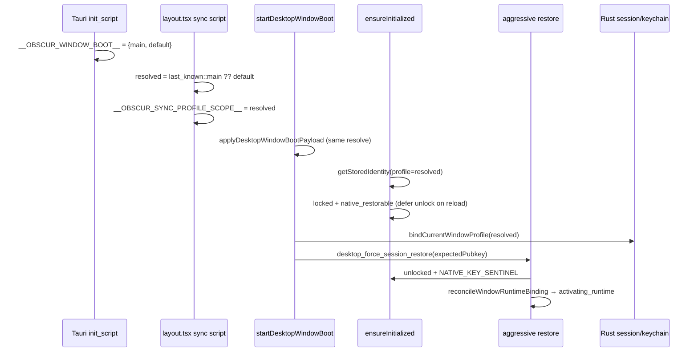

# Desktop F5 session restore — codebase analysis (2026-06-17)

**Symptom:** Signed-in user (e.g. TESTER1) presses F5 → "Welcome Back" login screen. Title bar may still show the profile name.

**Status:** Root cause identified in `apps/pwa/app/layout.tsx` inline boot script (clobber). Fix applied same date.

---

## Architecture: three tiers of session

| Tier | What | Survives F5? | Owner |
|------|------|--------------|-------|
| 1 — In-memory | Identity `unlocked` + Rust `SessionState` keys | JS: no. Rust process: yes until cleared | `use-identity.ts`, `session.rs` |
| 2 — OS keychain | `nsec::{profileId}` via `init_native_session` | Yes | `commands/session.rs`, `native_keychain.rs` |
| 3 — IndexedDB identity | `identity::{profileId}` encrypted record | Yes | `get-stored-identity.ts` |

Desktop policy (`session-credential-policy.ts`):

- `SESSION_AUTO_UNLOCK_ENABLED = false` — no passphrase in `localStorage`
- `NATIVE_SECURE_SESSION_RESTORE_ENABLED = true` — restore from keychain only
- F5 must re-hydrate tier 2 → tier 1; tier 3 supplies expected pubkey for mismatch checks

---

## Intended F5 flow



---

## What was broken (root cause)

### `layout.tsx` lines 100–118 (before fix)

On **every** document load, an inline script ran **before** React:

```javascript
window.__OBSCUR_SYNC_PROFILE_SCOPE__ = boot.profileId;  // always "default" on main window
localStorage.setItem('...last_known.v1::main', boot.profileId);  // OVERWRITE
```

Tauri hardcodes main window boot payload (`lib.rs:190-191`):

```rust
window.__OBSCUR_WINDOW_BOOT__={windowLabel:"main",profileId:"default",...}
```

**Effect:** Any non-default profile (TESTER1) had `last_known` reset to `default` on every F5 **before** any React restore code ran. Later fixes in `applyDesktopWindowBootPayload` could not recover—the cache was already destroyed.

**Why title bar still showed TESTER1:** Native profile snapshot (`desktop_get_profile_isolation_snapshot`) can return the correct Rust registry binding while JS identity scope pointed at `default` IndexedDB — UI chrome vs auth state diverged.

### Secondary amplifiers

1. **`ensureInitialized` defers unlock on reload** (`use-identity.ts:543-545`) — 100% dependence on post-boot aggressive restore; any scope bug → login screen.

2. **`auth-gateway` disables single-attempt restore on reload** (`auth-gateway.tsx:144`) — no fallback path.

3. **`init_native_session` uses Rust window profile at unlock time** (`session.rs`) — if scope was `default` during login, keychain entry may be under `default` while identity metadata thinks another profile (mitigated by `desktop_force_session_restore` cross-profile scan if expected pubkey is correct).

4. **`staySignedIn=false`** calls `logout_native` and **deletes keychain** (`use-identity.ts:316-318`) — consent flag in `localStorage` must not be `"false"`.

---

## Login → keychain persist (verified)

Password unlock **does** call keychain persist when stay-signed-in is true (default):

1. `unlockIdentityAction` → `applyNativeSessionPersistence` (`use-identity.ts:778`)
2. `syncNativeSessionInBackground` → `initNativeSession(privateKeyHex)` (`use-identity.ts:328-339`)
3. Rust `init_native_session` → `write_nsec_for_profile(profile_id)` (`commands/session.rs`)

Stay-signed-in defaults to **true** when no explicit `false` in storage (`device-session-consent.ts:27`).

Persist failures are logged to `sessionStorage` via `native-session-persist-feedback.ts` — check after unlock if restore still fails.

---

## What does NOT clear session on F5

| Mechanism | Clears keychain on F5? |
|-----------|------------------------|
| `clear_native_session` / lock | No (in-memory only) |
| `pagehide` handlers | No |
| `lockIdentity` | No (unless user action) |
| F5 itself | No |

Re-login means **restore failed**, not credentials deleted by reload.

---

## Profile scope resolution order

`read-active-desktop-profile-id.ts`:

1. `__OBSCUR_SYNC_PROFILE_SCOPE__` (set by layout + boot)
2. `last_known::{windowLabel}` ?? boot `profileId`
3. Legacy global `last_known`
4. Registry `activeProfileId`
5. `"default"`

Identity DB key: `identity::{profileId}` (`identity-db-key.ts`).

Rust IPC always uses `resolve_profile_for_window` (registry), not JS scope alone.

---

## Aggressive restore (current)

`native-session-reload-restore.ts`:

- Max **5** attempts, 350ms delay, global budget per page load
- `desktop_force_session_restore` — hydrate + scan all profiles for matching pubkey (`commands/session.rs`)
- Called from `desktop-window-boot` after bind + refresh

Safe against prior infinite-loop freeze: no reset of attempt budget on `profileId` changes.

---

## Fix applied (2026-06-17)

**`layout.tsx` inline script** now matches `resolveDesktopWindowBootProfileId`:

- Read `last_known::{windowLabel}` first
- `resolved = cached || boot.profileId`
- Set sync scope and cache to **resolved**, never blind overwrite with `default`

---

## Verification checklist

After rebuild:

1. Sign in as TESTER1 on main window
2. DevTools → Application → Local Storage:
   - `obscur.desktop.window_profile.last_known.v1::main` should be **your real profile id**, not `default`
3. F5 — value must **unchanged**
4. Should land in chat without login
5. If still fails: check `sessionStorage` for `obscur_native_session_persist_error::{profileId}`

```bash
taskkill //F //IM obscur_desktop_app.exe
pnpm dev:desktop:no-coord -- --rebuild
```

---

## Future hardening (not yet implemented)

1. **Single restore owner** — merge `ensureInitialized` defer + boot + auth-gateway into one post-bind path
2. **Await `initNativeSession`** before swapping to `NATIVE_KEY_SENTINEL` so fast F5 after login cannot outrun keychain write
3. **Rust main window boot payload** — inject resolved profile from registry instead of hardcoded `default`
4. **Remove duplicate scope logic** — one shared function for layout script + TS boot payload
