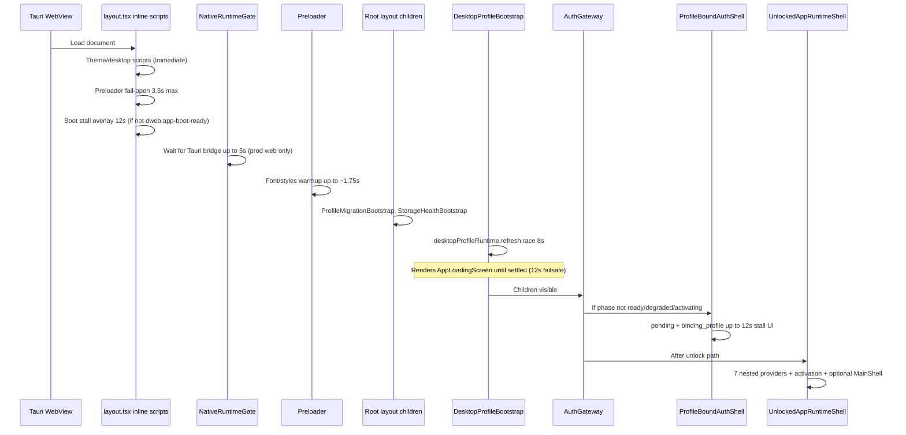
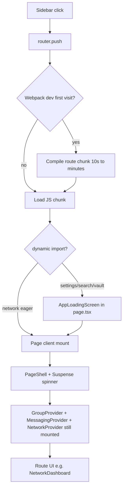
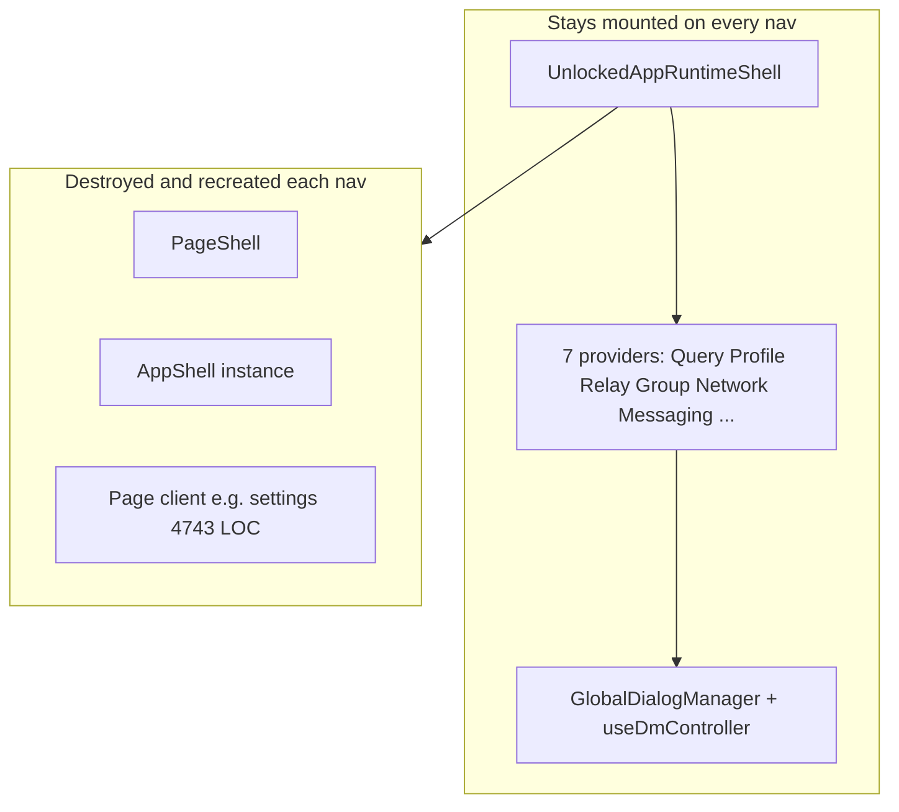
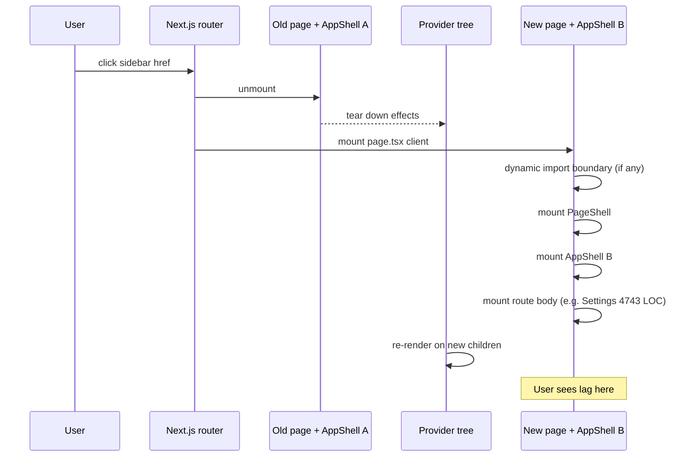

# Obscur startup & first-navigation investigation (2026-05)

**Scope:** Desktop dev (`pnpm dev:desktop` → `next dev --webpack` on port 3340) with experiment shell active.  
**Symptoms:** Blank/black screen for **>60s** at startup; **lag on every navigation to any page** (not only first visit or one route).  
**Method:** Full boot-chain + **per-navigation architecture** trace. No incremental patch claims.

---

## Executive summary

Performance problems are **not a single bug**. They are two overlapping systems:

1. **Startup** — sequential gates before the unlocked provider tree paints.
2. **Every navigation** — architectural remount of the entire page shell (sidebar + `AppShell`) on each route change, plus large per-route client bundles and always-on global controllers.

Experiment shell mitigates relay loops, defers some SQLite, and stops `MainShell` from mounting off `/`. It does **not** fix:

- Profile/auth boot gates.
- **`AppShell` / `PageShell` destroyed and recreated on every sidebar click.**
- **`GlobalDialogManager` + `useDmController` mounted on every page** (not only chat).
- **Multi-thousand-line route clients** (settings ~4.7k LOC) parsing and running mount effects on each entry.
- **Webpack dev compile** when a route module has not been loaded yet (feels like lag on “any new page” in dev).

Until chrome is **persistent** and route bodies are **thin**, per-navigation lag is **structural**, not tunable away hook-by-hook.

---

## Symptom A: long blank screen at startup

### What “blank” can mean (check which you see)

| Appearance | Likely layer |
|------------|----------------|
| Pure black, no UI at all | Webview waiting on **Next dev compile**, body boot scripts, or main-thread freeze before first paint |
| “Starting Obscur” card | `DesktopProfileBootstrap` blocking `AppProviders` |
| Pulsing Obscur logo (center) | `ProfileBoundAuthShell` — `binding_profile` / `pending` startup |
| Login / welcome auth UI | Past boot gates; slowness is **unlock + provider mount** |
| UI then freezes | Post-paint **provider hydration** or relay/render loop (partially mitigated by experiment shell) |

### Startup timeline (sequential gates)



### Gate details (files & budgets)

| Order | Component | Max / typical block | Blocks tree? |
|-------|-----------|---------------------|--------------|
| 1 | `layout.tsx` boot scripts | Preloader release **3.5s**; stall overlay **12s** | Can overlay; body should become visible |
| 2 | `NativeRuntimeGate` | **5s** if web prod without bridge | Entire app |
| 3 | `Preloader` | **~1.75s** bounded warmup | No (null render) |
| 4 | `StorageHealthBootstrap` | Async IDB health | No |
| 5 | `ProfileMigrationBootstrap` | `runProfileMigrationV088()` | No |
| 6 | **`DesktopProfileBootstrap`** | **`refresh()` race 8s`**, failsafe **12s** | **Yes — no `AppProviders` until settled** |
| 7 | `AuthGateway` | Until `ready` / `degraded` / `activating_runtime` | **Yes — no unlocked shell** |
| 8 | `ProfileBoundAuthShell` | `pending` + `binding_profile` **12s** before stall UX | **Yes — auth UI** |
| 9 | `useIdentity` `ensureInitialized` | Native DB open / identity load | Indirect via runtime sync |
| 10 | `UnlockedAppRuntimeShell` | All providers at once | Heavy first paint after unlock |

**Key file — profile boot blocks everything:**

```185:188:apps/pwa/app/features/profiles/components/desktop-profile-bootstrap.tsx
  if (!bootstrapSettled) {
    return (
      <AppLoadingScreen
        title="Starting Obscur"
```

**Key file — auth blocks unlocked tree:**

```244:248:apps/pwa/app/features/auth/components/auth-gateway.tsx
  if (runtime.snapshot.phase === "activating_runtime" || runtime.snapshot.phase === "ready" || runtime.snapshot.phase === "degraded") {
    return <>{children}</>;
  }
  return <ProfileBoundAuthShell />;
```

**Native IPC on profile refresh:** `desktopProfileRuntime.refresh()` uses Tauri invoke with **8s startup deadline** and **25s** snapshot timeout (`desktop-profile-runtime.ts`). Slow SQLite or plugin init here consumes the whole “Starting Obscur” phase.

### Experiment shell and startup blank

Experiment shell **does not shorten** gates 6–8. It only affects behavior **after** `AuthGateway` releases children. If blank persists **before** login or **before** sidebar, investigation must target **DPB + auth + dev compile**, not relay pool.

### Dev-environment multiplier: `next dev --webpack`

```7:7:apps/desktop/src-tauri/tauri.conf.json
    "beforeDevCommand": "cross-env NEXT_PUBLIC_DESKTOP_SHELL=1 TAURI_BUILD=true pnpm -C ../pwa exec next dev --webpack --hostname 127.0.0.1 --port 3340",
```

On cold start the WebView often loads **before** webpack finishes compiling the app shell. That can present as **minute-long black** with no React UI — not fixable by in-app deferral. **Verify:** open `http://127.0.0.1:3340` in Chrome during startup; if the tab is blank until “compiled”, the bottleneck is **build**, not hydration.

**Contrast:** Production desktop uses static `out/` (`beforeBuildCommand: build:pwa-shell`) — no on-demand compilation. Always compare prod shell when separating “app logic” vs “dev tooling”.

---

## Symptom B: first visit to a sidebar route lags

### Navigation architecture

| Route | Page entry | Client load | Shell wrapper |
|-------|------------|-------------|---------------|
| `/` | `app/page.tsx` → `null` | **MainShell** (~3900 lines) via `ChatRouteMainShell` | MainShell → `AppShell` |
| `/network` | `network/page.tsx` | **Eager** `network-page-client` | `PageShell` → **`AppShell`** |
| `/settings` | `settings/page.tsx` | **`dynamic()`** → large client | `PageShell` → `AppShell` |
| `/search` | `search/page.tsx` | **`dynamic()`** | `PageShell` → `AppShell` |
| `/vault` | `vault/page.tsx` | **`dynamic()`** | `PageShell` → `AppShell` |

**Nested shell:** Every non-chat route uses `PageShell`, which always wraps content in **`AppShell`** (`page-shell.tsx` line 31). Chat route uses **`AppShell`** inside `MainShell`. Only one `AppShell` instance per route, but **`AppShell` runs pathname effects on every navigation** (transition overlay, mount probes, stall watchdog — reduced in experiment mode, not removed).

### First-visit cost stack



| Cost | Evidence | Experiment mitigated? |
|------|----------|------------------------|
| Webpack compile on first `/settings` visit | `next dev --webpack`; no persistent route bundle | **No** |
| `dynamic()` loading boundary | `settings/page.tsx`, `search/page.tsx`, `vault/page.tsx` | **No** (network only made eager) |
| Large module graph | `settings-page-client.tsx` very large; `network-dashboard` + `useEnhancedDmController` | Partially |
| Provider tree still mounted | `UnlockedAppRuntimeShell` always wraps children | Partially (MainShell off-route) |
| `NetworkDashboard` hydration spinner | Waits `hasHydrated` + peerTrust + requestsInbox | **Yes** (fast local hydrate) |
| `useEnhancedDmController` on network | `network-dashboard.tsx` 98–107 | **No** (still mounted) |
| `preloadGroupHomePageClient` on network mount | `network-page-client.tsx` idle preload | Adds background work |
| Group membership hydrate | `hydrateGroupsForPublicKey` deferred 12s in experiment | Deferred, not removed |

### Dynamic import map (still active)

```5:14:apps/pwa/app/settings/page.tsx
const SettingsPageClient = dynamic(() => import("./settings-page-client"), {
  loading: () => (
    <AppLoadingScreen
```

Warmup skipped in experiment (`app-shell.tsx`), so **first click** pays full dynamic import + dev compile.

### Route warmup infrastructure (unused in experiment)

```8:13:apps/pwa/app/components/route-navigation-warmup.ts
export const ROUTE_CLIENT_CHUNK_LOADERS: Readonly<Record<string, () => Promise<unknown>>> = {
  "/network": () => import("@/app/network/network-page-client"),
  "/vault": () => import("@/app/vault/vault-page-client"),
  "/search": () => import("@/app/search/search-page-client"),
  "/settings": () => import("@/app/settings/settings-page-client"),
};
```

Designed to preload chunks on idle; **disabled when experiment shell enabled** to reduce startup work — trades startup for ** colder first navigation**.

---

## Provider monolith at unlock (post-auth freeze source)

`UnlockedAppRuntimeShell` mounts **all** subsystems in one tree:

```17:37:apps/pwa/app/features/runtime/components/unlocked-app-runtime-shell.tsx
    <TanstackQueryRuntimeProvider>
      <ProfileRuntimeProvider>
        <RelayProvider>
          <GroupProvider>
            <NetworkProvider>
              <RuntimeActivationManager />
              <MessagingProvider>
                <RuntimeMessagingTransportOwnerProvider>
```

| Provider | Still heavy in experiment? | Notes |
|----------|---------------------------|-------|
| `GroupProvider` | Yes (hydrate deferred) | Large coordinator + bus subscriptions when not experiment-gated |
| `MessagingProvider` | Yes (fast hydrate + idle full) | SQLite conversations/tombstones on idle |
| `ProfileRuntimeProvider` | Yes (tombstones idle) | |
| `NetworkProvider` | Reduced | Noop presence in experiment |
| `RelayProvider` | Stubbed | `ExperimentRelayShell` |
| `RuntimeMessagingTransportOwnerProvider` | Disabled | |
| `MainShell` | **Off-route only** | `ChatRouteMainShell` — major win for `/network` |

**`useWindowRuntime`** (identity + desktop snapshot sync) runs in auth and runtime components; `bindProfile` + `syncIdentity` effects run on many dependency changes (`window-runtime-supervisor.ts` 428–443).

---

## ranked root causes (evidence-based)

### P0 — Environment / toolchain

1. **`next dev --webpack` compile-on-demand** — Can dominate first minute with black webview; first route visit triggers second compile wave.
2. **No prod-shell comparison in reports** — `build:pwa-shell` + Tauri `frontendDist` removes dev compiler from the path.

### P1 — Sequential boot gates (pre-UI)

3. **`DesktopProfileBootstrap` blocks entire app** until native profile `refresh()` (8s race, 12s failsafe).
4. **`AuthGateway` + `ProfileBoundAuthShell`** — Additional `binding_profile` / `pending` UI up to 12s stall path.
5. **`useIdentity` initialization** — Native identity DB; errors surface as long “loading” phases.

### P2 — Architecture (post-unlock)

6. **Monolithic provider mount at unlock** — All domains initialize together.
7. **First-navigation dynamic imports** — Settings/search/vault still `dynamic()`.
8. **Large route clients** — MainShell, settings client, network dashboard + duplicate DM controller hook.
9. **`PageShell` → `AppShell` per route** — Navigation instrumentation and Suspense boundaries on every secondary route.

### P3 — Partially addressed by experiment shell

10. Relay WebSocket + recovery loops (stubbed).
11. Account projection/sync bootstrap at unlock (short-circuited).
12. MainShell hooks on non-chat routes (gated).
13. Triple hydration spinner on network (fast `hasHydrated`).

---

## What experiment shell changed (and did not)

| Changed | Did not change |
|---------|----------------|
| Relay transport stub | Profile bootstrap gate |
| Fast messaging `hasHydrated` | Auth/runtime phase machine |
| `ChatRouteMainShell` | Webpack dev compile |
| Idle SQLite/tombstones | Dynamic settings/search/vault pages |
| Noop presence | `GroupProvider` weight (deferred only) |
| Nav transition/watchdog off | `useEnhancedDmController` on network page |
| Network page eager import | Settings chunk size |

---

## Recommended investigation protocol (before more code)

### 1. Separate dev vs prod shell

```bash
# Prod-like (no webpack dev server)
pnpm run build:pwa-shell
# Run Tauri against out/ per desktop README
```

If prod is fast and dev is slow → **toolchain track**, not more React gates.

### 2. Timestamp boot phases

In DevTools Performance, mark:

- First paint / first contentful paint
- When `DesktopProfileBootstrap` releases (children appear)
- When `AuthGateway` shows unlocked shell
- When sidebar becomes clickable

Or enable existing `logAppEvent` streams: `runtime.profile_binding_*`, `runtime.activation.*`, `auth.auto_unlock_*`.

### 3. First-navigation A/B

| Action | Measure |
|--------|---------|
| Visit `/settings` first time (cold) | Network tab: JS compile; Performance: long tasks |
| Visit `/settings` second time | Should be fast if compile was the issue |
| Visit `/network` first time | Should be faster (eager import) |

### 4. Confirm experiment shell active

Bottom-right **“Experiment shell”** badge must be visible. If missing, env inlining bug may have returned (see `experiment-shell-policy.ts` — static `process.env.NEXT_PUBLIC_*` only).

---

## Subtraction lanes (not patch loops)

These are **architecture** responses aligned with experiment charter; each should be a deliberate band, not mixed tuning.

| Lane | Action | Targets symptom |
|------|--------|----------------|
| **S0** | Prod-shell QA matrix | Dev vs prod |
| **S1** | **Staged boot shell** — paint chrome after DPB with empty providers; defer Group/Messaging/Network until route needs | Startup blank |
| **S2** | **Eager desktop route bundles** — static imports for all `NAV_ITEMS` in desktop build; or single `sidebar-routes` entry | First nav |
| **S3** | **Route-owned providers** — mount `GroupProvider` only on `/` and `/groups/*`; `NetworkProvider` only on `/network` | Unlock + nav |
| **S4** | **Remove duplicate controllers** — network page must not mount `useEnhancedDmController` when global transport disabled | Network lag |
| **S5** | **Profile boot fail-open** — render shell with `default` profile in &lt;500ms; refresh in background | DPB blank |
| **S6** | **Dev: turbopack or prebuilt dev bundle** — stop using webpack cold-compile in Tauri loop | Dev blank |

**Do not:** re-enable full relay + projection + warmup simultaneously “to test”; that recreates the render-loop failure mode.

---

## File index (investigation entry points)

| Topic | Path |
|-------|------|
| Root boot scripts | `apps/pwa/app/layout.tsx` |
| Profile boot gate | `apps/pwa/app/features/profiles/components/desktop-profile-bootstrap.tsx` |
| Auth gate | `apps/pwa/app/features/auth/components/auth-gateway.tsx`, `profile-bound-auth-shell.tsx` |
| Runtime phases | `apps/pwa/app/features/runtime/services/window-runtime-supervisor.ts` |
| Provider tree | `apps/pwa/app/features/runtime/components/unlocked-app-runtime-shell.tsx` |
| Chat route gate | `apps/pwa/app/features/runtime/components/chat-route-main-shell.tsx` |
| Experiment policy | `apps/pwa/app/features/runtime/experiment-shell-policy.ts` |
| Nav / transitions | `apps/pwa/app/components/app-shell.tsx`, `page-shell.tsx` |
| Route chunks | `apps/pwa/app/components/route-navigation-warmup.ts`, `*/page.tsx` |
| Network UI | `apps/pwa/app/features/network/components/network-dashboard.tsx` |
| Desktop dev command | `apps/desktop/src-tauri/tauri.conf.json` |
| Handoff | `docs/handoffs/current-session.md` |
| S0 baseline protocol | `docs/program/obscur-shell-perf-baseline-s0.md` |
| Experiment charter | `docs/program/obscur-experiment-reset-2026-05.md` |

---

## Next atomic step (investigation complete → decision)

1. Run **prod-shell** cold start once; record time-to-sidebar vs dev.
2. If dev-only: treat **S6** as prerequisite for any further in-app work.
3. If prod also blank >30s: implement **S5** (profile fail-open) + **S1** (staged providers) as the next experiment band — not relay tuning.

**Handoff:** Update `docs/handoffs/current-session.md` when S0 prod comparison is done.

---

## Part II: Universal lag on every page navigation

> User report: no single stage — **any** loaded page lags when navigating. This section models that as the default outcome of current routing architecture, not as isolated route bugs.

### Core finding: there is no persistent app chrome

Next.js App Router has **only** `app/layout.tsx` above pages. There is **no** `app/(shell)/layout.tsx` (or equivalent) that keeps sidebar + `AppShell` mounted while swapping route content.

Every sidebar route embeds its own chrome:

```31:31:apps/pwa/app/components/page-shell.tsx
    <AppShell navBadgeCounts={navBadgeCounts} hideHeader={props.hideHeader}>
```

Chat is different: `MainShell` embeds its **own** `AppShell` (~3900 LOC tree). Non-chat routes use `PageShell` → **another** `AppShell`.



**Consequence:** Clicking Network → Settings does not “switch a view inside the app.” It **unmounts** the entire Network tree (including its `AppShell`) and **mounts** a fresh Settings tree (new `AppShell`, new effects, new Suspense boundary). That matches “lag on every page” even on repeat visits.

### What runs on every navigation (invariant checklist)

| Step | Always? | Cost driver |
|------|---------|-------------|
| Next.js client navigation / RSC payload | Yes | Framework + route module |
| Previous `page.tsx` client unmount | Yes | Full subtree teardown |
| New `page.tsx` client mount | Yes | Parse + init large module graph |
| **New `AppShell` mount** | Yes (per route) | ~950 lines component + pathname effects |
| **New `PageShell` mount** | Yes | Extra Suspense + header |
| Provider tree **re-render** (children swap) | Yes | All context consumers downstream |
| `GlobalDialogManager` | Stays mounted | `useEnhancedDmController` always active |
| `GroupProvider` / `MessagingProvider` | Stay mounted | Re-render + any pathname-agnostic effects |
| `ChatRouteMainShell` | Only on `/` | Off `/` returns null (good) |
| Webpack dev recompile | If module cold | Dev-only; feels like “this page is slow” |

### AppShell remount tax (repeat visits included)

`AppShell` (`app-shell.tsx`) attaches multiple `useEffect` hooks to **`pathname`**. On a **new instance** (every route entry via `PageShell`), effects run on **mount** as well:

| Effect | Experiment shell | Still runs on new AppShell instance? |
|--------|------------------|--------------------------------------|
| Intelligent nav warmup | Skipped | Cleanup only |
| Page transition overlay | Disabled (`arePageTransitionsEnabled` false) | Early return; still allocates sequence |
| Route mount probe (2× rAF + timers) | **Skipped entirely** | No |
| Route stall hard fallback (4.5s timer) | Skipped on arm | No |
| `setMobileSidebarOpen(false)` | Yes | Yes |
| Escape → `router.push("/")` listener | Re-registered | Yes |

Even with experiment mitigations, **remounting `AppShell` on every nav** repeats React work and re-binds listeners. This is independent of “first visit.”

### Chat ↔ sidebar switch is the worst remount

| Transition | What unmounts | What mounts |
|------------|---------------|-------------|
| `/` → `/network` | `MainShell` + inner `AppShell` + entire DM UI | `NetworkPageClient` + `PageShell` + new `AppShell` |
| `/network` → `/` | Network tree + `AppShell` | `MainShell` + `AppShell` + `useDmSync` + chat subtree |
| `/network` → `/settings` | Network `AppShell` | Settings `AppShell` (another new instance) |

There is **no shared** sidebar state between chat and other routes (scroll position, warmed prefetch sets inside that `AppShell` instance, transition recovery counters).

### Per-route bundle weight (sidebar NAV_ITEMS)

| Route | Page entry | Client size (LOC) | `dynamic()` in `page.tsx` |
|-------|------------|-------------------|---------------------------|
| `/` | `page.tsx` → null | **MainShell 3919** (when mounted) | No |
| `/network` | eager `network-page-client` | **NetworkDashboard 950** + page wrapper | No (eager) |
| `/settings` | `settings/page.tsx` | **settings-page-client 4743** | **Yes** |
| `/search` | `search/page.tsx` | **search-page-client 1793** | **Yes** |
| `/vault` | `vault/page.tsx` | **vault-page-client 113** | **Yes** |

Related heavy routes (not in sidebar, same pattern):

| Route | Client LOC | Notes |
|-------|------------|--------|
| `/groups/[...id]` | **1763** | Eager `group-home-page-client`; `useSealedCommunity` etc. |
| `/network/[pubkey]` | profile views | Nested under network surface |

**Settings is the extreme outlier:** one file larger than MainShell. Any navigation to Settings mounts that graph from a cold component tree (plus `dynamic()` boundary in dev).

### Double loading boundaries (per non-chat route)

1. **`page.tsx`** — `dynamic(() => import("*-page-client"))` shows `AppLoadingScreen` until chunk evaluates (settings/search/vault).
2. **`PageShell`** — inner `React.Suspense` with spinner around children.

Network avoids (1) after eager import change; still has (2).

### Always-on global work (explains lag “on every page”)

These mount at unlock and **do not** unmount when changing routes:

| Component | Why it hurts every page |
|-----------|-------------------------|
| **`GlobalDialogManager`** | Calls `useEnhancedDmController` with relay pool + network context; pulls GroupService, SocialGraphService, ProfileSearchService, crypto, trust policy |
| **`GroupProvider`** | Membership hydrate (deferred in experiment); large context |
| **`MessagingProvider`** | Chat state; SQLite idle loads |
| **`NetworkProvider`** | peerTrust, requestsInbox, blocklist (presence stubbed in experiment) |
| **`ProfileRuntimeProvider`** | Gateway + tombstones |
| **`RuntimeActivationManager`** | Activation side effects |
| **`TanstackQueryRuntimeProvider`** | Subscribes to `useWindowRuntime` + identity (re-renders on runtime sync) |

So navigation lag is **page mount + global re-render**, not “only the page you clicked does work.”

### `useDmController` instances (transport stack)

| Location | Mounted when |
|----------|----------------|
| `GlobalDialogManager` | **Every unlocked page** |
| `network-dashboard.tsx` | `/network` only |
| `network-profile-view.tsx` | Network profile routes |
| `connection-request-inbox.tsx` | When that UI mounts |
| `runtime-messaging-transport-owner-provider` | Every page (disabled in experiment) |
| MainShell | `/` only via `useDmSync` (not raw controller) |

**At minimum two transport-related setups** can exist: global dialog manager + page-level (network). Experiment disables runtime transport owner but **not** `GlobalDialogManager`.

### Provider re-render cascade

`UnlockedAppRuntimeShell` structure:

```17:31:apps/pwa/app/features/runtime/components/unlocked-app-runtime-shell.tsx
    <TanstackQueryRuntimeProvider>
      <ProfileRuntimeProvider>
        <RelayProvider>
          <GroupProvider>
            <NetworkProvider>
              ...
              {props.children}  // ← entire page swapped here
```

When `children` changes (navigation), React reconciles from the page boundary upward. Parents re-render; any hook without memoized children (most providers) runs render path for **all** descendants’ context consumers.

`useWindowRuntime` is used in auth, activation, tanstack provider, dialogs — identity/desktop snapshot sync effects can fire independently of route.

### Why “first visit” and “every visit” feel the same

| Perception | Mechanism |
|------------|-----------|
| First time opening Settings is awful | Webpack compiles ~4743 LOC module + `dynamic()` + full `AppShell` mount |
| Second time opening Settings still bad | **New `AppShell` + new `PageShell` + full Settings mount** every time; only webpack compile is gone |
| Every sidebar item lags | Invariant remount + route-specific client size |
| Blank then UI | Startup gates (Part I) **or** dev compile **or** loading boundaries stacking |

### Experiment shell vs universal navigation

| Mitigated | Not mitigated |
|-----------|----------------|
| MainShell off non-chat routes | `AppShell` still per-page |
| Relay / presence / transport owner | `GlobalDialogManager` dm controller |
| Nav warmup (reduces background prefetch) | No eager settings/search/vault |
| Fast `hasHydrated` | Full settings/search mount |
| Mount probe / transition watchdog | Provider re-renders |

### Dev vs prod (still required)

In **dev**, each route’s JS module may be compiled on first execution. User experience: “every new page lags” = **structural remount + compile**. In **prod** (`out/`), compile is gone but **remount + bundle size remain**.

### Subtraction lanes — navigation (N-series)

These target **invariant** per-nav cost, not startup-only.

| Lane | Change | Fixes |
|------|--------|-------|
| **N1 — Persistent chrome layout** | Add `app/(authenticated)/layout.tsx`: one `AppShell` + sidebar; `children` = route body only | `AppShell` remount every click |
| **N2 — Thin route pages** | `*-page-client` only renders surface content; no `PageShell` wrapper | Double shell, Suspense stack |
| **N3 — Lazy global dialogs** | Mount `GlobalDialogManager` / `useDmController` only when create-chat or create-group opens | Always-on transport on vault/settings |
| **N4 — Desktop eager route bundle** | Single `sidebar-routes.ts` static imports all NAV chunks in desktop build | `dynamic()` + cold chunk per route |
| **N5 — Split settings** | Settings tabs as `dynamic()` sub-chunks inside one route | 4743 LOC initial parse |
| **N6 — Prod-shell perf baseline** | Measure navigation in `out/` without webpack | Separates toolchain from architecture |

**N1 is the highest leverage:** matches how SPA routers are usually structured (one layout, outlet for pages). Current design fights Next.js App Router defaults.

### Universal navigation sequence (reference)



### Investigation commands (navigation)

1. React DevTools **Profiler**: record Network → Settings → Network; count commits on `AppShell`, `GroupProvider`, `settings-page-client`.
2. Performance tab: long tasks on navigation; note if `Evaluate Script` dominates (bundle parse).
3. Compare same sequence in **prod shell** vs `next dev`.
4. Confirm: two `AppShell` instances never exist simultaneously, but a **new** one appears every nav (component tree in DevTools).

---

## Updated priority order (startup + navigation)

| Priority | Lane | Symptom |
|----------|------|---------|
| P0 | S6 / S0 | Dev compile vs prod; don’t optimize React while webpack is compiling |
| P1 | **N1 persistent layout** | Every navigation |
| P1 | S5 profile fail-open | Startup blank |
| P2 | **N3 lazy GlobalDialogManager** | Every page baseline |
| P2 | **N4 + N5** route bundles | Settings/search first paint |
| P3 | S1 staged providers | Unlock freeze |
| P3 | N2 thin pages | After N1 |
