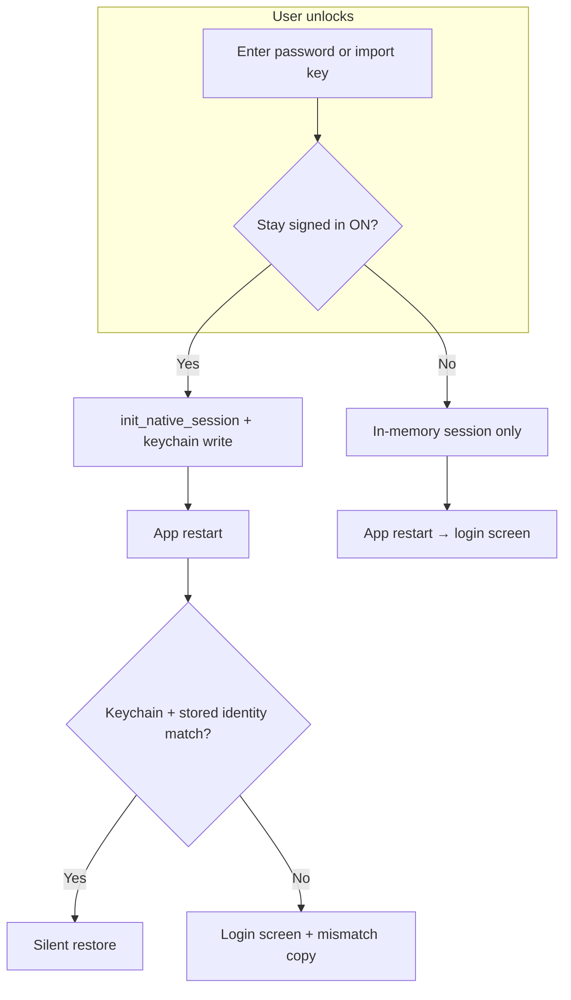

# v1.9.6 — Session persistence redesign

**Status:** Slices A–C landed; **desktop restart/F5 restore CANCELLED** (feasibility gate, 2026-06-17)  
**Owner:** `session-credential-policy.ts` + `device-trust-service.ts` + native `init_native_session` / keychain  
**Related:** [v1.9.6-profile-picker-charter.md](./v1.9.6-profile-picker-charter.md), `rules/05-auth-and-identity.md`, `rules/11-feasibility-and-modular-safety.md`

---

## Cancellation decision (2026-06-17)

**Goal:** AUTH-SESSION-1 — desktop F5 refresh and cold restart restore unlocked session from OS keychain.

**Outcome:** **CANCELLED on desktop** — maintainer confirmed after rebuild + login: F5 still shows Welcome Back; multiple JS + Rust iterations did not change runtime. Per `rules/11`, stop patch-debug loops.

**Product decision (Option B):** Desktop is **manual unlock every session** (refresh, restart, lock). Policy flags in `session-credential-policy.ts`:

- `NATIVE_SECURE_SESSION_RESTORE_ENABLED = false` (desktop shell)
- `NATIVE_DEVICE_SESSION_CONSENT_ENABLED = false` (desktop shell)
- UI copy no longer promises OS restore on desktop

**If this feature returns:** only **Rust-first boot owner** (single hydrate before React mount) with a CI integration gate — not incremental AuthGateway/use-identity patches. See redesign gates below.

---

## Feasibility decision (2026-06-12)

**Goal:** cold restart restores signed-in session when “Stay signed in on this device” is enabled (Slice D / AUTH-SESSION-1).

**Outcome:** **Deferred** — stop incremental patch-debug after multiple iterations without stable manual agreement (`rules/11`).

| Evidence | Result |
|----------|--------|
| Programmatic gates (`pnpm verify:session-persistence-policy`) | Pass |
| Manual restart restore (close app → reopen → chat, no login) | **Does not reliably pass** after profile-picker + static-shell + boot-timing fixes |
| User expectation (“closed window, did not log out”) | Still lands on auth screen on next open |

**Root causes (architecture, not one-line bugs):**

1. **Two session tiers** — in-memory unlock vs OS keychain restore; cold boot must reconcile profile scope, registry IPC, identity IDB, and `get_session_status` in order. Race windows remain.
2. **Multi-profile windows** — keychain is per `profileId`; boot payload / scope / window label must align before restore; picker + `/sign-in` routing added more entry paths.
3. **Close ≠ log out ≠ process exit** — desktop **hides** the main window on X (`CloseRequested` → `hide()`); full process exit is required for keychain restore path. Copy and user mental model diverge.
4. **Static dev shell** — UI/policy changes require rebuild; masked progress during iteration.

**What remains shipped (still valuable):**

- Stay signed in checkbox + consent flag; Lock vs Log out semantics (Slice C); Settings device-session diagnostic; profile picker + auth routing fixes.

**Do not continue** v1.9.6 session-restore patch loops. **Resume only** with a new path, e.g.:

- Dedicated **AUTH-SESSION-1** programmatic gate (headless/desktop integration test), or
- Single owner for boot restore (Rust-first hydrate before React identity init), or
- Product decision to accept **login on every cold start** and fix copy only.

---

## Problem

Users on desktop must re-enter a **master password** or **64-character private key** after every app restart. That was an intentional security tightening (browser `localStorage` unlock tokens disabled on desktop), but the UX cost is high:

- Private-key users may keep keys in plaintext files.
- Password users face friction on every cold start.
- Login copy is ambiguous: it promises “refresh restores from secure storage” but not **restart**, so behavior feels broken even when policy is working as coded.

---

## Current architecture (as implemented)

| Layer | Desktop today | Mobile shell browser |
|-------|---------------|----------------------|
| `SESSION_CREDENTIAL_PERSISTENCE_ENABLED` | `false` | `true` |
| `SESSION_AUTO_UNLOCK_ENABLED` | `false` | `true` |
| `NATIVE_SECURE_SESSION_RESTORE_ENABLED` | **`false` (cancelled 2026-06-17)** | `true` |
| Passphrase / hex in `localStorage` | **Never written** | Written when trusted |
| OS keychain (`init_native_session`) | **Should** persist nsec per `profileId` | N/A (APK uses Rust store) |
| Auto-restore on boot | `tryNativeSessionUnlock` via `get_session_status` → keychain hydrate | Token or native |

**Intended desktop path:** unlock once → `syncNativeSessionInBackground` → `init_native_session` → Windows Credential Manager / macOS Keychain → next launch restores without password.

**What was explicitly disabled:** browser “remember me” tokens (`obscur_auth_token::*`, `obscur_remember_me::*` as unlock proof). That is correct for desktop — do not re-enable passphrase-in-`localStorage`.

**Side effect:** `auth-screen.tsx` calls `revokeDeviceTrust(profileId)` on mount when persistence is disabled, so the device-trust **preference flag** is always cleared on desktop. Native restore does not require that flag today, but the product has no durable “stay signed in” consent signal.

---

## Diagnosis — why restart may still ask for credentials

1. **Keychain write failed silently** — `syncNativeSessionInBackground` catches errors; user stays unlocked in-memory but nothing is persisted.
2. **Passwordless native-only identity** — records with `encryptedPrivateKey === "__obscur_native_only__"` cannot unlock via passphrase; they depend entirely on keychain restore.
3. **Sign out vs lock** — **Lock** keeps keychain; title-bar **Sign out** clears in-memory session (`clear_native_session`) but not keychain (`logout_native`). True wipe is **Log out** flows that call `deleteNativeKey` / `forgetIdentity`.
4. **Copy mismatch** — UI says “once per session” (sounds like until browser/tab close), not “across app restart.”
5. **No user control** — no desktop checkbox for “Keep me signed in on this device”; security posture is implicit and opaque.

---

## Design goals

1. **Password once per device per profile** (default ON on desktop) using **OS secure storage only**.
2. **Never** store master password or raw private key in `localStorage` / `sessionStorage` on desktop.
3. **Explicit user consent** — visible “Stay signed in on this device” tied to keychain persist, not hidden policy flags.
4. **Clear actions** — Lock / Sign out / Remove device session mean different things and say so.
5. **Hex-key importers** — same keychain path after import; no pressure to save `.txt` keys.
6. **Evidence** — programmatic restart-restore gate before claiming fix.

---

## Proposed model — three session tiers



### Tier 1 — Unlocked (in-memory)

- Signing, DM, relay — active runtime.
- Lost on process exit unless Tier 2 is enabled.

### Tier 2 — Device session (OS keychain) — **default ON desktop**

- After successful unlock/import, persist nsec to keychain **only if** user consent flag is true (default true for desktop native).
- **Lock** (title bar): clear in-memory session; **keep** keychain → next open auto-restores.
- **Sign out**: clear in-memory session **and** delete keychain entry for this profile window.
- **No** passphrase in browser storage.

### Tier 3 — Full logout / remove account from device

- `forgetIdentity`, profile removal, or “Sign out & clear secure storage” — wipes keychain + encrypted identity blob per existing profile lifecycle.

---

## UI / product changes

| Surface | Change |
|---------|--------|
| Login screen | Restore checkbox: **“Stay signed in on this device”** (default checked on desktop). Maps to device-trust flag, **not** token storage. |
| Policy notice | Replace “once per session” with **“Stay signed in restores after app restart from OS secure storage.”** |
| Title bar | **Lock** = pause session, keep device sign-in. **Sign out** = end device sign-in (delete keychain). |
| Settings → Identity | Show per-profile: “Device session: active / off” + button “Forget this device.” |
| Import key tab | Same checkbox; after import, always call `init_native_session` when stay-signed-in is on. |

---

## Policy module changes (single owner)

Extend `session-credential-policy.ts`:

```ts
// Desktop native: trust flag + keychain (no browser tokens)
export const DESKTOP_DEVICE_SESSION_ENABLED = hasNativeRuntime(); // build-time + runtime

// Browser tokens: mobile shell only (unchanged)
export const SESSION_CREDENTIAL_PERSISTENCE_ENABLED = MOBILE_SHELL_BUILD;
```

Update `device-trust-service.ts`:

- On desktop native, `persistDeviceUnlockCredential({ trusted: true })` writes **trust flag only** (do not call `revokeDeviceTrust` when persistence disabled for native).
- Remove `auth-screen` mount effect that unconditionally `revokeDeviceTrust` on desktop.

Update `auth-gateway.tsx`:

- Native restore remains unconditional when `NATIVE_SECURE_SESSION_RESTORE_ENABLED` and keychain has key.
- Optional: only auto-restore when trust flag true (user opt-out respected).

---

## Security tradeoffs (explicit)

| Approach | Security | UX |
|----------|----------|-----|
| localStorage passphrase (old mobile path) | Poor — XSS/exfiltration | Best |
| OS keychain (proposed desktop default) | Good — OS-isolated, profile-scoped | Good |
| Re-enter every restart (current effective UX) | Best | Poor — pushes keys to files |
| System PIN/biometric wrap (future) | Better | Good |

**Recommendation:** OS keychain as default desktop path; never browser tokens on desktop; optional opt-out for shared machines.

---

## Implementation slices

### Slice A — Policy + consent (small)

1. Desktop “Stay signed in” checkbox on login/import.
2. Stop revoking device trust on auth screen mount for native desktop.
3. `persistDeviceTrust` on successful unlock when checkbox checked.
4. Update `en.json` session policy strings.
5. Gate: `pnpm verify:session-persistence-policy` (unit tests).

### Slice B — Restore reliability

1. Fail loudly if `init_native_session` fails after unlock (toast + log event), not silent catch-only.
2. Settings diagnostic: keychain present / identity match.
3. Retry native restore with backoff (replace single-attempt guard if IPC is slow on cold boot).

### Slice C — Sign out semantics

1. Title-bar **Sign out** → `logout_native` (delete keychain), not only `clear_native_session`.
2. **Lock** → `clear_native_session` only.
3. Integration test or dev-lab scenario: lock → restart → restore; sign out → restart → login.

### Slice D — Programmatic evidence

- `AUTH-SESSION-1`: desktop restart restores when stay-signed-in enabled.
- Document manual row in verification matrix.

---

## Non-goals (v1.9.6)

- Passphrase in `localStorage` on desktop.
- Cross-device session sync.
- Biometric gate (defer to v2).
- PWA full parity (desktop-first).

---

## Acceptance

### Slice A (landed)
- [x] Stay signed in checkbox on native login/import/create
- [x] Device trust flag persists without browser tokens (`pnpm verify:session-persistence-policy`)
- [x] Opt-out skips keychain write + blocks auto-restore
- [ ] Manual: restart restore with stay signed in enabled — **deferred** (feasibility gate 2026-06-12; see charter § Feasibility decision)

### Slice B (landed)
- [x] Toast + `auth.native_session_persist_failed` log when `init_native_session` fails
- [x] Settings → Identity device-session diagnostic panel
- [ ] Retry native restore with backoff (deferred)

### Slice C (landed)
- [x] Lock → `clear_native_session` only (keychain preserved)
- [x] Title-bar Log out → `logout_native` via `endNativeDeviceSignInBestEffort`
- [x] Contract gate: `native-device-session-lifecycle.test.ts`

---

## Next atomic step

**Paused** — restart restore deferred per feasibility gate. Resume only with AUTH-SESSION-1 or Rust-first boot restore owner.
