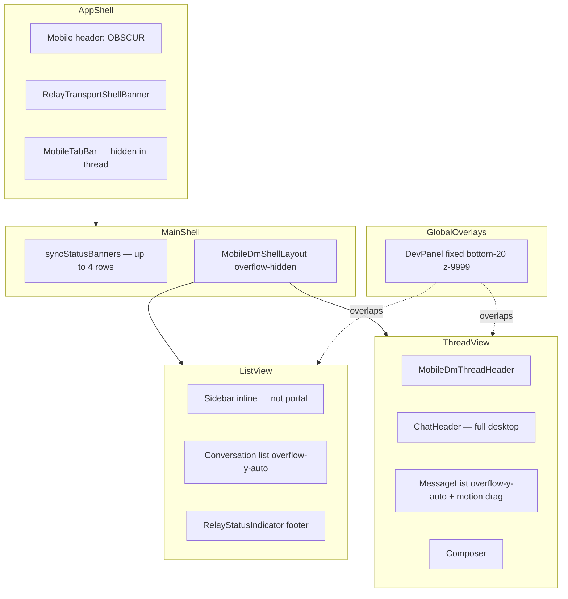

# P12 — Mobile shell UX audit (v1.8.12)

**Status:** Findings record — **P12-hotfix landed** (touch scroll, dev FAB, thread header)  
**Date:** 2026-05-29  
**Scope:** `NEXT_PUBLIC_MOBILE_SHELL` / Tauri Android WebView + browser mobile-shell dev (`pnpm dev:mobile-shell:online`)  
**Related:** [README.md](./README.md) · [mobile-ui-stack-evaluation.md](../../../program/mobile-ui-stack-evaluation.md)

---

## Executive summary

The mobile shell is **functionally reachable** (auth, tab bar, DM list, thread open) after P12 navigation fixes, but the UI is still a **desktop layout compressed into a phone viewport**. The most severe user-facing gaps are:

1. **Touch scrolling is unreliable or absent** on primary scroll regions — users may need to drag the visible scrollbar (unacceptable on a phone).
2. **Multiple fixed layers compete for the bottom-right** (Dev panel, scroll-to-bottom, composer-adjacent actions, relay footer).
3. **Status banners stack vertically** and consume most of the viewport during account restore.
4. **DM thread uses two headers** (mobile back bar + full desktop `ChatHeader`) with inconsistent naming.

This document captures observed shortcomings and a suggested redesign sequence. It does **not** block P12 install/launch smoke; items here are **P13+ mobile polish** unless marked P12-critical.

---

## Evidence (maintainer captures)

| Screenshot | Surface | File |
|------------|---------|------|
| Restore/sync banners + skeleton list + ghost FAB overlap | Chat list (loading) | [mobile-chat-list-restore-banners.png](./mobile-chat-list-restore-banners.png) |
| Chat list chrome, empty DM section, relay footer | Chat list (idle) | [mobile-chat-list-empty.png](./mobile-chat-list-empty.png) |
| Thread header mismatch, invite cards, FAB stack | DM thread | [mobile-dm-thread-overlap.png](./mobile-dm-thread-overlap.png) |
| Playwright unlocked list | Chat list (automated) | [playwright-mobile-shell-tester1-unlocked.png](./playwright-mobile-shell-tester1-unlocked.png) |

---

## Layout stack (current architecture)

**Key files**

| Concern | Location |
|---------|----------|
| Shell chrome, tab bar, banner slot | `apps/pwa/app/components/app-shell.tsx` |
| Mobile list ↔ thread routing | `apps/pwa/app/features/main-shell/main-shell.tsx` |
| Conversation list | `apps/pwa/app/features/messaging/components/sidebar.tsx` |
| Thread chrome | `apps/pwa/app/components/mobile/mobile-dm-thread-header.tsx` + `chat-header.tsx` |
| Message scroll region | `apps/pwa/app/features/messaging/components/message-list.tsx` |
| Dev ghost FAB | `apps/pwa/app/features/dev-tools/components/dev-panel.tsx` |
| Account restore banners | `main-shell.tsx` (`syncStatusBanners`) |

---

## Findings by surface

### 1. Chat list (Chats tab)

| ID | Severity | Shortcoming | Notes |
|----|----------|-------------|-------|
| L-1 | **P12-critical** | **Touch scroll not working** on conversation list | List uses `overflow-y-auto` (`sidebar.tsx`) but parent chain is `overflow-hidden` (`MobileDmShellLayout`, `app-shell`). On device, scroll may fall through to a non-touch-friendly outer region showing a thin scrollbar. |
| L-2 | High | **Banner stack eats viewport** | Up to four full-width rows: `RelayTransportShellBanner` + restore + missing-data + history sync + scope mismatch (`main-shell.tsx`, `app-shell.tsx`). During first login, list is barely visible. |
| L-3 | High | **Ghost Protocol FAB overlaps list + relay footer** | `DevPanel` at `fixed bottom-20 right-4 z-[9999]` sits above `RelayStatusIndicator` and last list rows. Dev builds only, but same slot needed for future FABs. |
| L-4 | Medium | **Duplicate navigation chrome** | **Mitigated** — mobile shell uses `SidebarListChrome` variant: search + compose first, underline Chats/Requests, compact Direct/Groups pills (not two chunky toggle rows). |
| L-5 | Medium | **Desktop sidebar layout on phone** | **Mitigated** — same mobile chrome; desktop layout unchanged via `variant="desktop"`. |
| L-6 | Low | **Relay footer clipped by tab bar padding** | Tab bar reserves `pb-[calc(4.25rem+safe-area)]` but relay strip + dev FAB compete for same bottom band. |

### 2. DM thread

| ID | Severity | Shortcoming | Notes |
|----|----------|-------------|-------|
| T-1 | **P12-critical** | **Touch scroll on message list** | `message-list.tsx` attaches Framer Motion `drag="y"` to the same node as `overflow-y-auto` when pull-to-refresh is enabled. On touch devices, drag often **captures vertical pans** instead of native scroll. Touch handlers only mark “reading history” intent — they do not scroll. |
| T-2 | High | **Bottom-right FAB collision** | Three layers: scroll-to-bottom (`bottom-6 right-6`), chat actions (`bottom-[108px] right-4`), DevPanel (`bottom-20 right-4`). User screenshot shows chevron + ghost + send-adjacent controls stacked. |
| T-3 | High | **Dual headers** | `MobileDmThreadHeader` shows back + title; `ChatHeader` still renders full profile row, Voice Call / Media buttons. Thread title shows **“Unknown contact”** while body shows **Tester1** — `resolveConversationTitle` vs profile metadata resolution mismatch. |
| T-4 | Medium | **Community invite cards too tall** | Full desktop invite card in narrow thread; Accept/Decline + badges + description dominate viewport; multiple invites require heavy scrolling (when scroll works). |
| T-5 | Medium | **Profile block redundant in 1:1 DM** | Avatar, offline strip, and action buttons repeat information already in mobile header. |
| T-6 | Low | **Sender label repetition** | “Tester1” label above messages in a 1:1 thread adds noise. |

### 3. Other tab surfaces (brief pass)

| Route | Severity | Shortcoming |
|-------|----------|-------------|
| **Settings** | Medium | Desktop-oriented panels via `PageShell`; long scroll pages, small touch targets in nested `details`/tables; no mobile-specific section nav. |
| **Network** | Medium | Dashboard uses sticky side nav + horizontal tab strip (`network-dashboard.tsx`) — awkward on narrow width; profile view is full scroll but untested on device safe areas. |
| **Search** | Low–Medium | `search-page-client.tsx` has bottom padding for tab bar; likely scrollable — verify touch on device. |
| **Vault** | Medium | Upload modals and grids assume desktop spacing; not yet in P12 checklist. |
| **Auth / lock** | Low | Auth screen scrolls (`overflow-y-auto`); acceptable for MVP. |

---

## Touch scrolling — root cause analysis

**Symptom:** On Android WebView / mobile-shell, users drag the **visible scrollbar** instead of panning content.

**Likely causes (code-backed):**

1. **Motion drag on scroll container** — `message-list.tsx` uses `drag="y"` on the scrolling `motion.div`. This is a known pattern that breaks native touch scrolling unless `touch-action: pan-y` is set and drag is disabled on coarse pointers.

2. **No explicit `touch-action` policy** — repo-wide grep shows **zero** `touch-action` rules. Mobile scroll regions should declare `touch-action: pan-y` (and `overscroll-behavior: contain` on inner regions, not only on `body`).

3. **Scroll ownership ambiguity** — outer shells use `overflow-hidden` (`mobile-dm-shell-layout.tsx`, `app-shell.tsx`) while inner lists use `overflow-y-auto`. If flex `min-h-0` is missing anywhere in the chain, the inner region **does not scroll** and the browser exposes a page-level scrollbar (thin strip on the right).

4. **Body-level `overscroll-behavior: none`** (`globals.css`) — prevents rubber-banding but should not alone block scroll; combined with wrong scroll parent it worsens “stuck” feel.

5. **Pull-to-refresh vs scroll** — touch handlers on message list detect upward intent but do not implement scrolling; refresh uses drag threshold — needs separate non-scroll gesture target (e.g. dedicated pull handle or `overscroll` behavior).

**Recommended fix direction (implementation backlog):**

- Add `mobile-scroll-region` utility: `overflow-y: auto; -webkit-overflow-scrolling: touch; touch-action: pan-y; overscroll-behavior: contain;`.
- Disable Framer `drag` on `(pointer: coarse)` or move pull-to-refresh to a dedicated top sentinel.
- Audit flex chain: every ancestor of a scroll region needs `min-h-0` + bounded height.
- Hide or relocate `DevPanel` on `isMobileShellProduct()` (or when not `isDevMode`).

---

## Redesign principles (mobile shell)

1. **One scroll owner per screen** — list, thread, and settings each get exactly one `mobile-scroll-region`.
2. **One bottom inset budget** — tab bar OR composer OR FAB lane; compute `env(safe-area-inset-bottom)` once in shell.
3. **Collapse status into a single dismissible strip** — combine relay offline + account restore + history sync into one expandable “Status” chip during restore.
4. **Thread = compact header** — mobile thread uses slim header only; defer Voice/Media to overflow menu until width ≥ `md`.
5. **Cards scale to viewport** — invite / system messages use `max-h` + compact variant under `640px`.

---

## Suggested delivery phases

| Phase | Focus | Outcome |
|-------|--------|---------|
| **P12-hotfix** | Touch scroll + dev FAB hide on mobile shell | List + thread pannable on device |
| **P13-a** | Banner consolidation + bottom inset layout grid | No overlap during restore |
| **P13-b** | Mobile thread header (drop duplicate `ChatHeader` fields) | Consistent titles, less vertical chrome |
| **P13-c** | Compact message cards (invites, system JSON previews) | Less thread height per message |
| **P14** | Settings / Network mobile layouts | Tab surfaces match shell quality |

---

## P12 checklist cross-reference

| Existing checklist item | Audit IDs |
|-------------------------|-----------|
| Safe area — header / tab bar not clipping | L-6, tab bar fix landed |
| Tab bar — Chats ↔ Settings | OK after `mobileDmMode` fix |
| One DM thread opens without crash | OK; overlap is UX not crash |
| Back gesture returns to list | OK functionally; header redundancy T-3 |
| **Touch scroll list + thread** | **Missing — add to checklist** L-1, T-1 |

---

## Out of scope for this audit

- Native Kotlin/Swift UI (see [mobile-ui-stack-evaluation.md](../../../program/mobile-ui-stack-evaluation.md))
- B1 live bot triggers
- Desktop shell regression
