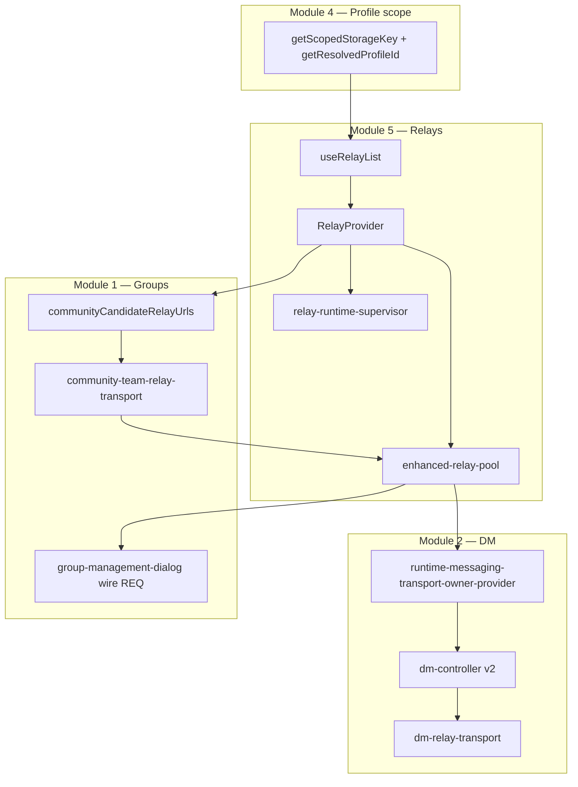

# Module 5 — Relays & transport

_Last reviewed: 2026-06-02 (baseline commit 7f84f813)._

**Status:** v1 complete (first-pass audit)  
**Last updated:** 2026-06-02  
**Scope:** `apps/pwa/app/features/relays/` + messaging transport boundary, native relay commands, group/community wire paths

---

## 1. Scope

**Primary path:** `apps/pwa/app/features/relays/` — **~95** TS/TSX files (**59** prod, **36** test), **~10k prod LOC**.

| Subfolder | ~Prod files | ~Prod LOC | Owns |
|-----------|-------------|-----------|------|
| `hooks/` | 19 | 5,069 | Pool, native adapter, relay list hook, primary selection, diagnostics |
| `services/` | 21 | 2,920 | Recovery supervisor, transport mode/scope, journal, observability |
| `providers/` | 2 | 675 | `RelayProvider` composition |
| `lib/` | 5 | 696 | NIP probes, runtime status |
| `components/` | 5 | 436 | Status indicator, readiness banners |
| `utils/` | 6 | 253 | WebSocket factory, NIP-65, safety limits |
| `types/` | 2 | 14 | Filter/connection types |

**Largest prod files:**

| File | ~LOC | Role |
|------|------|------|
| `hooks/enhanced-relay-pool.ts` | 2,578 | Truth map row 6 — wire transport owner (WS + native) |
| `hooks/native-relay.ts` | 610 | Tauri relay command surface |
| `providers/relay-provider.tsx` | 534 | Composition: list + pool + supervisor + custom nodes |
| `services/relay-resilience-observability.ts` | 513 | Reliability metrics + structured events |
| `services/relay-recovery-policy.ts` | 510 | Recovery action ladder |
| `services/relay-runtime-supervisor.ts` | 506 | Truth map row 5 — recovery phase owner |

**Adjacent paths (outside feature root):**

| Path | Role |
|------|------|
| `messaging/providers/runtime-messaging-transport-owner-provider.tsx` | Gates DM transport on identity + window phase; passes pool to v2 controller |
| `messaging/controllers/v2/dm-relay-transport.ts` | Canonical DM publish/subscribe wire layer |
| `messaging/controllers/v2/dm-controller.ts` | v2 DM hook; registers with `messaging-transport-runtime` |
| `messaging/services/request-transport-service.ts` | Contact-request transport (wraps `sendDm`) |
| `messaging/services/messaging-transport-runtime.ts` | Single incoming-owner invariant registry |
| `messaging/services/relay-checkpoint-sqlite-store.ts` | Native SQLite relay subscribe checkpoints (ACC-03) |
| `runtime/components/unlocked-app-runtime-shell.tsx` | Mounts `RelayProvider` before groups/messaging owners |
| `runtime/components/runtime-activation-manager.tsx` | Consumes relay readiness for activation gating |
| `groups/services/community-team-relay-transport.ts` | Community `TransportPort` adapter |
| `groups/services/community-relay-transport.ts` | Writable-community relay classification |
| `groups/components/group-management-dialog.tsx` | Direct pool REQ/CLOSE for roster wire |
| `desktop/utils/relay-persistence.ts` | **Orphan** — exported but no production importers |
| `apps/desktop/src-tauri/src/relay.rs` | Native WS relay commands |
| `packages/dweb-core/src/relay-url.ts` | `RelayUrl` type |
| `packages/dweb-transport-team-relay/` | Team-relay `TransportPort` adapter package |
| `apps/coordination/` | Invite relay hints (HTTP utility — not live Nostr transport) |
| `apps/relay-gateway/` | Dev proxy + community hide-registry |

**Scale vs other modules:**

| Module | Prod LOC | Note |
|--------|----------|------|
| Relays (M5) | ~10k | Second-largest single feature root after messaging hooks split |
| Messaging (M2) | ~56k | Consumes pool via transport owner provider |
| Groups (M1) | ~36.5k | Community wire partially bypasses team-relay adapter |
| Profiles (M4) | ~8.4k | Scopes relay list + transport mode keys |

---

## 2. Stated contract (canonical docs)

| Claim | Source |
|-------|--------|
| Row 5 — relay recovery owner: `relay-runtime-supervisor.ts` | Truth map |
| Row 6 — relay transport owner: `enhanced-relay-pool.ts` | Truth map |
| Invariant #6 — relay runtime truth ≠ window runtime truth; UI state ≠ transport truth | Truth map § Critical Runtime Invariants |
| Required diagnostics: `window.obscurRelayRuntime`, `window.obscurRelayTransportJournal` | Truth map § Required Diagnostics |
| Owner chain: `relay-provider.tsx` → `relay-runtime-supervisor.ts` → `relay-recovery-policy.ts` → `enhanced-relay-pool.ts` | `encyclopedia/15-relay-foundation-hardening-spec.md` |
| Messaging transport ownership invariant: `messaging-transport-runtime.ts` | `14-module-owner-index.md` |
| DM live path: v2 `dm-controller.ts` via `runtime-messaging-transport-owner-provider.tsx` | Module owner index + M2 exploration |
| Publish scope must be explicit; request transport converges on recipient evidence | `rules/04-messaging-and-relay.md` |
| Transport-agnostic product; Nostr optional adapter; private relays + coordination for workspace | `design-goals-and-constraints.md` |
| Relay list scoped via `getScopedStorageKey(base, profileId)` | M4 exploration §3.6 |
| Native relay boundary: `apps/desktop/src-tauri/src/relay.rs` | Module owner index |
| Failure triage map | `encyclopedia/13-relay-and-startup-failure-atlas.md` |

---

## 3. As-built ownership

### 3.1 Relay list (configuration)

| Entry point | Production? | Notes |
|-------------|-------------|-------|
| `hooks/use-relay-list.ts` → `useRelayList` | **Yes** (settings) | Reads/writes `obscur.relay_list.v2.{pubkey}::{profileId}`; migrates v1 → v2 via `applyRelayListScopeMigration` |
| `services/relay-transport-scope.ts` → `resolveDmTransportRelayUrls`, `resolveCommunityCandidateRelayUrls` | **Yes** (indirect) | Splits list into DM pool vs community-candidate URLs |
| `providers/relay-provider.tsx` → `FullRelayProvider` | **Yes** | Composes list + scope + pool + supervisor |

**Default relays:** `wss://relay.damus.io`, `wss://nos.lol`, dev `ws://localhost:7000` (disabled by default).

### 3.2 Relay pool & connect/disconnect

| Entry point | Production? | Notes |
|-------------|-------------|-------|
| `hooks/enhanced-relay-pool.ts` → `useEnhancedRelayPool` | **Yes** | WS via `create-relay-websocket.ts` or `native-relay.ts` when `hasNativeRuntime()` |
| `hooks/use-relay-pool.ts` → `useRelayPool` | **Yes** | Thin wrapper; dev-mode mock pool swap |
| `hooks/relay-native-adapter.ts` | **Yes** (desktop) | Tauri: `connect_relay`, `probe_relay`, `subscribe_relay`, `send_relay_message`, `recycle_relays` |
| `apps/desktop/src-tauri/src/relay.rs` | **Yes** (native) | Bounded connect budget, Tor retry, write queue saturation |
| `providers/relay-provider.tsx` | **Yes** | Sets `poolRelayUrls` from `mergeNostrPoolWithCustomNodeRelayUrls` + bootstrap delay |

**Active pool sizing:** `relay-transport-mode.ts` — `basic` = primary only; `redundancy` = up to 3 relays. Primary/standby from `use-relay-primary-selection.ts` + `relay-primary-selector.ts` (in-memory; manual lock in refs).

### 3.3 Publish / subscribe

| Entry point | Production? | Notes |
|-------------|-------------|-------|
| `enhanced-relay-pool.ts` → `publishToUrl`, `publishToUrls`, `publishToAll`, `subscribe`, `subscribeToMessages` | **Yes** | Circuit breaker, health monitor, community hide filter |
| `controllers/v2/dm-relay-transport.ts` → `publishToRelays`, `subscribeToIncomingDMs` | **Yes** | DM canonical wire layer; 7-day `since` lookback; transient fallback relays |
| `controllers/v2/dm-send-pipeline.ts` | **Yes** | Calls `publishToRelays` with hybrid targeting (`resolveDmHybridRelayTargeting`) |
| `groups/services/community-team-relay-transport.ts` | **Partial** | `addTransientRelay` + `reconnectRelay`; returns `{ success: true }` **without** wire payload |
| `groups/components/group-management-dialog.tsx` | **Yes** | Direct `relayPool.subscribeToMessages` + `sendToOpen` REQ for roster wire |

### 3.4 Transport mode & routing

| Entry point | Production? | Notes |
|-------------|-------------|-------|
| `services/relay-transport-mode.ts` | **Yes** | Profile-scoped `obscur.relay_transport_mode.v1::{profileId}` |
| `hooks/use-relay-transport-mode.ts` | **Yes** | React binding |
| `relay-provider.tsx` | **Yes** | Tor routing via native adapter → `transportRoutingMode: "direct" \| "privacy_routed"` |
| `services/relay-custom-node-pool.ts` | **Yes** | Merges community/operator relays into socket pool independent of DM mode |

### 3.5 Recovery, runtime phase, diagnostics

| Entry point | Production? | Notes |
|-------------|-------------|-------|
| `services/relay-runtime-supervisor.ts` → `createRelayRuntimeSupervisor` | **Yes** | Exposes `window.obscurRelayRuntime`; phases: `healthy` / `degraded` / `offline` / `fatal` |
| `services/relay-recovery-policy.ts` → `createRelayRecoveryController` | **Yes** | Actions: `reconnect`, `resubscribe`, `subsystem_reset`, `reload_required` |
| `services/relay-transport-journal.ts` → `relayTransportJournal` | **Yes** | Exposes `window.obscurRelayTransportJournal` |
| `services/relay-resilience-observability.ts` | **Yes** | Reliability metrics + structured events |
| `runtime/components/runtime-activation-manager.tsx` | **Yes** | Consumes `useRelay()` for activation/degraded gating |
| `hooks/use-relay-diagnostics-probe-state.ts`, `components/relay-status-indicator.tsx` | **Yes** | User-visible diagnostics |

### 3.6 Messaging transport ownership (M2 boundary)

| Entry point | Production? | Notes |
|-------------|-------------|-------|
| `runtime-messaging-transport-owner-provider.tsx` | **Yes** | Gates on unlock + `activating_runtime`/`ready`/`degraded`; passes `relayPool` to `useDmController` |
| `controllers/v2/dm-controller.ts` → `useDmController` | **Yes** | Registers with `messagingTransportRuntime`; subscribes via `subscribeToIncomingDMs` |
| `messaging-transport-runtime.ts` | **Yes** | Warns if `activeIncomingOwnerCount > 1` |
| `services/request-transport-service.ts` | **Yes** | Used by `use-request-transport.ts`; maps `SendResult` → `RequestTransportOutcome` |
| `controllers/enhanced-dm-controller.ts` | **Legacy** | Still on disk; referenced by some tests, `dm-queue-orchestrator.ts`, `search-page-client.tsx` |

**Startup mount order (observed):**

```
UnlockedAppRuntimeShell
  → RelayProvider (list + pool + supervisor)
  → RuntimeActivationManager (relay readiness gating)
  → GroupProvider / RuntimeMessagingTransportOwnerProvider / …
```

---

## 4. Persistence & truth

| Store | Authority (docs) | Authority (observed) | Scope key |
|-------|------------------|----------------------|-----------|
| **Relay list** | Profile + account pubkey | `use-relay-list.ts` → localStorage | `obscur.relay_list.v2.{publicKeyHex}::{profileId}` |
| **Transport mode** | Per profile | `relay-transport-mode.ts` | `obscur.relay_transport_mode.v1::{profileId}` |
| **Primary selection** | In-memory | `use-relay-primary-selection.ts` | Not persisted |
| **Relay runtime snapshot** | Window diagnostics | `relay-runtime-supervisor.ts` on `window` | Scoped by `profileId` + `windowLabel` in supervisor config |
| **DM subscribe checkpoint** | Native SQLite (ACC-03) | `relay-checkpoint-sqlite-store.ts` → `db_upsert_relay_checkpoint` | `(profile_id, relay_url)` → `last_event_at` |
| **Desktop relay persistence** | Enc. 04 cites `desktop/utils/relay-persistence.ts` | **Orphan** — no production importers | `obscur.relay.persistence::{profileId}` |
| **Coordination relays** | Invite metadata | `apps/coordination` D1 `relays_json` | HTTP utility; filtered from writable Nostr by `hasWritableCommunityRelayTransport` |
| **Operator workspace relay** | Groups operator config | `readOperatorWorkspaceRelayUrl()` merged into custom-node pool | Separate from DM list |

**Profile/account coupling (M4):**

- Relay list keyed by **both** `publicKeyHex` and `profileId` — same account in two profile slots can have different relay lists.
- `relay-provider.tsx` reads `desktopSnapshot.currentWindow.profileId` for bootstrap delay and supervisor scope.

**Connection truth vs UI truth:**

- Pool connection status lives in `enhanced-relay-pool` / `RelayContext`, not `windowRuntimeSupervisor` (explicit in `use-shell-transport-ready.ts`).

**Cross-module relay list drift:**

| Reader | Storage key | Risk |
|--------|-------------|------|
| `use-relay-list.ts` (settings) | v2 scoped | Canonical for UI |
| `invite-manager.ts` (invite hints) | **v1 scoped only** | Misses v2-only writes after migration |

---

## 5. Doc vs code conflicts

| Doc says | Code does | Severity |
|----------|-----------|----------|
| Truth map row 6 owner = `enhanced-relay-pool.ts` only | Enc. 15 lists `relay-provider.tsx` as chain head; provider orchestrates pool URLs, recovery, custom nodes | **Med** — layered ownership unstated in truth map |
| Enc. 04: `desktop/utils/relay-persistence.ts` for desktop relay persistence | File exists; **not wired** into `use-relay-list` or `RelayProvider` | **Med** — dead path / doc drift |
| Single messaging transport owner (v2) | `enhanced-dm-controller.ts`, `dm-queue-orchestrator.ts`, `outgoing-dm-orchestrator.ts` still in tree; some routes import legacy | **Med** |
| `createCommunityTeamRelayTransport` as community transport | Publish callback returns `success: true` without calling `publishToUrl` with event payload | **High** — optimistic publish |
| Invite relay list reads same store as settings | `invite-manager.ts` uses **v1** key; `use-relay-list` writes **v2** | **Med** |
| Coordination = transport | Coordination stores relay URLs for invites; `community-relay-transport.ts` rejects `8787` / `relay.internal` as non-writable Nostr | **Low** — intentional separation |
| Enc. 15 warm-up supervisor in historical sections | Marked archived; active path uses `runtime-activation-manager` + relay supervisor | **Low** |

---

## 6. Test & CI coverage

**Present (relays feature — 36 tests):**

| Area | Test file | Proves |
|------|-----------|--------|
| Pool reliability | `hooks/enhanced-relay-pool.reliability.test.ts` | Multi-relay publish failover, circuit breaker |
| Recovery | `services/relay-runtime-supervisor.test.ts`, `relay-recovery-policy.test.ts` | Phase mapping, action ladder |
| Transport scope/mode | `services/relay-transport-scope.test.ts`, `relay-transport-mode.test.ts` | DM vs community URL classification, mode persistence |
| Provider stability | `providers/relay-provider.stability.test.tsx` | Render-loop / effect stability |
| Native | `hooks/relay-native-adapter.test.ts`, `native-relay.test.ts` | Native command surface |
| Publish chaos | `lib/relay-publish-chaos.test.ts` | Publish under failure injection |

**Messaging / transport boundary tests:**

| Test | Proves |
|------|--------|
| `runtime-messaging-transport-owner-provider.test.tsx` | Owner gating |
| `messaging-transport-runtime.test.ts` | Single incoming-owner invariant |
| `controllers/v2/dm-relay-transport.test.ts` | Publish/subscribe contracts |
| `request-transport-service.test.ts`, `request-transport-deterministic.integration.test.ts` | Request transport outcomes |
| `relay-checkpoint-sqlite-store.test.ts` | Native checkpoint mirror |
| `runtime-activation-transport-gate.integration.test.tsx` | Activation ↔ relay readiness |

**CI gates:**

| Gate | Command |
|------|---------|
| Transport boundary allowlist | `pnpm transport:boundaries:check` → `scripts/verify-transport-boundaries.mjs` |
| Stability pack | `pnpm verify:stability` includes `relay-provider.stability.test.tsx` |
| Release test pack | `scripts/run-release-test-pack.mjs` — 15+ relay/messaging transport tests |
| Truth map minimal set | Does **not** include relay-specific tests |

**Missing (user-visible gaps):**

| Gap | Severity |
|-----|----------|
| No E2E: profile slot A relay list ≠ slot B under multi-window desktop | **High** |
| No integration: `invite-manager` reads same relay list version as settings after v2 migration | **Med** |
| Limited coverage: community custom-node pool merge + group create flow | Med |
| `relay-persistence.ts` has zero tests and no callers | Med |
| `createCommunityTeamRelayTransport` publish path not tested for actual EVENT wire delivery | **High** |
| Transient DM fallback relays may not appear in recovery/activation readiness counts | Med |

---

## 7. Hypotheses (not proven)

- **H1:** Invite relay hints can be empty/stale when users configure relays only through v2 storage — `invite-manager` never reads `obscur.relay_list.v2.*`.
- **H2:** `relay-persistence.ts` is legacy cruft from pre-`use-relay-list` era; live persistence is entirely `use-relay-list` + transport mode keys.
- **H3:** Community team-relay adapter's optimistic `success: true` may mask publish failures in sealed-community control paths until B1 centralizes wire I/O (per comment in `community-team-relay-transport.ts`).
- **H4:** Primary pool connects only 1 URL in basic mode but DM subscribe adds transient fallbacks in `dm-relay-transport.ts` — transient relays may not appear in `relayRecovery` / activation readiness counts.
- **H5:** Second owner risk at group UI boundary: `group-management-dialog.tsx` issues raw REQ/CLOSE on the shared pool alongside DM subscriptions — subscription ownership multiplicity (R1-adjacent, transport facet).
- **H6:** `dweb-transport-team-relay` package is thin wiring; real community wire behavior still lives in `enhanced-relay-pool` + group hooks.

---

## 8. Open questions for synthesis

1. Should truth map row 6 split into **composition owner** (`relay-provider.tsx`) and **wire owner** (`enhanced-relay-pool.ts`)?
2. Is `desktop/utils/relay-persistence.ts` a **delete candidate** or should it augment `use-relay-list`?
3. What is the **canonical migration** for `invite-manager.ts` to read v2 relay list (and respect `applyRelayListScopeMigration`)?
4. When community create selects an intranet relay, does **custom-node pool merge** guarantee connect before `hasWritableCommunityRelayTransport` checks pass?
5. Does DM **7-day subscribe lookback** interact correctly with native **SQLite relay checkpoints** on restart (`sync-checkpoints.ts` / `relay-checkpoint-sqlite-store.ts`)?
6. For M4 synthesis: same account in profile slot B with slot A's relay list still in localStorage under slot A's key — is relay config **per-window intent** or **per-account global**?
7. Should `transport-nostr-feature-allowlist.json` shrink now that v2 DM path is canonical, or does legacy `enhanced-dm-controller` justify parallel entries?
8. Fork decision: is community optimistic publish a **Path A non-blocker** (groups amputated) or **Path B hard requirement** (wire centralization)?

---

## 9. References

**Code:**

- `apps/pwa/app/features/relays/providers/relay-provider.tsx`
- `apps/pwa/app/features/relays/hooks/enhanced-relay-pool.ts`
- `apps/pwa/app/features/relays/hooks/use-relay-list.ts`
- `apps/pwa/app/features/relays/services/relay-runtime-supervisor.ts`
- `apps/pwa/app/features/relays/services/relay-recovery-policy.ts`
- `apps/pwa/app/features/relays/services/relay-transport-scope.ts`
- `apps/pwa/app/features/relays/services/relay-transport-mode.ts`
- `apps/pwa/app/features/messaging/providers/runtime-messaging-transport-owner-provider.tsx`
- `apps/pwa/app/features/messaging/controllers/v2/dm-relay-transport.ts`
- `apps/pwa/app/features/messaging/controllers/v2/dm-controller.ts`
- `apps/pwa/app/features/messaging/services/request-transport-service.ts`
- `apps/pwa/app/features/messaging/services/messaging-transport-runtime.ts`
- `apps/pwa/app/features/messaging/services/relay-checkpoint-sqlite-store.ts`
- `apps/pwa/app/features/groups/services/community-team-relay-transport.ts`
- `apps/pwa/app/features/invites/utils/invite-manager.ts` (v1 relay list reader)
- `apps/desktop/src-tauri/src/relay.rs`
- `packages/dweb-core/src/relay-url.ts`
- `packages/dweb-transport-team-relay/src/team-relay-transport-adapter.ts`

**Docs:**

- `docs/encyclopedia/12-core-architecture-truth-map.md` (rows 5–6, invariant #6)
- `docs/encyclopedia/13-relay-and-startup-failure-atlas.md`
- `docs/encyclopedia/15-relay-foundation-hardening-spec.md`
- `docs/encyclopedia/14-module-owner-index.md`
- `rules/04-messaging-and-relay.md`
- `docs/program/design-goals-and-constraints.md`

**Prior modules:**

- [01-community-groups.md](./01-community-groups.md) — relay snapshots / sealed community wire
- [02-messaging-dm.md](./02-messaging-dm.md) — v2 transport owner chain
- [04-profiles-multi-window-scope.md](./04-profiles-multi-window-scope.md) — scoped relay list keys

**Cross-module interaction:**



---

## Revision history

| Date | Change |
|------|--------|
| 2026-06-02 | v1 — first-pass audit |
