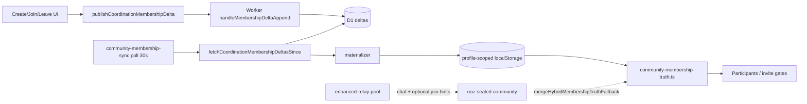

# Module 6 — Coordination / Path B workspace

_Last reviewed: 2026-06-02 (baseline commit 7f84f813)._

**Status:** v1 complete (first-pass audit)  
**Last updated:** 2026-06-02  
**Scope:** `apps/coordination/` Worker + PWA Path B client (membership directory, workspace activation, trust gates) + transport packages

---

## 1. Scope

**Primary paths:**

| Area | Path | Role |
|------|------|------|
| Coordination Worker | `apps/coordination/` | Cloudflare Worker + D1: invites, membership directory API (B2) |
| PWA Path B client | `apps/pwa/app/features/groups/services/community-coordination-*`, `community-workspace-*`, `community-membership-truth.ts`, `community-trust-policy.ts`, `operator-trust-config.ts` | Health gate, delta publish/poll, directory materialization, create/join activation |
| PWA hooks | `use-coordination-membership-directory.ts`, `use-community-membership-truth.ts`, `use-workspace-community-trust-gate.ts` | React bindings; `use-sealed-community.ts` still owns leave publish + poll wiring |
| Invites | `invites/utils/invite-manager.ts`, `main-shell/hooks/use-invite-redemption.ts` | `POST /invites/create`, `POST /invites/redeem` |
| Transport packages | `packages/dweb-coordination-contracts/`, `packages/dweb-transport-coordination/`, `packages/dweb-transport-team-relay/` | Delta signing, semantic mapping, `TransportPort` adapters |
| Operator relay | `apps/relay-gateway/` | Dev WS proxy + community hide-registry (not membership truth) |
| Program docs | `docs/program/community-fork-decision-2026-05.md`, `platform-pivot-private-trust-2026-05.md`, `obscur-r1-workspace-consolidation.md`, `v1.9.0-kernel-backend-spec.md` §4.7 | Path A/B policy, R1 gates, B2 API spec |

No dedicated coordination documentation directory exists in the repo (exploration notes live under `docs/exploration/` only).

### `apps/coordination/` inventory

| Subfolder | Files | Notes |
|-----------|-------|-------|
| `src/` | `index.ts`, `membership-directory.ts`, tests, `test-utils/mock-d1.ts` | Single Worker entry + membership handlers |
| `migrations/` | `0001_init.sql`, `0002_membership_directory.sql` | Invites + membership tables |
| `scripts/` | `purge-membership-directory.sql` | Dev purge helper |
| Root | `schema.sql`, `wrangler.toml`, `README.md`, `vitest.config.ts` | D1 binding `DB`; local dev via `scripts/coordination-dev.mjs` |

### Scale (approx.)

| Metric | Value |
|--------|-------|
| Worker prod LOC | ~674 (`index.ts` 392, `membership-directory.ts` 282) |
| Worker test files | 3 (+ mock D1) |
| PWA Path B service LOC | ~3,831 (coordination + workspace + workspace-relay + trust/operator + membership sync/truth) |
| PWA Path B test files | 13+ dedicated test files (~850 LOC) |
| Packages (3) | ~200 prod LOC total |
| `relay-gateway` | ~270 prod LOC |

**Largest PWA Path B files:**

| File | ~LOC | Role |
|------|------|------|
| `community-workspace-activation.ts` | 612 | `runWorkspaceMembershipActivation`, relay + coordination join evidence, pending queue |
| `community-coordination-membership-directory-store.ts` | 265 | Profile-scoped localStorage materialization + incremental refresh |
| `community-membership-sync.ts` | 300 | 30s poll → semantic events → directory store |
| `community-coordination-membership-client.ts` | 206 | `fetchCoordinationMembershipHead`, `fetchCoordinationMembershipDeltasSince`, `publishCoordinationMembershipDelta` |
| `community-coordination-fetch.ts` | 196 | Timeouts, desktop loopback workarounds |
| `workspace-relay-calibrator.ts` | 236 | Join-time relay prep for workspace |
| `use-sealed-community.ts` | 3,379 | **Overlap with M1** — leave publish, coordination poll subscription, hybrid roster |

**Scale vs other modules:**

| Module | Prod LOC | Note |
|--------|----------|------|
| Coordination Worker (M6 server) | ~674 | Small; D1 is cross-client truth |
| PWA Path B slice (M6 client) | ~3.8k | Lives inside M1 groups feature root |
| Groups (M1 total) | ~36.5k | Path B is ~10% of groups code; `use-sealed-community` dominates overlap |
| Relays (M5) | ~10k | Chat wire still Nostr-shaped for Path B |

---

## 2. Stated contract (canonical docs)

| Claim | Source |
|-------|--------|
| **Path B:** membership roster = coordination API signed head/deltas; relay = chat delivery hints only | `community-fork-decision-2026-05.md` |
| **Path A:** DM-only; hide community create/invite/roster | Same |
| Public-relay community membership **infeasible**; fork decision **superseded** by platform pivot | `community-fork-decision-2026-05.md` → `platform-pivot-private-trust-2026-05.md` |
| Transport-agnostic platform; Nostr optional; coordination = workspace membership authority | `design-goals-and-constraints.md` §1 |
| B2 API: `/health`, invites, `/communities/:id/membership/{head,deltas,delta}`; **WS/SSE subscribe planned** | `v1.9.0-kernel-backend-spec.md` §4.7 |
| B2 **Done on main**; K-M1/K-M2 target coordination poll, not relay roster | `v1.9.2-scope.md` |
| R1: new create = `managed_workspace` only; coordination + non–public-default relay required | `obscur-r1-workspace-consolidation.md` |
| Relay tiers: `public_default` blocks managed workspace; `trusted_private` / `managed_intranet` allow | `community-mode-contract.ts` + fork doc |
| `TransportKind`: `obscur_coordination`, `team_relay`, `nostr` | Kernel spec §4.3 |
| Membership truth rewrite: coordination **only** authority for `managed_workspace`; stop monotonic OR-set | `community-membership-truth-rewrite-2026-05.md` |
| Demo matrix K-M1–K-M6 | `docs/assets/demo/v1.9.0/README.md` |
| **Decision record unfilled** (Path A vs B checkbox empty) | `community-fork-decision-2026-05.md` §Decision record |

---

## 3. As-built ownership

### 3.1 Coordination service (server)

| Concern | Owner | Symbols |
|---------|-------|---------|
| HTTP router | `apps/coordination/src/index.ts` | `export default.fetch` |
| Invite create | `handleInviteCreate` | D1 `invites` insert, token hash |
| Invite redeem | `handleInviteRedeem` | Lookup + `invite_redemptions` |
| Membership head | `membership-directory.ts` → `handleMembershipHead` | D1 `community_membership_heads` |
| Membership deltas read | `handleMembershipDeltasSince` | Limit 200, `since` seq |
| Membership delta append | `handleMembershipDeltaAppend` | `verifyMembershipDeltaSignature`, seq monotonic |
| Path routing | `matchMembershipDirectoryPath` | Regex `/communities/{id}/membership/{head\|deltas\|delta}` |
| NIP-98 / upload | `verifyNip98`, `handleUpload` | **501 storage_disabled** — stubs only |

**Authorization (observed):** Delta append verifies cryptographic signature only — no steward ACL, community binding, or actor-role check on the Worker.

### 3.2 Client → coordination HTTP

| Entry point | Production? | Notes |
|-------------|-------------|-------|
| `community-coordination-membership-client.ts` | **Yes** | Canonical publish/fetch for deltas |
| `community-coordination-health.ts` → `probeCoordinationHealth` | **Yes** | 15s cache; gates create/join |
| `community-coordination-fetch.ts` | **Yes** | Shared fetch + timeout policy |
| `invite-manager.ts` → `coordinationCreateInvite` / `coordinationRedeemInvite` | **Yes** | Invites feature |
| `use-invite-redemption.ts` → `redeemInviteToken` | **Yes** | Deep-link invite flow |
| `operator-trust-config.ts` → `resolveCoordinationBaseUrl` | **Yes** | Override `obscur.operator.coordination_url.v1` or `NEXT_PUBLIC_COORDINATION_URL` |

### 3.3 Membership truth (Path B roster)

| Entry point | Production? | Notes |
|-------------|-------------|-------|
| `community-membership-truth.ts` | **Yes** | Declared **single owner** for workspace truth when R1 + coordination configured |
| `community-coordination-membership-directory-store.ts` | **Yes** | Pull deltas, materialize, persist per **profileId** |
| `community-coordination-membership-materializer.ts` | **Yes** | Fold join/leave/expel → active/left/expelled sets |
| `community-coordination-membership-reconcile.ts` → `runCoordinationMembershipReconcile` | Partial | Manual/K-M reconcile; feeds semantic callback |
| `community-membership-sync.ts` → `subscribeToMembershipSync` | **Yes** | Background poll (default **30s**), not WS |
| `use-community-membership-truth.ts` | **Yes** | Hook over truth snapshot |
| `use-coordination-membership-directory.ts` | **Yes** | Directory materialization hook |
| `community-workspace-r1-policy.ts` → `shouldUseCoordinationMembershipAuthority` | **Yes** | `managed_workspace` + configured + (`R1` env or `coordination_preferred`) |
| `use-sealed-community.ts` | **Yes (parallel)** | Still hydrates relay membership, publishes leave, subscribes sync — **3,379 LOC overlap with M1** |

**Hybrid fallback:** `mergeHybridMembershipTruthFallback` in `community-membership-truth.ts` repopulates `activeMemberPubkeys` from relay/chat when `syncStatus !== "fresh"`.

### 3.4 Workspace create / join / activation

| Entry point | Production? | Notes |
|-------------|-------------|-------|
| `community-trust-policy.ts` → `assessWorkspaceCommunityTrust` / `assessWorkspaceCommunityTrustAsync` | **Yes** | Hard gate: coordination + health + non-public relay |
| `create-group-dialog.tsx` | **Yes** | Fixed `managed_workspace`; probes health; `isCoordinationGateSatisfied` |
| `global-dialog-manager.tsx` | **Yes** | Create side effects call `assessWorkspaceCommunityTrustAsync` |
| `community-invite-card.tsx` | **Yes** | Join → `runWorkspaceMembershipActivation` |
| `community-workspace-activation.ts` → `runWorkspaceMembershipActivation` | **Yes** | Parallel relay join events + coordination join delta |
| `community-workspace-membership.ts` → `publishWorkspaceMemberJoin` | **Yes** | Forces `coordination_preferred`, publishes join delta |
| `operator-trust-setup-wizard.tsx` | **Yes** | Operator coordination URL + workspace relay setup |

### 3.5 Transport resolution (chat vs control)

| Entry point | Role |
|-------------|------|
| `community-workspace-transport-policy.ts` → `resolveCommunityControlTransportKind` | `managed_workspace` + private writable relay → `team_relay`; else `nostr` |
| `community-team-relay-transport.ts` → `createCommunityTeamRelayTransport` | Wires `createTeamRelayTransportAdapter` to pool; publish returns `{ success: true }` without wire payload (M5 finding) |
| `packages/dweb-transport-coordination/src/coordination-transport-adapter.ts` | Default `publishCommunityControl` → **`coordination_publish_not_wired`** unless callbacks injected |
| `local-workspace-relay-publish.ts` | Ephemeral WS fallback when pool publish fails (localhost relay) |
| `workspace-relay-calibrator.ts` → `prepareWorkspaceRelayForJoin` | Ensures writable relay before activation |

### 3.6 Operator relay (M5 adjacency)

| Entry point | Role |
|-------------|------|
| `apps/relay-gateway/src/index.ts` | WS proxy to upstream; PoW gate kind-0; hide-registry on wire |
| `community-relay-hide-suppress.ts` | Filters hidden community events — **not** membership directory |

---

## 4. Persistence & truth

| Store | Authority (docs) | Authority (observed) | Scope |
|-------|-------------------|----------------------|-------|
| **D1 `community_membership_deltas` / `heads`** | Cross-client membership truth (Path B) | **Server truth** for join/leave/expel seq ledger | Per `communityId` |
| **D1 `invites` / `invite_redemptions`** | Relay hints + invite metadata | Invite redemption audit only; **not** roster | Global |
| **localStorage** `obscur.community.coordination_membership_directory.v1::{profileId}` | Client cache of directory | **UI read authority** when `syncStatus: fresh`; profile-scoped | Per profile + community |
| **localStorage** seq cursor (`community-coordination-membership-cursor.ts`) | Incremental poll cursor | Client pull state | Per profile + community |
| **localStorage** `obscur.community.workspace_activation_pending.v1::{profileId}` | Retry queue for partial activation | Pending join evidence | Per profile |
| **localStorage** `obscur.operator.coordination_url.v1` | Operator override | Runtime coordination URL | **Device-global** (not profile-scoped) |
| **localStorage** `obscur.membership_sync_mode.v1` | Mode selection | Overridden to `coordination_preferred` when R1 enforced | Device-global |
| **Relay (Nostr kinds)** | Chat ciphertext + **hints only** on Path B | Still ingested by `use-sealed-community` for sovereign/legacy and hybrid fallback | Per community relay URL |
| **SQLite** (groups, M1) | Group list metadata | Not coordination directory owner | Profile-scoped |

**Truth flow (Path B, as-built):**

**Cross-module coupling:**

| Module | Interaction |
|--------|-------------|
| **M1 Groups** | `use-sealed-community`, `group-provider`, invite cards — parallel roster + sealed chat; Path B truth intended but not subtracted |
| **M5 Relays** | Pool publishes join/chat; `community-relay-transport.ts` classifies writable hosts; team-relay adapter optimistic |
| **M4 Profiles** | Directory + pending activation scoped by `profileId`; operator URL is global |
| **Invites** | Coordination HTTP for token create/redeem; separate from membership delta ledger |

---

## 5. Doc vs code conflicts

| Doc says | Code does | Severity |
|----------|-----------|----------|
| Encyclopedia / module index: coordination = **invite + upload utility** | Worker implements **full membership directory** (B2); README opening blurb still invite-only | **Med** |
| Kernel spec §4.7: `GET head` returns **signer pubkeys** | `handleMembershipHead` returns `seq`, `headHash`, `updatedAtUnixMs` only | **Low** |
| Kernel spec §4.7: **`/membership/subscribe` WS/SSE** | **Not implemented**; client uses HTTP poll in `community-membership-sync.ts` | **Med** |
| `createCoordinationTransportAdapter` should wire B1 port | Adapter defaults to **not wired**; poll path bypasses `TransportPort` | **Med** |
| R1 / fork: coordination **mandatory** for workspace | Dev escapes: `NEXT_PUBLIC_DEV_COORDINATION_ONLY_WORKSPACE`, `assume_local_coordination`, `NEXT_PUBLIC_WORKSPACE_R1_MEMBERSHIP=false` | **Low** (intentional dev) |
| `community-membership-truth.ts` = **single owner** | `use-sealed-community` still maintains parallel relay roster; `mergeHybridMembershipTruthFallback` widens active set when not `fresh` | **High** |
| Fork decision **unsigned** (Path A/B checkbox empty) | Code implements **Path B shape** (R1 gates, `managed_workspace` default) while sovereign/legacy paths remain | **Med** |
| Team transport: membership on coordination, control on team relay | `createCommunityTeamRelayTransport` publish returns `{ success: true }` without always sending EVENT payload | **Med** (M5 overlap) |
| Coordination stores membership authorization policy | Worker verifies signature only — any key can append join/leave/expel for any `communityId` | **High** (production security gap) |

---

## 6. Test & CI coverage

**Worker (`pnpm test:coordination-worker`):**

| Test | Proves |
|------|--------|
| `membership-directory.test.ts` | Path parse, head empty, signed join/leave/expel, invalid sig |
| `index.cors.test.ts` | CORS preflight |
| `membership-live.integration.test.ts` | Optional live test against `COORDINATION_LIVE_URL` (skipped unless env set) |

**PWA (coordination-focused unit tests):**

| Test | Proves |
|------|--------|
| `community-coordination-membership-client.test.ts` | Publish/sign paths, native key sentinel |
| `community-coordination-membership-reconcile.test.ts` | Reconcile flow |
| `community-coordination-membership-directory-store.test.ts` | Materialization + profile scope |
| `community-coordination-membership-materializer.test.ts` | Join/leave/expel fold |
| `community-coordination-health.test.ts`, `community-coordination-fetch.test.ts` | Health probe, fetch policy |
| `community-trust-policy.test.ts`, `community-membership-truth.test.ts` | Trust gates, truth snapshot |
| `community-workspace-activation.test.ts`, `community-workspace-transport-policy.test.ts` | Activation, transport kind |
| `community-workspace-r1-policy.test.ts` | R1 authority selection |
| `workspace-relay-url.test.ts`, `workspace-relay-calibrator.test.ts` | Relay prep |
| `create-group-dialog.test.tsx`, `use-invite-redemption.test.ts` | UI flows |

**Packages:**

- `packages/dweb-transport-coordination/src/map-coordination-delta.test.ts`
- `packages/dweb-transport-team-relay/src/team-relay-transport-adapter.test.ts`

**CI gates:**

| Script | Includes M6? |
|--------|----------------|
| `test:coordination-worker` | Worker unit tests |
| `test:workspace-membership` | Worker + `test:community-invariants` (PWA package) |
| `test:community-invariants` | Coordination client, reconcile, health, trust, membership-truth, port tests |
| `verify:phase3` | Adds `community-coordination-health.test.ts`, relay transport tests |
| `coordination:health` | `scripts/coordination-health.mjs` smoke |
| `dev:coordination` / `coordination:migrate` | Local Worker + D1 schema |

**Missing (user-visible gaps):**

| Gap | Severity |
|-----|----------|
| No automated two-client E2E for K-M1/K-M2 (leave propagates roster shrink) in CI | **High** |
| No worker test for invite expiry, concurrent delta seq races, or authorization beyond signature | Med |
| No integration test PWA poll → UI roster update (browser/desktop) | **High** |
| WS subscribe spec untested (unimplemented) | Med |
| Path A amputation (feature-flag communities) — no test pack | Med |
| Production deployment of Worker — only local wrangler + placeholder docs | Med |

---

## 7. Hypotheses (not proven)

- **H1:** Hybrid roster persists because `use-sealed-community` still widens from relay/chat while coordination directory is stale (`headSeq === 0` or poll backoff), and `mergeHybridMembershipTruthFallback` repopulates active set when truth is not `fresh`.
- **H2:** Desktop loopback causes false `coordination_unreachable` unless dev flags (`assume_local_coordination`, coordination-only mode) — gates may block real users on Tauri while `curl` succeeds.
- **H3:** `team_relay` TransportPort is mostly nominal; actual community wire I/O still flows through `enhanced-relay-pool` directly (M5 finding), so Path B chat delivery is still Nostr-shaped.
- **H4:** Invite tokens carry relay hints but do not bind `communityId` or membership — workspace join still depends on separate group invite / activation pipeline.
- **H5:** Operator coordination URL is device-global while directory cache is profile-scoped — multi-profile on one device could read/write different roster caches against one coordination deployment.
- **H6:** Unsigned fork decision + implemented Path B gates means product is **de facto Path B** without formal sign-off or Path A cleanup.

---

## 8. Open questions for synthesis

1. **Subtract or finish?** Should synthesis treat `use-sealed-community` relay roster as **amputation target** for `managed_workspace`, or keep hybrid fallback indefinitely?
2. **Poll vs push:** Is HTTP poll (30s, backoff) acceptable for v1.9 band exit, or is WS/SSE a **hard** Path B requirement?
3. **Steward ACL:** Who may append deltas for a `communityId`? Worker currently verifies signature only — sufficient for production Path B?
4. **Path A honesty:** If fork stays unsigned, should UI still expose sovereign/public-relay create paths, or enforce R1 gates everywhere?
5. **Coordination without relay:** Fork doc says membership proof can pass K-M1/K-M2 with coordination alone; does product allow **coordination-only dev mode** in production builds?
6. **Module boundary:** Is `apps/coordination` part of the **shipping product** (ops requirement) or optional infrastructure — affects Path A vs B fork economics?
7. **Cross-module gate:** M4 multi-window + M6 profile-scoped directory — is per-window coordination refresh required for K-M2 offline reopen?
8. **relay-gateway role:** Stay dev-only hide-registry, or become part of operator "private trust stack" narrative?
9. **Fork sign-off:** Should synthesis recommend filling the fork decision record before any further community persistence work (M1 Test 10)?

---

## 9. References

**Code — Worker:**

- `apps/coordination/src/index.ts` — `handleInviteCreate`, `handleInviteRedeem`, router
- `apps/coordination/src/membership-directory.ts` — `handleMembershipHead`, `handleMembershipDeltasSince`, `handleMembershipDeltaAppend`
- `apps/coordination/schema.sql`

**Code — PWA Path B:**

- `apps/pwa/app/features/groups/services/community-coordination-membership-client.ts`
- `apps/pwa/app/features/groups/services/community-coordination-membership-directory-store.ts`
- `apps/pwa/app/features/groups/services/community-membership-truth.ts`
- `apps/pwa/app/features/groups/services/community-membership-sync.ts`
- `apps/pwa/app/features/groups/services/community-workspace-activation.ts`
- `apps/pwa/app/features/groups/services/community-trust-policy.ts`
- `apps/pwa/app/features/groups/services/community-workspace-r1-policy.ts`
- `apps/pwa/app/features/groups/services/operator-trust-config.ts`
- `apps/pwa/app/features/groups/services/community-mode-contract.ts`
- `apps/pwa/app/features/groups/components/create-group-dialog.tsx`
- `apps/pwa/app/features/groups/hooks/use-sealed-community.ts` (leave + poll overlap)

**Code — packages / relay:**

- `packages/dweb-coordination-contracts/src/membership-delta.ts`
- `packages/dweb-transport-coordination/src/coordination-transport-adapter.ts`
- `packages/dweb-transport-team-relay/src/team-relay-transport-adapter.ts`
- `apps/relay-gateway/src/index.ts`

**Docs:**

- `docs/program/community-fork-decision-2026-05.md`
- `docs/program/platform-pivot-private-trust-2026-05.md`
- `docs/program/obscur-r1-workspace-consolidation.md`
- `docs/program/v1.9.0-kernel-backend-spec.md` §4.7–4.9
- `docs/program/community-membership-truth-rewrite-2026-05.md`
- `docs/assets/demo/v1.9.0/README.md` — K-M1–K-M6

**Prior modules:**

- [01-community-groups.md](./01-community-groups.md) — M1 overlap / Path B partial
- [04-profiles-multi-window-scope.md](./04-profiles-multi-window-scope.md) — profile-scoped directory cache
- [05-relays-transport.md](./05-relays-transport.md) — team-relay optimistic publish, relay-gateway

---

## Revision history

| Date | Change |
|------|--------|
| 2026-06-02 | v1 — first-pass audit |
