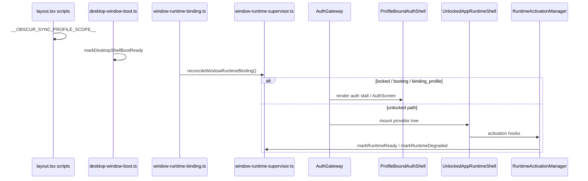

# Module 7 — Runtime, shell, startup

_Last reviewed: 2026-06-02 (baseline commit 7f84f813)._

**Status:** v1 complete (first-pass audit)  
**Last updated:** 2026-06-02  
**Scope:** `apps/pwa/app/features/runtime/` + startup composition (`providers.tsx`, `layout.tsx`, `main-shell/`, `app-shell.tsx`)

---

## 1. Scope

**Primary paths:**

| Path | Role |
|------|------|
| `apps/pwa/app/features/runtime/` | Window lifecycle FSM, binding, activation, shell policy, native adapters |
| `apps/pwa/app/features/main-shell/` | DM chat shell (mounted persistently from runtime) |
| `apps/pwa/app/components/providers.tsx` | Startup composition root (`AppProviders`) |
| `apps/pwa/app/components/app-shell.tsx` | Navigation chrome (sidebar, route guards, warmup) |
| `apps/pwa/app/layout.tsx` | Pre-React boot scripts (scope, theme, watchdog) |

### Scale (approx.)

| Metric | `runtime/` | `main-shell/` | Adjacent |
|--------|------------|---------------|----------|
| Prod files | ~43 TS/TSX | ~22 TS/TSX | `providers.tsx`, `app-shell.tsx`, `layout.tsx`, `persistent-app-chrome.tsx` |
| Test files | 32 | 10 | `auth-gateway.test.tsx`, `app-shell.test.tsx` |
| Prod LOC | ~4.2k | ~6.7k (`main-shell.tsx` alone ~4.2k) | — |

**Largest prod files (`runtime/`):**

| File | ~LOC | Role |
|------|------|------|
| `services/window-runtime-supervisor.ts` | 749 | Truth map row 1 — window phase FSM |
| `components/runtime-activation-manager.tsx` | 716 | Truth map row 4 — ready/degraded convergence |
| `components/startup-experience-overlay.tsx` | 295 | Post-unlock startup UX overlay |
| `services/secondary-profile-window-reload-scheduler.ts` | 137 | Secondary-window DM refresh scheduling |
| `components/profile-bound-auth-shell.tsx` | 119 | Truth map row 3 — auth stall recovery |
| `components/unlocked-app-runtime-shell.tsx` | 53 | Unlocked provider tree root |

**Adjacent paths:**

| Path | Role |
|------|------|
| `apps/pwa/app/components/desktop/desktop-window-root-surface.tsx` | Mounts `AppProviders` |
| `apps/pwa/app/features/profiles/components/desktop-profile-bootstrap.tsx` | Truth map row 2 (composition) |
| `apps/pwa/app/features/profiles/services/desktop-window-boot.ts` | `production-surfaces.md` boot service owner |
| `apps/pwa/app/features/auth/components/auth-gateway.tsx` | Auth gate + auto-unlock; renders `ProfileBoundAuthShell` or children |
| `apps/pwa/app/features/profiles/providers/profile-runtime-provider.tsx` | R0 gateway install (inside unlocked tree) |
| `apps/desktop/src-tauri/src/profiles.rs` | Native `__OBSCUR_WINDOW_BOOT__` injection |

**Scale vs other modules:**

| Module | Prod LOC | Note |
|--------|----------|------|
| Runtime (M7) | ~4.2k | Orchestration layer; fans out to M2–M6 providers |
| Main-shell (M7 adjacency) | ~6.7k | Hidden startup cost — persistent mount from unlocked tree |
| Profiles (M4) | ~8.4k | Boot scope injection before M7 binding |
| Relays (M5) | ~10k | First heavy provider in unlocked tree |

---

## 2. Stated contract (canonical docs)

| Claim | Source |
|-------|--------|
| Row 1 — window lifecycle owner: `window-runtime-supervisor.ts` | Truth map |
| Row 2 — startup profile-binding owner: `desktop-profile-bootstrap.tsx` | Truth map |
| Row 3 — startup auth-shell recovery owner: `profile-bound-auth-shell.tsx` | Truth map |
| Row 4 — runtime activation/degradation owner: `runtime-activation-manager.tsx` | Truth map |
| Invariant #1 — profile/identity scope before account-scoped stores | Truth map § Critical Runtime Invariants |
| Invariant #2 — signed-out windows stay light (no heavy sync/transport) | Truth map |
| Invariant #5 — startup fail-open to `locked` / `degraded` / `fatal` | Truth map |
| Invariant #6 — relay runtime truth ≠ window runtime truth | Truth map |
| Invariant #7 — derived caches must not outlive account/profile scope | Truth map |
| Startup flow steps 1–6 | Truth map § Startup and Runtime Flow |
| Desktop multi-window boot owner: `desktop-window-boot.ts`; never block React on native IPC | `architecture/production-surfaces.md` |
| Startup composition owner: `providers.tsx` | `encyclopedia/03-runtime-architecture.md` |
| Unlocked composition root: `unlocked-app-runtime-shell.tsx` | Enc. 03, Enc. 14 |
| Required diagnostics: `window.obscurWindowRuntime`, relay runtime, transport journal | Truth map § Required Diagnostics |
| PWA is dev/integration shell; desktop/mobile are production | `production-surfaces.md` § Product shells |

---

## 3. As-built ownership

### 3.1 Startup composition & mount order

**Entry:** `layout.tsx` → `DesktopWindowRootSurface` → `AppProviders` (`providers.tsx`)

```
DesktopProfileBootstrap
  WindowRuntimeBindingOwner          ← startWindowRuntimeBinding()
  ChatStateDurabilityOwner           ← pagehide flush only
  SealedGroupMessageDurabilityOwner
  StartupExperienceOverlay           ← gated by runtime phase internally
  AuthGateway
    UnlockedAppRuntimeShell          ← only when AuthGateway passes children through
      {route children}
```

| Step | Owner | Function / symbol | Production UI? |
|------|-------|-------------------|----------------|
| Pre-React scope mirror | `layout.tsx` inline scripts | Sets `__OBSCUR_SYNC_PROFILE_SCOPE__`, scoped theme/accessibility | No |
| Pre-React boot watchdog | `layout.tsx` ~L261–478 | 45s stall overlay; listens `dweb:app-boot-ready` | Yes (fallback DOM overlay) |
| Profile boot kickoff | `DesktopProfileBootstrap` | `startDesktopWindowBoot()` via `useEffect` | Dev web only (`AppLoadingScreen`) |
| Boot ready signal | `desktop-window-boot.ts` | `markDesktopShellBootReady()` → `APP_BOOT_READY_EVENT` | No |
| Identity↔profile reconcile | `window-runtime-binding.ts` | `reconcileWindowRuntimeBinding()` | No |
| Binding subscription | `WindowRuntimeBindingOwner` | `startWindowRuntimeBinding()` | No |
| Auth gate | `AuthGateway` | Auto-unlock effects; phase switch | Partial (unlocking spinner) |
| Pre-unlock auth UI | `ProfileBoundAuthShell` | Stall spinner / recovery / `AuthScreen` | Yes |
| Unlocked provider tree | `UnlockedAppRuntimeShell` | Full relay/groups/messaging stack | No (providers only) |
| Activation convergence | `RuntimeActivationManager` | `markRuntimeReady` / `markRuntimeDegraded` | No |
| Navigation chrome | `PersistentAppChrome` → `AppShell` | Route guards, sidebar, warmup | Yes |
| DM shell (persistent) | `ChatRouteMainShell` → `MainShell` | Hidden off `/` route | Yes (on `/`) |

**Finding:** Truth map step 4 lists `ProfileBoundAuthShell` as a peer step before `UnlockedAppRuntimeShell`. As-built, `ProfileBoundAuthShell` is **inside** `AuthGateway`, which **replaces** the entire `UnlockedAppRuntimeShell` subtree when phase ∉ `{activating_runtime, ready, degraded}`. Signed-out windows do not mount relay/groups/messaging providers.

### 3.2 Window runtime supervisor (row 1)

| Concern | Owner | Key symbols |
|---------|-------|-------------|
| Phase FSM | `window-runtime-supervisor.ts` | `windowRuntimeSupervisor`, `transitionTo`, `bindProfile`, `syncIdentity` |
| Phases | `window-runtime-contracts.ts` | `booting` → `binding_profile` → `auth_required` → `unlocking` → `activating_runtime` → `ready`/`degraded`/`fatal` |
| React hook | `window-runtime-supervisor.ts` | `useWindowRuntime`, `useWindowRuntimeSnapshot` |
| Diagnostics | `window-runtime-supervisor.ts` | `window.obscurWindowRuntime.getSnapshot()` |
| Unlock/create/import | `useWindowRuntime()` | `unlockBoundProfile`, `createIdentityForBoundProfile`, `importIdentityForBoundProfile`, `lockBoundProfile` |
| Account slot guards | via unlock paths | `assertAccountUnlockAllowed`, slot conflict errors, `claimActiveSessionLease` |

**Binding inputs:** `window-runtime-binding.ts` → `reconcileWindowRuntimeBinding()` calls `getIdentityDiagnosticsSnapshot()` + `desktopProfileRuntime.getSnapshot()` → `windowRuntimeSupervisor.bindProfile()` / `syncIdentity()`.

### 3.3 Profile boot (row 2 — M4 interaction)

| Layer | Owner | Mechanism |
|-------|-------|-----------|
| Composition | `desktop-profile-bootstrap.tsx` | `shouldBlockBootScreen()` — native never blocks; dev web may show `AppLoadingScreen` |
| Boot logic | `desktop-window-boot.ts` | `startDesktopWindowBoot()` — sync scope from label/cache; background `desktopProfileRuntime.refresh()` |
| Pre-React scope | `layout.tsx` L74–96 | Mirror `__OBSCUR_WINDOW_BOOT__` → `__OBSCUR_SYNC_PROFILE_SCOPE__` |
| Stall timeout policy | `profile-boot-stall-policy.ts` | `resolveProfileBootStallTimeoutMs()` — 12s web / 45s desktop |
| Stall recovery UI | `profile-bound-auth-shell.tsx` | `refreshWindowBinding()`, `lockBoundProfile()` on stall |

M4 hands off to M7 at `WindowRuntimeBindingOwner`: desktop snapshot + identity diagnostics drive supervisor phases.

### 3.4 Auth shell recovery (row 3)

| Entry | `ProfileBoundAuthShell` |
|-------|-------------------------|
| Blocking boot | `isBlockingInitialBoot` when startup pending + phase `booting`/`binding_profile` + identity loading + no stored identity |
| Stall recovery | `resolveProfileBootStallTimeoutMs()` → Retry Binding / Continue to Login |
| Fatal | `runtime.phase === "fatal"` → Back to Login |
| Default | Renders `AuthScreen` |

Mounted exclusively via `AuthGateway` return path when phase ∉ `{activating_runtime, ready, degraded, unlocking}`.

### 3.5 Unlocked runtime shell (post-auth provider tree)

`UnlockedAppRuntimeShell` mount order:

1. `TanstackQueryRuntimeProvider`
2. `ProfileRuntimeProvider` — `setProfileRuntimeScope`, `buildAppClientGateway` (R0)
3. `AccountScopeBoundaryOwner` — cache purge on profile+account change (Enc. 18)
4. `RelayProvider` (M5)
5. `GroupProvider` → `NetworkProvider`
6. `RuntimeActivationManager` (M2/M3 activation)
7. `ActiveSessionLeaseOwner` (M4 cross-window)
8. `SecondaryProfilePostLoginRefresh` (M4 secondary window)
9. `MessagingProvider` → `RuntimeMessagingTransportOwnerProvider` (M2 transport gate)
10. `PersistentAppChrome` → `ChatRouteMainShell` + route `children`

**Reverted path:** `route-domain-providers.tsx` (`RouteDomainProviders`) — route-scoped unmount **reverted**; **no production importers**.

### 3.6 Runtime activation (row 4 — M2/M3/M5 interaction)

| Input | Hook / source | Convergence action |
|-------|---------------|-------------------|
| Account sync | `useAccountSync` | Phase telemetry; error → `markRuntimeDegraded("account_sync_degraded")` |
| Account projection | `useAccountProjectionRuntime` | Ready → `markRuntimeReady`; degraded → `markRuntimeDegraded` |
| Migration policy | `getAccountSyncMigrationPolicy`, `setAccountSyncMigrationPolicy` | shadow→drift_gate→read_cutover promotion |
| Relay pool | `useRelay` | First-open telemetry; **not** a hard gate for ready |
| Fail-open timer | 12s `ACTIVATION_FAIL_OPEN_TIMEOUT_MS` | `markRuntimeDegraded("activation_timeout")` |
| Experiment stub | `isExperimentOfflineStubEnabled()` | Short-circuit to `markRuntimeReady` without relay/projection gate |
| Scope mismatch | `resolveActivationProfileScopeMismatchReasonCode` | Logs `runtime.activation.profile_scope_mismatch` (warn only) |
| Transport invariant | post-ready check | Logs `runtime.activation.transport_owner_invariant` |

**Dead code finding:** `resolveRelayRuntimeGate()` is defined in `runtime-activation-manager.tsx` but **never called**. `relay_runtime_degraded` exists in contracts; tests assert it is **not** emitted on degraded relay during activation.

### 3.7 Shell / navigation layer

| Concern | Owner | Notes |
|---------|-------|-------|
| Single AppShell instance | `persistent-app-chrome.tsx` | Routes register chrome via `useRegisterAppChrome` |
| Nav performance | `app-shell.tsx` | `navigation-performance-coordinator`, route mount probes, intelligent warmup |
| Experiment deferrals | `experiment-shell-policy.ts` | `shouldDeferExperimentHeavyWork`, `shouldRunNavigationInstrumentation` |
| Transport-ready narrow hook | `use-shell-transport-ready.ts` | Subscribes supervisor phase only (`ready`/`degraded`) |
| Home route body | `page.tsx` | Returns `null`; DM UI from `ChatRouteMainShell` |

### 3.8 Startup overlay (non-truth-map owner)

| Owner | `StartupExperienceOverlay` |
|-------|----------------------------|
| Mount point | `providers.tsx` (outside `AuthGateway`, inside bootstrap) |
| Participates when | identity ≠ locked, phase not `auth_required`/`fatal`, session overlay not seen |
| Complete when | identity ready + projection ready (relay **non-blocking** per O1 comment) |
| Bypass | Manual dismiss after 6s |

---

## 4. Persistence & truth

| Store / surface | Authority (docs) | Authority (observed) | Notes |
|-----------------|------------------|----------------------|-------|
| Window runtime phase | `window-runtime-supervisor.ts` | Same | `window.obscurWindowRuntime` |
| Relay runtime phase | `relay-runtime-supervisor.ts` (M5) | Synced into supervisor via `syncRelayRuntime` | Separate truth surface (invariant #6) |
| Profile scope (pre-React) | M4 sync scope | `layout.tsx` + `desktop-window-boot.ts` | `__OBSCUR_SYNC_PROFILE_SCOPE__` |
| Profile scope (post-unlock) | `ProfileRuntimeProvider` | `setProfileRuntimeScope` | Only inside unlocked tree |
| Account scope caches | Enc. 18 / invariant #7 | `AccountScopeBoundaryOwner` + `account-scope-boundary.ts` | Purges `chatStateStoreService` memory |
| Boot watchdog state | sessionStorage | `obscur.boot.watchdog.auto_recovery_*` | Logged in `AppProviders` as `runtime.boot_watchdog_auto_recovery` |
| Startup overlay seen | sessionStorage | `obscur.runtime.startup_overlay_seen.v1` | Per-tab |
| Active session lease | M4 cross-window | `ActiveSessionLeaseOwner` | Heartbeat while unlocked |

**Startup invariants (observed vs stated):**

| # | Invariant | Observed |
|---|-----------|----------|
| 1 | Scope before account stores | **Mostly yes** — `ProfileRuntimeProvider` + `AccountScopeBoundaryOwner` only in unlocked tree; pre-unlock uses sync scope for theme/UI keys |
| 2 | Signed-out stays light | **Mostly yes** — heavy providers unmounted; **partial exception**: `ChatStateDurabilityOwner` / `SealedGroupMessageDurabilityOwner` / `WindowRuntimeBindingOwner` always mounted (light listeners) |
| 5 | Fail-open to actionable state | **Yes** — stall recovery UI, activation timeout → degraded, boot watchdog overlay |
| 6 | Separate relay/window truth | **Yes** — overlay explicitly non-blocking on relay; supervisor holds `relayRuntime` snapshot |
| 7 | Cache scope boundaries | **Yes** — `AccountScopeBoundaryOwner` on profile/account change |

**As-built startup sequence:**



---

## 5. Doc vs code conflicts

| Doc says | Code does | Severity |
|----------|-----------|----------|
| Row 2 owner: `desktop-profile-bootstrap.tsx` | Boot logic in `desktop-window-boot.ts`; bootstrap is thin wrapper | **Low** (composition vs service split; M4 noted same) |
| `production-surfaces.md` boot owner: `desktop-window-boot.ts` | Truth map row 2 cites bootstrap component | **Low** |
| Enc. 03: `relay_runtime_degraded` emitted during activation convergence | `resolveRelayRuntimeGate` defined but unused; tests expect **no** `relay_runtime_degraded` on degraded relay | **Med** |
| Truth map flow: sequential steps 4–5 as peers | `ProfileBoundAuthShell` nested in `AuthGateway`; replaces unlocked tree when locked | **Low** (accurate behavior, diagram imprecise) |
| Route-domain provider split (future) | `RouteDomainProviders` exists, zero importers; comment says reverted | **Low** |
| Enc. 03 reviewed 2026-03-29 | Substantial activation/overlay changes since (CHANGELOG 2026-05) | **Low** (staleness) |

---

## 6. Test & CI coverage

**Present (runtime-focused):**

| Test file | What it proves |
|-----------|----------------|
| `window-runtime-supervisor.test.ts` | Phase transitions, `bindProfile`, unlock flows |
| `window-runtime-binding.test.ts` | Reconcile scheduling, identity+desktop forwarding |
| `profile-bound-auth-shell.test.tsx` | Stall spinner, recovery actions, fatal screen |
| `runtime-activation-manager.test.tsx` | Ready/degraded/timeout, scope mismatch logs, relay non-gate |
| `runtime-activation-transport-gate.integration.test.tsx` | Transport owner gating integration |
| `startup-experience-overlay.test.tsx` | Overlay visibility/bypass logic |
| `experiment-shell-policy.test.ts` | Shell flag / deferral policy |
| `chat-route-main-shell.test.tsx` | MainShell persistence across routes |
| `auth-gateway.test.tsx` | Phase gating between auth shell and children |
| `profile-boot-stall-policy.test.ts` | Web vs desktop timeout values |

**CI gates (root package.json):**

| Script | Includes M7? |
|--------|----------------|
| `verify:phase1` | `runtime-activation-manager`, `window-runtime-supervisor`, `experiment-shell-policy` |
| `verify:stability` | Adds `window-runtime-binding`, activation manager |
| `test:shell-invariants` | `startup-experience-overlay.test.tsx` |
| Truth map minimal set | `profile-bound-auth-shell`, `runtime-activation-manager`, `use-identity` |

**Missing (user-visible gaps):**

| Gap | Severity |
|-----|----------|
| End-to-end startup chain test (layout scripts → boot ready → auth gate → unlocked mount) | **High** |
| `DesktopProfileBootstrap` + `desktop-window-boot.ts` integration (native IPC mocked) | Med |
| Multi-window secondary profile: `SecondaryProfilePostLoginRefresh` + scheduler soak | **High** |
| `AppShell` navigation fail-open under rapid nav | Med (manual gate per navigation contract) |
| `providers.tsx` mount-order regression (pre-auth durability owners vs invariant #2) | Med |

---

## 7. Hypotheses (not proven)

- **H1:** `resolveRelayRuntimeGate` may be **intentionally retired** — ready now promotes on projection readiness while relay continues in background; docs not updated.
- **H2:** Pre-auth `ChatStateDurabilityOwner` / `SealedGroupMessageDurabilityOwner` may flush/persist scoped data before identity is known — risk for invariant #2 if they touch account-scoped stores without scope checks.
- **H3:** `StartupExperienceOverlay` mounted outside `AuthGateway` still runs hooks (`useAccountProjectionSnapshot`) before unlock — may subscribe to empty/stub snapshots in experiment mode.
- **H4:** `main-shell.tsx` size (~4.2k LOC) makes it a **hidden startup cost** — first paint after unlock may be dominated by MainShell mount even when `page.tsx` is null.
- **H5:** Truth map row 2 should split **composition owner** (`desktop-profile-bootstrap.tsx`) vs **boot service owner** (`desktop-window-boot.ts`) as M5 does for relay layers.

---

## 8. Open questions for synthesis

1. Should truth map rows 2 and `production-surfaces.md` harmonize to a two-layer owner table (composition + boot service)?
2. Is `relay_runtime_degraded` still an intended degraded reason, or should Enc. 03 and contracts drop it?
3. Should pre-auth durability owners move inside `AuthGateway` unlocked branch to tighten invariant #2?
4. Can `RouteDomainProviders` be deleted, or is it a planned re-entry after hook-safe globals?
5. Does `RuntimeActivationManager` belong in M7 only, or split ownership with M3 (account-sync) and M5 (relay) in the synthesis diagram?
6. What is the canonical "app ready for interaction" signal — supervisor `ready`, projection ready, or overlay dismiss?
7. Fork decision: does Path A amputation require moving `SealedGroupMessageDurabilityOwner` behind auth gate (currently always mounted from M1 persistence work)?

---

## 9. References

**Code:**

- `apps/pwa/app/layout.tsx`
- `apps/pwa/app/components/providers.tsx` — `AppProviders`
- `apps/pwa/app/components/desktop/desktop-window-root-surface.tsx`
- `apps/pwa/app/components/app-shell.tsx` — `AppShell`
- `apps/pwa/app/components/persistent-app-chrome.tsx`
- `apps/pwa/app/features/profiles/components/desktop-profile-bootstrap.tsx`
- `apps/pwa/app/features/profiles/services/desktop-window-boot.ts`
- `apps/pwa/app/features/auth/components/auth-gateway.tsx` — `AuthGateway`
- `apps/pwa/app/features/runtime/components/profile-bound-auth-shell.tsx`
- `apps/pwa/app/features/runtime/components/unlocked-app-runtime-shell.tsx`
- `apps/pwa/app/features/runtime/components/runtime-activation-manager.tsx`
- `apps/pwa/app/features/runtime/components/window-runtime-binding-owner.tsx`
- `apps/pwa/app/features/runtime/services/window-runtime-supervisor.ts`
- `apps/pwa/app/features/runtime/services/window-runtime-binding.ts`
- `apps/pwa/app/features/runtime/services/window-runtime-contracts.ts`
- `apps/pwa/app/features/runtime/components/chat-route-main-shell.tsx`
- `apps/pwa/app/features/main-shell/main-shell.tsx`
- `apps/pwa/app/features/runtime/app-boot-ready-event.ts`
- `apps/pwa/app/features/runtime/experiment-shell-policy.ts`

**Docs:**

- `docs/encyclopedia/12-core-architecture-truth-map.md` (rows 1–4, invariants, startup flow)
- `docs/architecture/production-surfaces.md`
- `docs/encyclopedia/03-runtime-architecture.md`
- `docs/encyclopedia/14-module-owner-index.md`

**Prior modules:**

- [04-profiles-multi-window-scope.md](./04-profiles-multi-window-scope.md) — boot scope, binding, secondary refresh
- [05-relays-transport.md](./05-relays-transport.md) — RelayProvider mount + activation coupling
- [03-account-sync-backup-restore.md](./03-account-sync-backup-restore.md) — activation hooks for sync/projection
- [01-community-groups.md](./01-community-groups.md) — SealedGroupMessageDurabilityOwner pre-auth mount

---

## Revision history

| Date | Change |
|------|--------|
| 2026-06-02 | v1 — first-pass audit |
