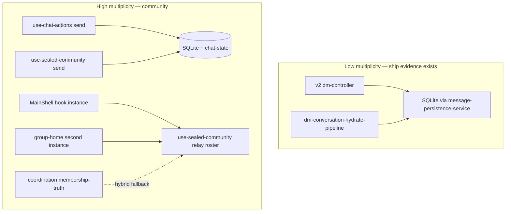

# Synthesis — as-built architecture & fork options

_Last reviewed: 2026-06-02 (baseline commit 7f84f813)._

**Status:** v1 complete (synthesis of modules 1–8)  
**Last updated:** 2026-06-02  
**Inputs:** [Exploration modules 1–8](../README.md#module-index) · [Methodology](../00-methodology-and-synthesis-plan.md) · [Community fork decision](../../program/community-fork-decision-2026-05.md)

---

## 1. Executive summary

The Obscur monorepo is **not one broken app** — it is **two products welded together**:

| Product slice | Maturity (as-built) | Evidence |
|---------------|---------------------|----------|
| **DM + adjacent** (1:1 chat, requests, voice, vault, backup metadata) | **Strong** — single live transport owner, named hydrate pipeline, 64-test P5 CI gate on native DM | [M2](../modules/02-messaging-dm.md), [M8](../modules/08-native-sqlite-persistence-policy.md) |
| **Community / workspace** (group chat, roster, governance, sealed relay ingest) | **Architecturally multi-path** — ~36.5k LOC, parallel send/hydrate/truth owners, **no** group-message cold-restart CI gate | [M1](../modules/01-community-groups.md), [M6](../modules/06-coordination-path-b-workspace.md) |

**User-reported failures** (Test 8 group vanish, Test 10 group messages lost on restart, sidebar metadata survives while thread empty) align with **cross-store drift** and **parallel owners**, not a single missing SQLite table:

```
List/metadata store  ≠  message body store  ≠  membership truth store
         ↓                      ↓                        ↓
   survives restart        may miss hydrate          may hybrid-widen
```

**Fork decision: Path B signed 2026-06-02** ([community-fork-decision-2026-05.md](../../program/community-fork-decision-2026-05.md) · [back-online-modular-roadmap-2026-06.md](../../program/back-online-modular-roadmap-2026-06.md)). Code already implements Path B **shape** (R1 gates, `managed_workspace` default, coordination health probes) but **sovereign/relay roster parallel paths remain** until bands B1–B3 land ([M6](../modules/06-coordination-path-b-workspace.md)).

**Recommendation for synthesis (judgment, not implementation):**

1. **Do not** continue piecemeal group-message persistence patches without a **fork sign-off** and **subtraction plan**.
2. **Path A (DM-only)** is the fastest honest ship if team chat is not the near-term product — removes ~30–40k LOC of active UI surface and stops funding parallel paths.
3. **Path B (internal network)** is viable only with **ops commitment** (coordination Worker + trusted relay) and a **mandatory subtraction** of relay roster truth from `use-sealed-community.ts` — not more adapters.
4. **DM ship claims** can stand on P5 CI + existing architecture; **community ship claims cannot** without new COM-MSG gates and K-M1/K-M2 automation.

---

## 2. Product split — what works vs what does not

### 2.1 Works (evidence-backed)

| Capability | Canonical owners | CI / policy |
|------------|------------------|-------------|
| DM send/receive (native) | `runtime-messaging-transport-owner-provider` → `dm-controller` v2 → `dm-relay-transport` | P5-DM-1/2/3 |
| DM hydrate (native) | `dm-conversation-hydrate-pipeline` → `dm-conversation-hydrate-indexed-scan` → SQLite | P5-DM-2 (8+ day survival) |
| DM conversation list (native) | `conversation-list-authority` → always `sqlite_native` | P3a |
| DM delete / tombstones (native) | Gateway ports → `message-persistence-service` → SQLite | P3b |
| Native persistence policy | `requiresSqlitePersistence()` → `@dweb/db` → `libobscur` | `verify:p5-persistence` |
| Startup / auth gating | `window-runtime-supervisor` → `AuthGateway` → `UnlockedAppRuntimeShell` | `verify:phase1`, truth map minimal set |
| Relay wire (DM) | `enhanced-relay-pool` + `dm-relay-transport` | Transport boundary check |
| Account projection bootstrap (native) | Seal-only — no DM timeline import | `account-event-bootstrap-service.native.test.ts` |
| Native restore body strip | P5-BKP-1 — no dual-write DM/group bodies to chat-state | `encrypted-account-backup-service.native-restore.test.ts` |
| Path B membership API | `apps/coordination` Worker + D1 deltas | `test:coordination-worker`, `test:community-invariants` |
| Relay checkpoints + call history (native) | ACC-03/04 owners | In `verify:p5-persistence` |

### 2.2 Does not work / not shippable as-is

| Capability | Failure mode | Root cause class |
|------------|--------------|------------------|
| **Group chat message cold restart** (Test 10) | Live send OK; empty after full app exit | Parallel send (`use-chat-actions` + `use-sealed-community`); dual hook instances; SQLite vs chat-state vs hook memory; no COM-MSG CI gate |
| **Group sidebar vs thread** | Name / last activity survive; bodies empty | Different lifecycle owners for list vs messages ([M1](../modules/01-community-groups.md) §4) |
| **Public-relay community membership** | Roster never converges across clients | Architecturally infeasible per fork doc — not a bug to fix |
| **Path B roster truth** | Leave may not shrink UI roster reliably | `community-membership-truth.ts` declared single owner but `mergeHybridMembershipTruthFallback` + `use-sealed-community` relay roster still active |
| **Community team-relay publish** | Optimistic `{ success: true }` without wire EVENT | [M5](../modules/05-relays-transport.md) — masks publish failures |
| **Cross-device DM/group bodies via backup** (native) | Sparse restore | Backup **publish** reads chat-state mirror only; native bodies live in SQLite ([M3](../modules/03-account-sync-backup-restore.md)) |
| **Invite relay hints** | Empty/stale after v2 relay list migration | `invite-manager.ts` reads v1 key; settings write v2 ([M5](../modules/05-relays-transport.md)) |
| **Multi-window profile cold restart soak** | Unproven | P3b–P3d manual matrix pending; no CI ([M4](../modules/04-profiles-multi-window-scope.md)) |
| **Coordination production security** | Any signed key can append deltas for any `communityId` | No steward ACL on Worker ([M6](../modules/06-coordination-path-b-workspace.md)) |

### 2.3 Adjacent / partial

| Capability | State |
|------------|-------|
| Voice / media / vault | Strong DM adjacency; not re-audited in exploration shelf |
| Legacy DM v1 controllers | On disk; not production path — deletion candidate for Path A |
| `relay-persistence.ts` | Orphan — no importers ([M5](../modules/05-relays-transport.md)) |
| `RouteDomainProviders` | Reverted experiment — zero importers ([M7](../modules/07-runtime-shell-startup.md)) |
| Rust `background_sync_checkpoints` vs PWA `relay_checkpoints` | Undocumented dual store ([M8](../modules/08-native-sqlite-persistence-policy.md)) |

---

## 3. Owner multiplicity heat map

Severity: **High** = parallel production paths for same user action; **Med** = layered composition unclear in truth map; **Low** = legacy dead code on disk.

| Domain | Declared owner (truth map / enc.) | Parallel / competing paths (observed) | Severity |
|--------|-----------------------------------|---------------------------------------|----------|
| **Group message send** | Enc. 10 sealed community | `use-chat-actions` **and** `use-sealed-community.sendMessage` | **High** |
| **Group message hydrate** | `use-sealed-community` | Main shell instance **+** `group-home-page-client` second instance | **High** |
| **Group message persist** | `sealed-group-message-persistence` | SQLite + chat-state + hook memory + relay; `persistSealedGroupMessages` no-op native but `commitSealedGroupMessages` active | **High** |
| **Membership roster (Path B)** | `community-membership-truth.ts` | Coordination directory **+** `use-sealed-community` relay OR-set **+** `mergeHybridMembershipTruthFallback` | **High** |
| **DM message read (web)** | R1 collapse target | Projection + chat-state + indexed + relay replay | Med (native collapsed) |
| **DM message read (native)** | SQLite indexed scan | Single choke — **low multiplicity** | Low |
| **DM send** | v2 `dm-controller` | Legacy v1 on disk only | Low (live path clean) |
| **Relay composition** | Row 6 `enhanced-relay-pool` | `relay-provider` orchestrates pool + recovery + custom nodes | Med |
| **Profile active id** | Row 2 bootstrap | Registry `activeProfileId` **vs** per-window `__OBSCUR_SYNC_PROFILE_SCOPE__` | Med |
| **Relay list storage** | `use-relay-list` v2 | `invite-manager` v1 reader | Med |
| **Community wire publish** | `team_relay` TransportPort | `enhanced-relay-pool` direct + optimistic team adapter + `group-management-dialog` raw REQ | **High** |
| **Startup profile scope** | Row 2 bootstrap | `layout.tsx` + `desktop-window-boot` + `desktop-profile-runtime` + bootstrap | Med |
| **Backup publish payload** | Row 7 backup service | chat-state mirror only — not SQLite | **High** (cross-device) |
| **15× profile bus dual-subscribers** | Profile bus | Legacy window events bridged in parallel | Med |



---

## 4. Persistence authority map (native)

| Data | Read authority (native) | Write path | Survives cold restart? | CI gate |
|------|-------------------------|------------|------------------------|---------|
| DM thread messages | **SQLite** (`dbGetMessages`) | `message-persistence-service` | **Yes** if write succeeded + correct profile slot | P5-DM-1/2 |
| DM conversation list | **SQLite** (`dbGetConversations`) | persistence service + provider merge | Yes (list) | P3a |
| DM tombstones | **SQLite** | Gateway + persistence service | Yes | P3b |
| Group list rows | **SQLite** + chat-state merge | `community-group-sqlite-store` | List often yes | P5-COM-4 |
| Group message bodies | **SQLite** (intended) + chat-state supplement | `commitSealedGroupMessages` | **Unproven** — Test 10 fails | **None** |
| Membership roster (Path B) | Coordination directory cache (localStorage) when `fresh` | HTTP delta publish | Poll-dependent; hybrid widens from relay | K-M1/K-M2 manual only |
| Membership roster (legacy) | Relay / chat-state OR-set | `use-sealed-community` | Not cross-client truth | None |
| chat-state `messagesByConversationId` | **Not read authority** on native | Mirror on write | Metadata may survive | P5-BKP-1 strip on restore |
| Account projection DM timeline | **Not imported** on native | Seal-only bootstrap | N/A | P3c test |
| Backup payload DM/group bodies | N/A on publish | chat-state serialization | **Sparse on native** | BKP-1 restore only |
| Relay checkpoints | SQLite per-relay + localStorage `dm:all` | `relay-checkpoint-sqlite-store` | Yes (ACC-03) | In P5 gate |
| Call records | SQLite terminal history | `call-record-sqlite-store` | Yes (ACC-04) | In P5 gate |

**Cross-cutting failure pattern:**

> Sidebar/metadata uses **list + chat-state + ledger** paths. Thread bodies use **sealed persistence + hook state**. Wrong **profile slot** at write vs read (M4) empties bodies while list survives. **Mitigation:** `listAccountSharedSqliteProfileIds` on native only.

---

## 5. Doc debt register

Consolidated from modules 1–8. Severity drives synthesis priority.

| ID | Doc says | Code does | Modules | Severity |
|----|----------|-----------|---------|----------|
| D1 | Enc. 10 community create/join stable | Multi-path send/hydrate; user Test 10 evidence | M1 | **High** |
| D2 | Truth map row 2 = `desktop-profile-bootstrap` only | Boot split across 4 owners | M4, M7 | Med |
| D3 | Enc. 04 `enhanced-dm-controller` live | v2 `dm-controller` is live path | M2 | Med |
| D4 | `relay_runtime_degraded` during activation | `resolveRelayRuntimeGate` unused | M7 | Med |
| D5 | `NON_CANONICAL` diagnostic on native IDB reads | String not in codebase | M8 | Med |
| D6 | Policy § Domains: relay checkpoints "no PWA owner" | Owner matrix: ACC-03 done | M8 | Med |
| D7 | Fork decision unsigned | De facto Path B gates in UI | M6 | Med |
| D8 | `community-membership-truth` single owner | Hybrid fallback + sealed-community parallel | M6, M1 | **High** |
| D9 | `createCommunityTeamRelayTransport` transport | Optimistic success without EVENT | M5, M6 | **High** |
| D10 | Invite relay list = settings list | v1 vs v2 storage keys | M5 | Med |
| D11 | `relay-persistence.ts` desktop persistence | Orphan, no importers | M5 | Med |
| D12 | Backup restore audit / dual path | Publish still chat-state-only | M3 | **High** |
| D13 | P3b–P3d done | Manual two-profile soak pending | M4, M8 | **High** |
| D14 | Coordination = invite utility (some enc. index entries) | Full B2 membership directory | M6 | Med |
| D15 | Kernel spec WS/SSE membership subscribe | HTTP poll 30s only | M6 | Med |

---

## 6. Test gate map

### 6.1 What CI proves today

| Gate | Command | Proves | Does **not** prove |
|------|---------|--------|-------------------|
| P5 persistence | `pnpm verify:p5-persistence` | 64 tests: DM write/hydrate/lookback, BKP-1 strip, COM-2/3/4 list/leave, ACC-03/04 | Group **message** restart; multi-window soak; backup **publish** |
| Phase 1 runtime | `pnpm verify:phase1` | Window supervisor, activation manager, experiment shell | Full startup chain E2E |
| Coordination worker | `pnpm test:coordination-worker` | Signed delta append, head/deltas API | Steward ACL, two-client E2E |
| Community invariants | `pnpm test:community-invariants` | Coordination client, trust policy, membership truth unit | Poll → UI roster update |
| Transport boundaries | `pnpm transport:boundaries:check` | Nostr feature allowlist | Community wire delivery |
| Truth map minimal set | vitest 6-file pack | Auth shell, activation, identity, backup service, group membership integration | Relay boot, profile multi-window |

### 6.2 Manual-only / missing gates (ship blockers by domain)

| Domain | Missing gate | Blocks claim |
|--------|--------------|--------------|
| **Group messages** | Send → kill process → reopen → bodies visible | "Community chat works" |
| **Path B roster** | Two clients K-M1/K-M2 automated | "Leave propagates" |
| **Multi-window** | Profile A/B relay list + hydrate isolation | Desktop production |
| **Backup cross-device** | Native publish includes SQLite-derived bodies | "Restore my history on new device" |
| **Community wire** | Team-relay EVENT delivery test | Path B chat publish |

### 6.3 DM vs community test asymmetry (synthesis fact)

| Band | DM | Community |
|------|-----|-----------|
| Outbound persist | P5-DM-1 ✅ | — |
| Hydrate survival | P5-DM-2 ✅ | — |
| List authority | P3a ✅ | P5-COM-4 ✅ |
| Leave recovery | — | P5-COM-2 ✅ |
| **Message cold restart** | Partial (unit; no Tauri E2E) | **❌ none** |

---

## 7. Fork options

All options assume **no further piecemeal patches** without explicit fork sign-off. Estimates are **order-of-magnitude** for planning — not implementation commitments.

### 7.1 Path A — DM-only (honest interim ship)

**Policy:** Hide or feature-flag community product surface; keep DM, profiles, relays (DM), backup, security, vault/voice as today.

| Dimension | Assessment |
|-----------|------------|
| **User value** | Strong DM + media + voice; honest about no team rooms |
| **Code impact** | Subtract UI routes + dialogs; **do not delete** all 36k LOC day one — flag first |
| **Ops** | No coordination Worker required |
| **Risk** | Low regression to DM if subtraction is UI-first |
| **Evidence to ship** | Existing P5 + phase1 + manual DM soak |

**Subtraction list (priority order):**

1. Hide: `create-group-dialog`, community home routes, invite-connections group flows, participant modal, group management entry points.
2. Stop mounting: `SealedGroupMessageDurabilityOwner` pre-auth if not needed for DM ([M7](../modules/07-runtime-shell-startup.md) invariant #2).
3. Delete after flag soak: second `useSealedCommunity` in `group-home-page-client`, `use-chat-actions` group send branch.
4. Archive: sovereign room create path, public-relay community candidate URLs in default relay list.
5. Docs: Fill fork decision record **Path A**; cancel K-Matrix community bands.

**Keep (minimum for DM-adjacent):**

- `runtime-messaging-transport-owner-provider`, v2 DM stack, `message-persistence-service`, hydrate pipeline.
- Community **invite DMs** if product needs invite-in-DM — audit `community-dm-invite-pipeline` separately (small slice).

**LOC still running (flagged, not deleted):** ~30k groups services — acceptable technical debt until hard delete pass.

---

### 7.2 Path B — Internal network (finish, don't patch)

**Policy:** Coordination directory owns roster; trusted/private relay for chat; `managed_workspace` only for new creates; subtract relay roster truth.

| Dimension | Assessment |
|-----------|------------|
| **User value** | Team rooms with provable leave/roster shrink (K-M1/K-M2) |
| **Code impact** | **Subtraction > addition** — amputate hybrid paths in `use-sealed-community` for `managed_workspace` |
| **Ops** | **Required:** deployed coordination Worker + at least one trusted `wss://` relay |
| **Risk** | High if hybrid fallback remains; security gap on Worker ACL |
| **Evidence to ship** | K-M1/K-M2 automated + COM-MSG gate + steward ACL design |

**Mandatory subtractions (not optional):**

1. For `managed_workspace`: **disable** `mergeHybridMembershipTruthFallback` relay widen — coordination `fresh` or empty only.
2. **Remove** relay roster as membership authority in `use-sealed-community` for workspace mode (ingest chat only).
3. **Fix** `createCommunityTeamRelayTransport` to publish real EVENT or fail visibly.
4. **Migrate** `invite-manager.ts` to v2 relay list keys.
5. **Add** Worker steward ACL (who may append deltas per `communityId`).
6. **Add** `P5-COM-MSG` + K-M1/K-M2 to CI.

**Addition scope (smaller than subtraction):**

- WS/SSE subscribe **or** accept 30s poll with explicit product SLA.
- BKP-2: backup publish reads SQLite evidence on native ([M3](../modules/03-account-sync-backup-restore.md)).

**LOC:** Retain `apps/coordination` (~674 LOC server) + Path B client (~3.8k) — shrink `use-sealed-community` over time, not grow.

---

### 7.3 Path C — Community amputation (hard delete)

**Policy:** Path A + delete `apps/pwa/app/features/groups/` prod surface over phased PRs.

| Dimension | Assessment |
|-----------|------------|
| **Benefit** | Removes ~36.5k LOC confusion; agents stop patching wrong module |
| **Cost** | Lose all community UI; invite/community DM pipelines need explicit port or delete |
| **When** | After Path A flag proves DM ship stable 2–4 weeks |

**Not on critical path for DM ship.**

---

### 7.4 Path D — Full community rewrite

**Policy:** New module with single owner per concern; reuse `GroupService` crypto + coordination client only.

| Dimension | Assessment |
|-----------|------------|
| **Benefit** | Clean architecture |
| **Cost** | Highest — essentially new product module inside monorepo |
| **Prerequisite** | Path B policy signed + COM-MSG contract defined |
| **Recommendation** | **Only if Path B subtraction fails** after 2 substantial iterations (feasibility gate per `rules/11`) |

---

### 7.5 Abandon / pause

**Policy:** Stop community investment; maintain DM-only; archive coordination Worker.

Valid if ops cannot run coordination + private relay. Matches Path A with explicit product positioning.

---

## 8. Fork comparison matrix

| Criterion | Path A DM-only | Path B finish | Path C amputate | Path D rewrite |
|-----------|----------------|---------------|-----------------|----------------|
| Time to honest ship | **Weeks** | Months | Weeks + delete sprints | Quarters |
| Ops burden | Low | **High** | Low | High |
| Stops Test 10 class bugs | **Yes** (no product) | Only if subtraction complete | **Yes** | Eventually |
| DM regression risk | Low | Med (shared providers) | Low | Low |
| Uses existing B2 code | No | **Yes** | No | Partial |
| Signed fork record needed | **Yes** | **Yes** | Yes | Yes |

---

## 9. Cross-module dependency facts (for any fork)

| If you change… | Also impacts… |
|----------------|---------------|
| `UnlockedAppRuntimeShell` mount order | M2 transport, M5 relay, M1 groups, M3 activation |
| `requiresSqlitePersistence()` | All hydrate + persist owners |
| `listAccountSharedSqliteProfileIds` | M2 DM hydrate, M1 sealed group load |
| `chat-state-store` write | M3 backup publish, M1 group merge, Enc. 18 cache purge |
| `use-sealed-community` | M1 send/hydrate, M6 hybrid roster, M5 pool subscriptions |
| Coordination Worker URL | M6 create/join gates, M1 invite flows |
| `AuthGateway` phase gating | Everything heavy — invariant #2 |

---

## 10. Recommended order if staying on Path B

1. **Sign fork decision record** (Path A or B) — unblocks all implementation.
2. **Add COM-MSG + K-M1/K-M2 CI** — fail-first before more UI work.
3. **Subtract hybrid roster** in `managed_workspace` — single coordination truth.
4. **Fix team-relay publish** + invite-manager v2 relay keys.
5. **Worker steward ACL** — production blocker for Path B.
6. **BKP-2 backup publish** — cross-device native bodies.
7. **Phase B manual soak** — two-profile desktop matrix; promote to CI when stable.
8. **Truth map / enc. doc pass** — resolve D1–D15 after code matches chosen fork.

If **Path A**: steps 1 → flag UI → P5 maintenance only → optional Path C delete pass.

---

## 11. What exploration did not audit

| Area | Note |
|------|------|
| Voice call full convergence | Enc. 04 cites active hardening |
| Vault / media CAS recovery | Adjacent to M3 restore |
| Mobile Tauri shell | Policy claims parity; not module-audited |
| Production web | Disabled per `production-surfaces.md` |
| Tauri Rust background sync | Dual checkpoint store flagged only |

---

## 12. References

### Module notes (primary evidence)

- [01 — Community / groups](../modules/01-community-groups.md)
- [02 — Messaging / DM](../modules/02-messaging-dm.md)
- [03 — Account sync & backup](../modules/03-account-sync-backup-restore.md)
- [04 — Profiles & multi-window scope](../modules/04-profiles-multi-window-scope.md)
- [05 — Relays & transport](../modules/05-relays-transport.md)
- [06 — Coordination / Path B workspace](../modules/06-coordination-path-b-workspace.md)
- [07 — Runtime, shell, startup](../modules/07-runtime-shell-startup.md)
- [08 — Native SQLite & persistence policy](../modules/08-native-sqlite-persistence-policy.md)

### Canonical program docs

- [community-fork-decision-2026-05.md](../../program/community-fork-decision-2026-05.md)
- [obscur-native-sqlite-policy.md](../../program/obscur-native-sqlite-policy.md)
- [p5-persistence-survival-contract.md](../../program/p5-persistence-survival-contract.md)
- [12-core-architecture-truth-map.md](../../encyclopedia/12-core-architecture-truth-map.md)

---

## Revision history

| Date | Change |
|------|--------|
| 2026-06-02 | v1 — synthesis of exploration modules 1–8 |
