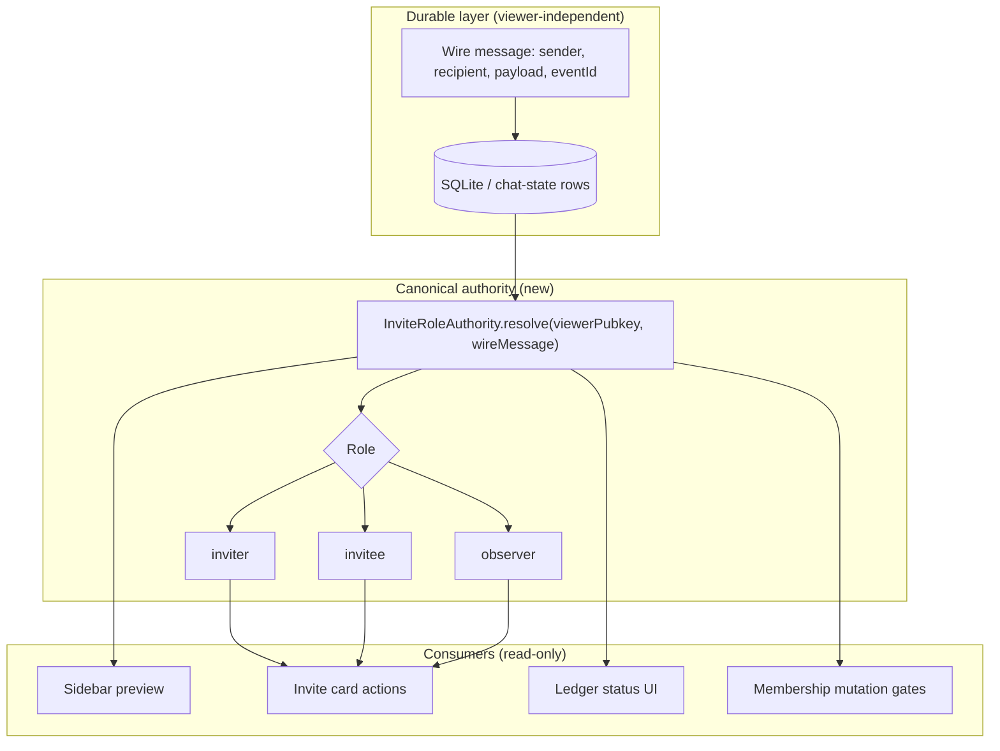

# Community invite role ecosystem — design

- Status: **Draft charter** (2026-06-25)
- Investigation: [`specs/backend/community-invite-role-authority-investigation.md`](../../specs/backend/community-invite-role-authority-investigation.md)
- Principle: **One canonical role resolver per viewer action.** Subtract overlapping owners before UI changes.

## Goal

Establish a **role-matching ecosystem** so invite/request flows always present the correct affordances:

| Viewer role | Active invite card | Terminal response card |
|-------------|-------------------|------------------------|
| **Inviter** | Cancel, view status | Outgoing accept/decline copy |
| **Invitee** | Accept, Decline | Outgoing accept/decline copy |
| **Observer** | Read-only historical | Read-only |

No profile may inherit another profile's role. Sidebar, thread card, and action handlers must agree.

---

## Architecture



### Module: `InviteRoleAuthority`

**Location (proposed):** `apps/pwa/app/features/groups/services/community-invite-role-authority.ts`

**Public API:**

```ts
export type CommunityInviteViewerRole = "inviter" | "invitee" | "observer";

export type ResolveCommunityInviteViewerRoleParams = Readonly<{
  viewerPublicKeyHex: PublicKeyHex;
  message: Pick<Message, "senderPubkey" | "recipientPubkey" | "content">;
}>;

export function resolveCommunityInviteViewerRole(
  params: ResolveCommunityInviteViewerRoleParams,
): CommunityInviteViewerRole;

export function resolveCommunityInviteResponseViewerRole(
  params: ResolveCommunityInviteViewerRoleParams,
): CommunityInviteViewerRole;

export function isCommunityInviteActionPermitted(
  role: CommunityInviteViewerRole,
  action: "accept" | "decline" | "cancel",
): boolean;
```

**Rules (normative):**

1. Parse invite/response payload from `message.content`.
2. Compare **normalized** `viewerPublicKeyHex` to `senderPubkey`, `recipientPubkey`, and payload `creatorPubkey` (if set).
3. **Inviter** if viewer sent the invite rumor OR viewer is payload creator and sender is missing (legacy only — log telemetry).
4. **Invitee** if viewer is recipient and not inviter.
5. **Observer** otherwise (superseded, foreign, or incomplete wire).
6. **Never** read `message.isOutgoing` for role resolution.
7. **Never** read ledger `direction` for role resolution.

**Bubble layout (separate concern):**

```ts
export function resolveDmBubbleIsOutgoing(
  viewerPublicKeyHex: PublicKeyHex,
  message: Pick<Message, "senderPubkey">,
): boolean;
// Strict: senderPubkey === viewerPublicKeyHex
```

Normalize pipeline must **recompute** `isOutgoing` from sender + viewer at hydrate time, overwriting stale sqlite flags for display.

---

## Subtraction plan (remove parallel owners)

Execute in order — **no new UI until steps 1–3 land.**

| Step | Subtract | Replace with |
|------|----------|--------------|
| S1 | `buildSyntheticOutboundInviteMessages` in thread display | Hydrate only wire/sqlite rows; ledger drives **status** not synthetic rows |
| S2 | `normalizeCommunityInviteThreadSenderPubkeys` | Fix ingest to always persist sender/recipient; normalize derives sender from wire |
| S3 | Role logic inside `augmentCommunityDmInviteThreadMessages` | Augment becomes **status overlay only** (superseded, terminal) — no role |
| S4 | `CommunityInviteCard` prop `isOutgoing` | Prop `viewerRole: CommunityInviteViewerRole` from authority |
| S5 | Ledger field `direction` as UI input | Ledger stores invite facts; direction derived when needed for analytics only |

---

## Ledger redesign (minimal)

Keep ledger for **status** and **idempotency**, not role:

```ts
type CommunityDmInviteLedgerEntry = Readonly<{
  inviteId: CommunityDmInviteId;
  conversationId: string;
  peerPubkey: PublicKeyHex;       // the other party
  inviterPubkey: PublicKeyHex;    // wire truth — NEW required field
  inviteePubkey: PublicKeyHex;    // wire truth — NEW required field
  groupId: string;
  status: CommunityInviteResolutionStatus;
  // ... payload mirror fields
}>;
```

Migration: on read, infer `inviterPubkey`/`inviteePubkey` from legacy `direction` + `peerPubkey` + local account; rewrite on next mutation.

---

## Consumer contract

### Message list / dm-kernel thread

```ts
const viewerRole = resolveCommunityInviteViewerRole({
  viewerPublicKeyHex: activeAccountPubkey,
  message,
});
<CommunityInviteCard viewerRole={viewerRole} ... />
```

### Sidebar preview

Already peer-aware — switch to `InviteRoleAuthority` for invite/response JSON types so list and card share one function.

### Action handlers (`community-invite-card.tsx`)

```ts
if (!isCommunityInviteActionPermitted(viewerRole, "accept")) return;
```

Remove branching on `isOutgoing` for permissions (layout styling may still use bubble direction).

---

## Proof plan

| Layer | Command / scenario | Pass criteria |
|-------|-------------------|---------------|
| **L1** | `community-invite-role-authority.test.ts` | Matrix: all sender/recipient/creator × viewer combinations |
| **L1** | Extend `community-dm-invite-pipeline.test.ts` | Augment does not inject synthetic invites; no role in augment |
| **L2** | `community-invite-card.test.tsx` | Invitee sees Accept; inviter sees Cancel; observer read-only |
| **L3** | Two-window harness (Tester1/Tester2) | COM-MEM-2 steps 3–4: invite → accept — one card each, correct buttons |
| **L4** | Leave → re-invite → rejoin (user test) | Membership + no duplicate accept; roles stable after cold restart |

### L3 manual matrix (record in COM-MEM-2)

| Step | Actor | Expected UI |
|------|-------|-------------|
| 1 | A sends invite | A: Cancel · B: Accept/Decline |
| 2 | B accepts | A: incoming acceptance · B: outgoing acceptance |
| 3 | Cold restart both | Same as step 2 — no duplicate cards, roles unchanged |
| 4 | B leaves community | Roster updates both sides |
| 5 | A re-invites | Repeat step 1 — no ghost prior invite actions |

---

## Implementation slices (ordered)

1. **IRA-1** — `InviteRoleAuthority` module + L1 matrix tests (no UI change). **Landed 2026-06-25** — `community-invite-role-authority.ts`
2. **IRA-2** — Normalize recompute `isOutgoing` from sender; ingest audit for missing sender/recipient. **Landed 2026-06-25** — `dm-conversation-normalize-message.ts`
3. **IRA-3** — Subtract synthetic invite injection; ledger status-only. **Landed 2026-06-25** — augment no longer calls `buildSyntheticOutboundInviteMessages`
4. **IRA-4** — Wire `CommunityInviteCard` to `viewerRole`; delete permission branches on `isOutgoing`. **Landed 2026-06-25** — `message-list.tsx`, `community-invite-card.tsx`, `community-invite-response-card.tsx`
5. **IRA-5** — dm-kernel + legacy thread paths call authority at display boundary (single function). **Landed 2026-06-25** — `community-invite-display-boundary.ts`; `message-list`, `format-conversation-message-preview`, `conversation-row`
6. **IRA-6** — Ledger schema v3 with inviter/invitee pubkeys; lazy migration. **Landed 2026-06-25** — `community-dm-invite-ledger.ts` v3 storage + wire party inference

**COM-RUN-11 IRA slice complete** — manual L3/L4 retest + register close remain.

---

## Register entry

| ID | Severity | Summary |
|----|----------|---------|
| **COM-RUN-11** | P0 | Invite role collapse — both profiles see inviter Cancel (no Accept) |

Link investigation + this design. Status: **Open** — IRA-6 ledger v3 landed (L1); rebuild + manual invite matrix retest required before closing COM-RUN-11.

---

## User rejoin test (when to run)

Run the leave → re-invite test **after IRA-4** rebuild. Before that, expect role mismatch regardless of membership correctness — testing membership alone will confound role bugs with relay/membership bugs (COM-RUN-01/05).

Until then, record observations only:

- Sidebar text vs card buttons (documents split-brain)
- Whether duplicate acceptance cards appear (separate dedupe band — COM-RUN-11 adjunct)
