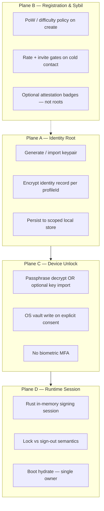

# Obscur Auth Kernel — charter (serverless identity & unlock)

**Status:** **AUTH-K-AUTHORITY landed** — runtime owner on `auth-kernel`; `isAuthKernelAuthority()` true; KERN 1–5 headless + surface port routing complete. Manual soak: [auth-kernel-kern-manual-matrix.md](./auth-kernel-kern-manual-matrix.md).  
**Last updated:** 2026-06-25  
**Owner (target):** `packages/dweb-auth` + `apps/pwa/app/features/auth-kernel` + Rust `auth_boot` in Tauri  
**Predecessors:** [v1.9.6-session-persistence-redesign.md](../archive/program/inactive-2026-06/v1.9.6-session-persistence-redesign.md) · [obscur-auth-assistant-charter.md](../archive/program/inactive-2026-06/obscur-auth-assistant-charter.md) · [auth-ux-redesign-future.md](../archive/program/inactive-2026-06/auth-ux-redesign-future.md)  
**Analog:** [v1.9.0-kernel-backend-roadmap.md](../archive/program/inactive-2026-06/v1.9.0-kernel-backend-roadmap.md) (Lane K for communities/DMs)  
**Rules:** `rules/05-auth-and-identity.md` · `rules/11-feasibility-and-modular-safety.md`

---

## 1. Thesis — “serverless Better Auth”

[Better Auth](https://better-auth.com/docs/introduction) solves **centralized session management**: email/OAuth roots, server-side session tables, refresh tokens, and “remember me” cookies. It is excellent for blogs, e-commerce, and SaaS where **the operator runs the IdP**.

Obscur’s auth problem is different:

| Dimension | SaaS (Better Auth class) | Obscur Auth Kernel |
|-----------|--------------------------|-------------------|
| Identity root | Server-issued user id + password hash | **Locally generated Nostr keypair** (self-custody) |
| Session proof | HTTP cookie / JWT from server | **In-memory signing keys** + optional **OS secure storage** per `profileId` |
| Registration | Server validates email, CAPTCHA, billing | **Local create/import** + **optional sybil friction** (PoW, invites, rates) |
| “Remember me” | Server session TTL | **Device unlock** — passphrase primary; **not** a browser token; **no biometric MFA** |
| Multi-tenant | One app, many users on server | **Many profile windows**, each with explicit scope |
| Trust model | Operator can revoke accounts | **User revokes device material**; no vendor ban hammer |

**Product sentence:** Obscur Auth Kernel is a **portable, self-hosted library** for *local-first identity lifecycle* — create, import, unlock, lock, sign out, register with abuse friction — without a session server.

OAuth / enterprise IdP may attach **later as optional attestations or business SSO bridges**, never as the only root for self-custody users.

---

## 2. Why rethink now (same lesson as DMs / communities)

Community and DM work converged on **one kernel owner** (`workspace-kernel-*-port.ts`, coordination backend, subtraction manifest). Auth today is the opposite:

```text
Today (scatter — do not extend)
├── use-identity.ts              ← identity state + unlock + bootstrap + native restore
├── auth-gateway.tsx             ← auto-restore effects + routing + defer shells
├── window-runtime-supervisor.ts ← unlock wrappers + device trust side effects
├── session-credential-policy.ts ← build flags (easy to flip; runtime unchanged)
├── device-trust-service.ts      ← consent flags (parallel to keychain)
├── desktop-window-boot.ts       ← profile bind + deferred session retry
├── native-session-reload-restore.ts ← aggressive F5 loop
├── auth-screen.tsx              ← UX + import/create/login
└── apps/desktop session.rs      ← keychain + in-memory SessionState (no boot owner)
```

**Evidence:** `pnpm verify:session-persistence-policy` passes; manual F5/restart restore fails repeatedly ([v1.9.6 § Cancellation](../archive/program/inactive-2026-06/v1.9.6-session-persistence-redesign.md)). Policy patches are not a module — they are symptoms of **missing auth kernel ownership**.

---

## 3. Auth Kernel — four planes (library boundaries)

Treat each plane as a **port** with typed contracts in `packages/dweb-auth`, runtime adapters in app/Tauri, and **one owner per plane**.



### Plane A — Identity Root (`IdentityRootPort`)

**Job:** Cryptographic identity exists locally; no network required for success.

| Operation | Input | Output | Never stores |
|-----------|-------|--------|--------------|
| `createIdentity` | passphrase, username?, sybil policy | `IdentityRecord` + pubkey | passphrase in browser storage (desktop) |
| `importIdentity` | privateKeyHex, passphrase?, username? | bound record | raw hex in browser storage |
| `readStoredIdentity` | `profileId` | record or absent | — |

**Existing packages:** `@dweb/crypto`, `@dweb/core/identity-record`, `identity-persistence.ts` (to migrate behind port).

### Plane B — Registration & Sybil (`RegistrationPolicyPort`)

**Job:** Raise cost of mass automated registration **without** mandatory real-world ID ([greenfield 03](../archive/greenfield/03-identity-and-sybil.md)).

| Tier | Mechanism | When |
|------|-----------|------|
| A (always) | Per-pubkey rate limits, backoff on cold contact | Messaging / invites |
| B (default) | Invite artifacts, WoT depth, steward approval | Groups / cold DM |
| C (optional deploy) | PoW on account create (already partial in `createPoWIdentity`) | High-abuse deployments |
| D (optional badge) | Passkey cluster, email verify **badge only** | B2Pro / enterprise later |

**Not auth-kernel v1:** OAuth login root, SMS OTP root, server-side CAPTCHA as sole gate.

**Relationship to v1.9.5:** SEC-F / SEC-B are **downstream consumers** of pubkey + trust signals — not duplicate registration owners.

### Plane C — Device Unlock (`DeviceUnlockPort`)

**Job:** User **explicitly** unlocks a profile window — daily UX without pasteboard gymnastics.

| Material | Storage | Revoke action |
|----------|---------|---------------|
| Master passphrase | OS keychain / encrypted vault entry | “Remove from this device” |
| Raw nsec (first bind only) | Transient → OS vault after import | Sign out + delete keychain |
| Browser unlock token | **Mobile shell only** | Clear trust flag |

**Lessons absorbed:**

- **v1.9.6 silent restore:** cancelled — boot race ([feasibility gate](../archive/program/inactive-2026-06/v1.9.6-session-persistence-redesign.md)).
- **Auth Assistant:** deferred — same unlock must go through **one IPC path after shell ready** ([AA charter](../archive/program/inactive-2026-06/obscur-auth-assistant-charter.md)).

**v1 product stance:** *Passphrase unlock* is the primary daily path. **No biometric MFA.** OS biometric (if present in code) is **not** a second factor and must not become a required gate. Wallet-style key / recovery-phrase surfaces stay **optional** (advanced import/export) — never mandatory onboarding.

### Plane D — Runtime Session (`RuntimeSessionPort`)

**Job:** Signing keys in memory for crypto + relay; clear semantics for lock / sign out / refresh.

| User action | Memory session | OS keychain | Identity record |
|-------------|----------------|-------------|-----------------|
| Unlock | Load | Write if consented | Unchanged |
| Lock | Clear | Keep | Keep |
| Sign out | Clear | Delete | Keep (or wipe if user chooses) |
| F5 refresh | **Rust boot owner hydrates** before React | Read | Rehydrate from scoped store |

**Critical invariant:** `RuntimeSessionPort` owns **boot hydrate order** — profile scope → registry bind → keychain read → memory session → emit `AuthBootSnapshot` to JS. No parallel restore in `AuthGateway` / `use-identity` effects.

---

## 4. Target module layout

### Package (portable library)

```text
packages/dweb-auth/
  src/
    ports/
      identity-root-port.ts
      registration-policy-port.ts
      device-unlock-port.ts
      runtime-session-port.ts
    contracts/
      auth-boot-snapshot.ts      # status, profileId, pubkey, startupPhase
      auth-unlock-options.ts     # staySignedIn, context
      auth-sybil-policy.ts       # PoW difficulty, invite required, etc.
      auth-diagnostic.ts         # keychain ready / mismatch / persist_error
    policy/
      session-credential-policy.ts   # moved from app; build-time flags only
    index.ts
  package.json
```

**Dependency rule:** `packages/dweb-auth` imports `@dweb/crypto`, `@dweb/core` — **not** React, **not** `@dweb/nostr`, **not** app features.

### App adapter (like workspace-kernel)

```text
apps/pwa/app/features/auth-kernel/
  auth-kernel-provider.tsx
  auth-kernel-native-adapter.ts    # Tauri IPC → RuntimeSessionPort
  auth-kernel-web-adapter.ts       # mobile shell token path
  auth-kernel-boot-owner.tsx         # subscribes to Rust boot snapshot ONLY
  auth-kernel-subtraction-manifest.ts
  auth-kernel-*.contract.test.ts
  index.ts
```

### Rust boot owner (desktop / mobile native)

```text
apps/desktop/src-tauri/src/auth/
  boot.rs              # single hydrate before webview signals ready
  session_commands.rs  # move from commands/session.rs
  keychain.rs          # wrap native_keychain
```

**IPC contract:** `auth_boot_snapshot` event or command returning `{ profile_id, session_active, npub, keychain_present, mismatch }`.

### UI (thin)

`auth-screen.tsx`, title-bar lock/sign-out → call **only** `auth-kernel` ports. Delete restore loops from `auth-gateway.tsx` over time (subtraction manifest).

---

## 5. Comparison to abandoned / deferred paths

| Path | Fate | Absorbed into Auth Kernel as |
|------|------|------------------------------|
| v1.9.6 silent remember-me | Cancelled | Plane D boot owner + explicit `DESKTOP_OS_SESSION_RESTORE_PRODUCT_READY` gate |
| Auth Assistant AA-1 | Deferred | Plane C assisted unlock UI + same `DeviceUnlockPort` IPC |
| Browser remember-me desktop | Policy forbidden | Plane C mobile-only token adapter |
| `session-credential-policy` flag flips | Insufficient | Policy becomes **outputs** of kernel diagnostic, not inputs to hope |

---

## 6. Phased delivery (AUTH-K bands)

Do **not** run parallel with community UI subtraction unless handoff explicitly splits capacity.

| Band | Scope | Exit gate |
|------|--------|-----------|
| **AUTH-K0** | This charter + port interfaces + subtraction manifest listing legacy owners | Doc + empty ports compile |
| **AUTH-K1** | Extract Plane A + C pure TS to `packages/dweb-auth`; app adapters call ports; no behavior change | `pnpm verify:auth-kernel-contracts` (new) green; existing auth tests green |
| **AUTH-K2** | Rust `auth_boot` owner; JS consumes `AuthBootSnapshot` only; delete F5 restore loops from `use-identity` / `auth-gateway` | **AUTH-KERN-1:** headless/desktop test — unlock → F5 → chat without Welcome Back |
| **AUTH-K3** | Plane B registration policy port; wire PoW create + invite-required modes; steward-configurable sybil profile | Contract tests + dev-lab registration abuse scenario |
| **AUTH-K4** | Auth Assistant (Plane C UI) on top of `DeviceUnlockPort`; passphrase-first; **no biometric MFA** | Manual mobile + desktop unlock without clipboard |
| **AUTH-K5 (optional)** | Enterprise OAuth **bridge** — maps external IdP to local profile binding, not replacement root | Separate charter; B2Pro only |

**Flip `DESKTOP_OS_SESSION_RESTORE_PRODUCT_READY`** only when AUTH-KERN-1 passes — not before.

---

## 7. Verification matrix

| Gate | Proves |
|------|--------|
| `verify:auth-kernel-contracts` | Port purity, one owner per plane, no forbidden imports |
| **AUTH-KERN-1** | Desktop: unlock → F5 → unlocked runtime (no auth screen) |
| **AUTH-KERN-2** | Desktop: lock → F5 → auth screen; keychain preserved → one password unlock |
| **AUTH-KERN-3** | Sign out → F5 → auth screen; keychain empty |
| **AUTH-KERN-4** | Two profile windows — keychain/session scoped; no cross-profile leak |
| **AUTH-KERN-5** | PoW create at configured difficulty; farm attempt throttled |

Manual rows: [auth-kernel-kern-manual-matrix.md](./auth-kernel-kern-manual-matrix.md) (same pattern as COM-MEM / dm-kernel gates).

---

## 8. Non-goals (Auth Kernel v1)

- Email / phone / OAuth as **identity roots** for self-custody mode
- Cloud-synced password vault (1Password-style hosted service)
- Browser `localStorage` unlock tokens on **desktop**
- Silent cold-start autologin without user gesture
- Replacing encrypted workspace backup / export story
- Claiming “Better Auth parity” — different problem, different library

---

## 9. Program placement

| Item | Decision |
|------|----------|
| Community roster band | Remains paused (honest UI subtraction) — **do not** mix with AUTH-K2 boot work |
| Current desktop UX | Honest copy: manual unlock on refresh until AUTH-KERN-1 passes |
| v2.0 gate | Auth kernel exit (K2 + K3 minimum) before marketing “secure session on desktop” |

---

## 10. Next atomic step (AUTH-K2)

1. Rust `auth_boot` owner + `RuntimeSessionPort` native adapter.
2. JS consumes `AuthBootSnapshot` only; subtract F5 restore from legacy scatter.
3. Gate: **AUTH-KERN-1** (unlock → F5 → chat).

**AUTH-K1 complete:** identity + device-unlock adapters, legacy bridge, provider mounted (inactive).

**Do not:** flip `isAuthKernelAuthority()` before AUTH-KERN-1.

---

## Reference map

| Doc | Role |
|-----|------|
| [03-identity-and-sybil.md](../archive/greenfield/03-identity-and-sybil.md) | Sybil ladder (Plane B) |
| [security-foundation-contracts.ts](../../packages/dweb-core/src/security-foundation-contracts.ts) | Session/device types for E2EE layer alignment |
| [14-module-owner-index.md](../encyclopedia/14-module-owner-index.md) | Update when auth-kernel owner lands |
| [design-goals-and-constraints.md](./design-goals-and-constraints.md) | Self-custody invariants |
