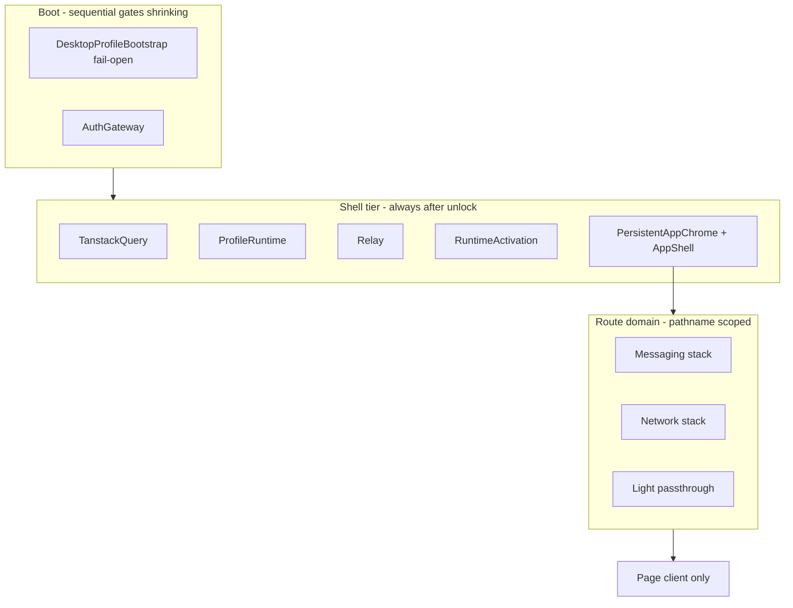

# Obscur product shell — global architecture (2026-05)

**Status:** Adopted for experiment trunk  
**Problem:** Startup gates + full provider tree + per-route remounts make the app feel broken in dev and prod.  
**Goal:** One persistent shell, progressive runtime, fast desktop dev loop — without another greenfield rewrite.

---

## Decision summary

| Layer | Choice | Rationale |
|-------|--------|-----------|
| **Desktop shell** | Stay **Tauri + static export** for production | Already matches `frontendDist`; no server at runtime |
| **Desktop dev** | **`next dev --turbopack`** (not webpack) | Removes minute-long cold compile from the inner loop; prod still static |
| **Web/PWA** | Keep **Next App Router** | SEO, shareable routes, one codebase |
| **Long-term desktop** (optional Phase B) | **Vite SPA** in `apps/desktop-ui` sharing `packages/*` | If turbopack + staged shell insufficient; migrate when loadability proven |
| **UI architecture** | **Persistent product chrome + route domain providers** | Fixes “every nav remounts the world” structurally |
| **Boot** | **Fail-open profile on desktop** | Paint shell in &lt;500ms; native refresh in background |

We do **not** adopt another 500M-token framework migration now. We adopt a **shell contract** that any future stack (Next, Vite, etc.) must satisfy.

---

## Product shell contract (invariants)

1. **One `AppShell` instance** per unlocked session (sidebar + nav rail survive route changes).
2. **Route bodies swap inside the shell** — only `children` of `PersistentAppChrome` unmount on nav.
3. **Heavy providers are route-domain scoped** — messaging stack only on `/` and `/groups/*`; network stack on `/network/*`; light routes avoid Group/Messaging.
4. **No React node in global chrome registry** — serializable flags + portals for chat sidebar.
5. **Boot paints shell before native profile IPC completes** (desktop).
6. **Dev perf is measured separately from prod** — `pnpm perf:shell:s0:*`.

---

## Route runtime domains

Implemented in `route-domain-providers.tsx` via `resolveRuntimeDomain(pathname)`:

| Domain | Paths | Providers mounted |
|--------|-------|-------------------|
| `messaging` | `/`, `/groups/*` | Group → Network → Messaging → Transport owner |
| `network` | `/network/*` | Group → Network |
| `search` | `/search` | Network |
| `light` | `/settings`, `/vault`, `/invites`, … | None (shell tier only) |

Navigating **Settings** tears down the messaging stack (thousands of hooks) instead of keeping it alive globally.

---

## Stack track (desktop dev)

| Mode | Command | Compiler |
|------|---------|----------|
| **Fast dev (default)** | `pnpm dev:desktop` | Turbopack (`next dev --turbopack`) |
| **Webpack dev (legacy)** | `pnpm dev:desktop:webpack` | Webpack — use only when debugging bundler issues |
| **Prod-like** | `pnpm dev:desktop:static` | Serve `apps/pwa/out` — no dev compiler |

`apps/desktop/src-tauri/tauri.conf.json` `beforeDevCommand` uses turbopack.

---

## Phase B (optional) — Vite desktop shell

Trigger: S0 shows prod acceptable but dev still unacceptable after turbopack + staged shell.

1. New `apps/desktop-ui` — Vite + React Router + same `packages/dweb-*`.
2. Tauri `frontendDist` → `desktop-ui/dist`.
3. Next PWA remains for web; desktop stops using Next dev server entirely.

Estimated: 2–4 weeks focused migration; not started until Phase A evidence.

---

## What we stop doing

- Patch-debug relay/render loops as primary perf strategy.
- Passing `sidebarContent` through React context maps.
- `require(dynamicPath)` in shared route factories (webpack context bug).
- Treating `next dev --webpack` lag as an in-app bug.

---

## Files

| Topic | Path |
|-------|------|
| Route domains | `apps/pwa/app/features/runtime/components/route-domain-providers.tsx` |
| Unlocked tree | `apps/pwa/app/features/runtime/components/unlocked-app-runtime-shell.tsx` |
| Chrome / portal | `apps/pwa/app/components/app-chrome-registry.tsx`, `app-shell-sidebar-portal.tsx` |
| Profile fail-open | `apps/pwa/app/features/profiles/components/desktop-profile-bootstrap.tsx` |
| Tauri dev | `apps/desktop/src-tauri/tauri.conf.json` |
| Perf harness | `scripts/obscur-shell-perf-baseline.mjs`, `docs/program/obscur-shell-perf-baseline-s0.md` |

---

## Success criteria

1. No `Maximum update depth` / chrome registry loops.
2. Settings nav does not mount MainShell or MessagingProvider.
3. Desktop cold start shows shell (sidebar or auth) without 30s blank.
4. S0: prod static nav medians &lt; 1.5s after unlock; dev turbopack not 5× worse than prod on repeat nav.

See [current-session handoff](../handoffs/current-session.md).
