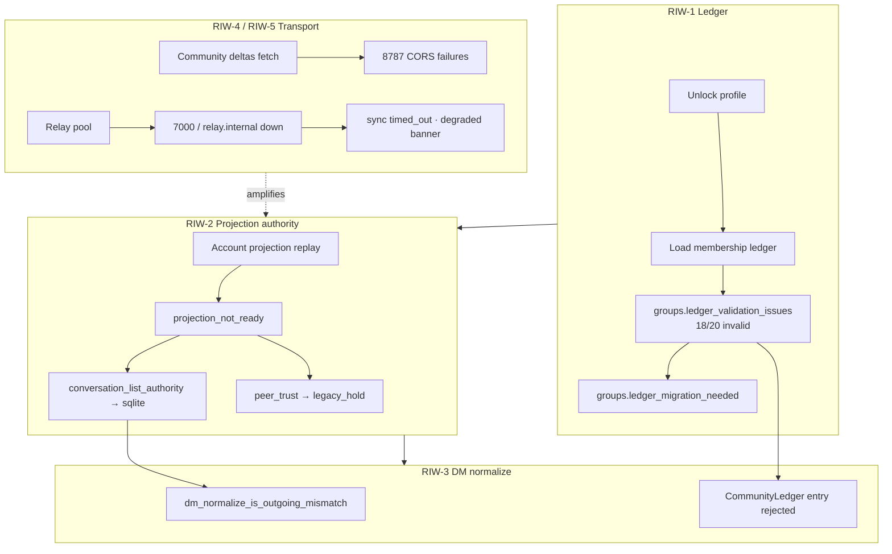

# Runtime issue investigation — workflow charter (2026-06)

**Status:** Active — investigation and capture only (no implementation band until a workflow exits with a spec)  
**Last updated:** 2026-06-30 (UTC)  
**Audience:** Obscur maintainers + CodaCtrl agents  
**Policy:** [modular-iteration-contract.md](./modular-iteration-contract.md) · [rules/07-documentation.md](../../rules/07-documentation.md) · [unified-verification-issues-register.md](./unified-verification-issues-register.md)

---

## Purpose

MCP interactive clicks are useful but not a cure-all. This charter breaks the **observed error chain** into **independent workflows** that can be run one at a time. Each workflow is **capture-first**: record evidence, file issues, update registers — **no code changes** until the workflow produces an investigation spec and maintainer picks an implementation band.

**Two projects, one chain:**

| Project | Role in this charter |
|---------|----------------------|
| **Obscur** | Product truth — `logAppEvent`, SQLite/ledger/projection owners, relay/coordination runtime |
| **CodaCtrl** | Evidence layer — client sessions, health scan findings, issues register, console capture |

---

## Error chain (why order matters)



**Default execution order:** RIW-1 → RIW-2 → RIW-3 → RIW-4/5 (parallel infra) → RIW-6/7 (CodaCtrl hygiene) → RIW-8 (capture product).

---

## Shared capture protocol (every workflow)

Use the same evidence shape so Obscur and CodaCtrl stay aligned.

### Obscur (in-app)

| Step | Action | Output |
|------|--------|--------|
| O1 | After repro, run `window.obscurM0Triage?.captureJson()` in DevTools (or equivalent export) | `obscur.m0.capture.v1` bundle |
| O2 | Pull focused events: `window.obscurAppEvents?.getDigest(300)` | Event digest JSON |
| O3 | Note `location.href`, profile id, relay banner state | One-line session context |

Relevant API: `apps/pwa/app/shared/m0-triage-capture.ts`, `log-app-event.ts`.

### CodaCtrl (MCP)

| Step | Action | Output |
|------|--------|--------|
| C1 | `client_dev_environment_get` | Environment + `workspaceAligned` |
| C2 | `client_session_connect` (CDP 9230) | `csess-*` session |
| C3 | Repro steps via `client_interact_click` (not `client_navigate` on SPA) | `steps.json` + captures |
| C4 | `client_runtime_health_scan` | Findings incl. `multi-window-single-cdp-target` when applicable |
| C5 | `client_console_latest` | `.codectx/verify/client-sessions/*/console.jsonl` |
| C6 | `client_screenshot_capture` | PNG under captures |
| C7 | `client_issue_create` on new findings | `.codectx/verify/issues-register.json` |

Workflow guide: MCP `client_workflow_guide` @ v1.4.0 (`obscurGoldenPath`).

### Register updates

| Register | Path | When to touch |
|----------|------|----------------|
| Agent/runtime (machine) | `.codectx/verify/issues-register.json` | Every new captured finding with evidence refs |
| Product (human) | [unified-verification-issues-register.md](./unified-verification-issues-register.md) | When a workflow maps to COM-RUN-* or new Obscur row |
| Community detail | [community-relay-technical-issues-register-2026-06.md](./community-relay-technical-issues-register-2026-06.md) | Ledger/coordination/roster bands |

**Exit criteria per workflow:** investigation note (below) filled in + at least one evidence path + issue row(s) filed or existing row updated with new refs. **No diff to `apps/` until a separate implementation charter exists.**

---

## Workflow index

| ID | Title | Primary owner (Obscur) | CodaCtrl role | Depends on | Status |
|----|-------|------------------------|---------------|------------|--------|
| [RIW-1](#riw-1--membership-ledger-integrity) | Membership ledger integrity | `community-membership-ledger.ts` | Capture unlock console; assert `groups.ledger_validation_issues` | — | **Captured** (2026-07-01) |
| [RIW-2](#riw-2--projection-authority-drift) | Projection authority drift | `messaging-provider.tsx`, `use-peer-trust.ts` | M0 triage `sync_restore` + `media_hydration` | RIW-1 context | **Captured** (2026-07-01) |
| [RIW-3](#riw-3--dm-direction-normalize-mismatch) | DM direction normalize mismatch | `dm-conversation-normalize-message.ts` | Filter console for `dm_normalize_is_outgoing_mismatch` | RIW-2 | **Captured** (2026-07-01) |
| [RIW-4](#riw-4--coordination-cors--membership-deltas) | Coordination CORS / membership deltas | coordination client / wrangler CORS | `requestfailed` bucket on `:8787` | Dev stack up | **Captured** (2026-07-01) |
| [RIW-5](#riw-5--dev-relay-stack-completeness) | Dev relay stack completeness | relay transport engine | Health scan + relay journal snapshot | — | **Captured** (2026-07-01) |
| [RIW-6](#riw-6--codactrl-verify-scenario-hygiene) | CodaCtrl verify scenario hygiene | `scripts/verify-profile-picker-flow.mjs` | `verify:scenario` runs | — | **Captured** (2026-07-01) |
| [RIW-7](#riw-7--codactrl-multi-window-attach) | CodaCtrl multi-window attach | Tauri WebView2 / optional WebDriver | `multi-window-single-cdp-target` finding | — | **Captured** (issue filed) |
| [RIW-8](#riw-8--runtime-issue-capture-product) | Runtime issue capture product | `m0-triage-capture.ts`, issues ingest | `client_issue_create` + register schema | RIW-1–3 event list | **Designed** (2026-07-01) |

---

## RIW-1 — Membership ledger integrity

**Symptom IDs:** `groups.ledger_validation_issues`, `groups.ledger_migration_needed`, `CommunityLedger` validation console

**Observed (2026-06-30, Tester1 unlock):**

- 18/20 ledger entries invalid; 9 need migration
- Sample errors: missing `publicKeyHex`; **CRITICAL** missing `memberPubkeys` ("group will lose all members on recovery")
- Evidence: `.codectx/verify/client-sessions/csess-5c26475ea529/console.jsonl` (lines with `ledger_validation_issues`)

**Maps to product register:** COM-RUN-06 (late detection), COM-RUN-07 (multi-owner), ACC-02

### Investigation questions (capture answers only)

1. Are invalid entries **legacy fixture corruption** on Tester1 or a systematic validation bug?
2. Does `migrateLedgerEntries` run to completion after unlock? Any stall signature in logs?
3. Which group IDs appear in `sampleErrors` — overlap with NewTest 2 / DM invite history?
4. Does purge + clean retest ([community-relay register](./community-relay-technical-issues-register-2026-06.md) fixture) clear the band?

### Capture checklist

- [x] M0 triage bundle at unlock + 30s after (`client_runtime_digest_pull`)
- [x] Ledger events in console / digest topNames
- [x] MCP session console export
- [x] Screenshot post-unlock
- [x] Issue row `symptomId: groups-ledger-validation`

### Investigation note

| Field | Value |
|-------|--------|
| Date | 2026-07-01 |
| Session / csess | `csess-f2191e90e578` |
| invalidEntries / totalEntries | **18 / 20** (stable vs 2026-06-30 `csess-5c26475ea529`) |
| needsMigrationCount | **9** |
| sampleErrors (full list) | `b93f53e23d8c4456835afd3f4d3a627b`: missing `publicKeyHex`; `6d5e4723ad1946869e91c6fe8e3b45c9`: missing `publicKeyHex`; `f83e544943bc44df9e1043314d8cfdbf`: CRITICAL missing `memberPubkeys` |
| Migration completed? | **No evidence of repair** — `groups.ledger_migration_needed` logged 46× in digest; `invalidEntries: 18` unchanged at load |
| Stack | `pnpm dev:desktop -- --online --skip-build`; coordination **8787 not listening** |
| Downstream at capture | `criticalDriftCount: 1`; 36× `dm_normalize_is_outgoing_mismatch` in digest (note for RIW-2/3) |
| CommunityLedger | Rejects inbound: missing `publicKeyHex`, invalid status `"historical"` |
| Issue filed | `verify:issue:agent:0c914a5d3cb0912d` |
| Next spec candidate | Investigation spec: fixture corruption vs validation regression; `migrateLedgerEntries` completion; purge vs repair |

**Evidence paths:** `.codectx/verify/client-sessions/csess-f2191e90e578/` · `.codectx/verify/faults/fault-6a3f1d6c.json`

**Capture answers (investigation questions):**

1. **Fixture vs bug:** Same 18/20 on two sessions → likely **persistent Tester1 local data**, not transient; `b93f53…` ties to NewTest 2 / legacy invite DM traffic.
2. **Migration:** Logs `needsMigrationCount: 9` repeatedly; **no** log showing migration reduced invalid count.
3. **Group IDs:** See sampleErrors; overlap with community-invite-response in Tester2 DM.
4. **Purge retest:** Not run this pass — charter item for a future capture-only session.

---

## RIW-2 — Projection authority drift

**Symptom IDs:** `messaging.conversation_list_authority_selected`, `network.peer_trust_read_authority_selected`, `account_projection.replay_complete` (driftStatus)

**Observed (2026-07-01, Tester1 unlock — same run as RIW-1):**

- `selectedAuthority: sqlite`; `projectionReadAuthorityReason` oscillates `projection_not_ready` ↔ `read_cutover_enabled`
- `projectionConversationCount: 0` while `sqliteConversationCount: 2` throughout unlock window
- Peer trust: `legacy_hold`, `holdReason: projection_empty_legacy_nonempty` when cutover enabled; `projectionPeerCount: 0`, `storedPeerCount: 1`
- `account_projection.replay_complete`: `driftStatus: drifted` on every replay (95 → 98 → 99 events)
- `criticalDriftCount`: 0 at first authority warn → **1** after first `replay_complete`; stays 1
- Evidence: `csess-f2191e90e578/console.jsonl`; digest `cap-3f0b18b57d6a`; warm pull `fault-6e8f7e13` (`csess-d0e975bc8b08`)

**Maps to:** COM-RUN-07, native sqlite policy, account sync band

### Investigation questions

1. Is projection empty **because** ledger load failed (RIW-1) or independent replay bug?
2. Timeline: authority warnings **before** vs **after** first relay EOSE?
3. Does `criticalDriftCount` ever go non-zero on longer soak?
4. `account_projection.replay_complete` — what is `driftStatus`?

### Capture checklist

- [x] M0 `sync_restore` + `media_hydration` focused events
- [x] `obscurRelayRuntime.getSnapshot()` via digest (`relayRuntime.phase: healthy`, 1/6 active relays)
- [x] Console filter: `conversation_list_authority`, `peer_trust_read_authority`, `account_projection`
- [x] Issue row: `symptomId: projection-authority-not-ready`

### Investigation note

| Field | Value |
|-------|--------|
| Date | 2026-07-01 |
| Session / csess | Unlock timeline: `csess-f2191e90e578`; daemon re-attach: `csess-d0e975bc8b08` |
| projectionConversationCount vs sqliteConversationCount | **0 vs 2** (stable entire unlock → post-EOSE window) |
| projectionPeerCount vs storedPeerCount | **0 vs 1** |
| replay driftStatus | **`drifted`** on all `replay_complete` (95, 98, 99 events) |
| criticalDriftCount | **0 → 1** at first replay (~967 ms after unlock); remains 1 |
| Authority vs EOSE | First `conversation_list_authority_selected` **~43 ms** after ledger validation; first DM EOSE quorum **~3.0 s** after unlock — warnings **precede** EOSE |
| Blocked by RIW-1? | **Correlated, not proven sole cause** — ledger load (18/20 invalid) fires in same 50 ms window; account projection replays 95+ events yet conversation projection stays empty → likely **replay/ingest gap** plus ledger corruption context |
| Issue filed | `verify:issue:agent:7a3d72a85a8e1c35` |
| Next spec candidate | Investigation spec: why `replay_complete` reports drifted with zero projection rows; cutover oscillation; peer trust `legacy_hold` policy |

**Evidence paths:** `.codectx/verify/client-sessions/csess-f2191e90e578/` · `.codectx/verify/faults/fault-6e8f7e13.json` · `.codectx/verify/client-sessions/csess-d0e975bc8b08/`

**Capture answers (investigation questions):**

1. **Ledger vs replay:** Ledger corruption (RIW-1) co-occurs at unlock; projection replay runs and ingests events but **never** raises `projectionConversationCount` — points to **account projection / conversation projection wiring**, not ledger load alone.
2. **Timeline:** Authority warnings **before** first relay EOSE (`messaging.transport.sync_pass_complete` @ `eose_quorum_reached`).
3. **criticalDriftCount:** Goes **non-zero** after first `replay_complete`; persists through relay sync.
4. **driftStatus:** Always **`drifted`**.

---

## RIW-3 — DM direction normalize mismatch

**Symptom IDs:** `messaging.dm_normalize_is_outgoing_mismatch`

**Observed (2026-07-01, Tester1 unlock — same run as RIW-1/2):**

- **36** `dm_normalize_is_outgoing_mismatch` events in digest; **6** unique `messageIdHint` values logged before LogHygiene suppression (~52 total normalize passes estimated)
- Split by sender: **3** `e07f67dc` (Tester1), **3** `3db055b4` (Tester2) — alternating `storedIsOutgoing` vs `resolvedIsOutgoing` inversion
- Burst **~404 ms** after ledger validation; same unlock window as RIW-2 authority warnings
- Tester2 DM thread screenshot: UI labels appear consistent ("You" / "TE Tester2") despite console mismatches — likely normalize uses resolved direction for display
- Evidence: `csess-f2191e90e578/console.jsonl`; digest `cap-3f0b18b57d6a`; screenshot `cap-500c39b33caf`

**Owner:** `dm-conversation-normalize-message.ts` — likely **symptom** of RIW-2 authority split, not primary root

### Investigation questions

1. Count mismatches per conversation — all on Tester2 thread?
2. Correlation with community-invite-response plaintext in same sync window?
3. After cold restart, do mismatches repeat or shrink?

### Capture checklist

- [x] Export unique `messageIdHint` + direction pairs from console
- [x] Screenshot DM thread (Tester2) if UI shows wrong "You" labeling
- [x] Issue row only if mismatches persist **after** RIW-1/2 documented

### Investigation note

| Field | Value |
|-------|--------|
| Date | 2026-07-01 |
| Session / csess | `csess-f2191e90e578` (unlock console); screenshot `csess-d0e975bc8b08` |
| Mismatch count | **36** digest / **6** unique messages / ~**52** with suppression |
| Conversation | **Tester2 DM only** (`persistedDmThreadCount: 1`) |
| Affects UI labels? | **Not visibly** on screenshot — outgoing Tester1 messages show "You"; Tester2 shows contact label |
| Tied to invite cards? | **Likely** — burst coincides with sqlite hydrate of thread containing multiple NewTest 2 invite cards |
| Correlation RIW-2 | Same ~400 ms post-ledger window; sqlite authority with `projectionConversationCount: 0` |
| Issue filed | `verify:issue:agent:df96c6996e0512a9` |
| Next spec candidate | Investigation spec: stored vs resolved direction owner when sqlite is authority; invite-card message kinds |

**Evidence paths:** `.codectx/verify/client-sessions/csess-f2191e90e578/` · `.codectx/verify/client-sessions/csess-d0e975bc8b08/captures/cap-500c39b33caf/`

**Capture answers (investigation questions):**

1. **Per conversation:** All on **Tester2** thread (only DM thread on account).
2. **Invite correlation:** Mismatches fire during initial sqlite conversation hydrate alongside **NewTest 2** invite cards in thread — **probable** correlation; not isolated to plaintext invites alone.
3. **Cold restart:** Not run this pass — same Tester1 data as RIW-1; expect repeat until sqlite/projection authority fixed.

---

## RIW-4 — Coordination CORS / membership deltas

**Symptom:** `requestfailed` on `http://127.0.0.1:8787/communities/.../membership/deltas`

**Observed (2026-07-01):**

- **Desktop-only** (`pnpm dev:desktop -- --online --skip-build`, 8787 down): **19×** `net::ERR_CONNECTION_REFUSED` on membership/deltas (`csess-f2191e90e578`)
- **Prior full-stack** (`csess-5c26475ea529`, 2026-06-30, wrangler listening): **28×** browser CORS policy blocks — no `Access-Control-Allow-Origin`
- **curl probe** with `pnpm dev:coordination` up: **404** response includes `Access-Control-Allow-Origin: *` — contradicts prior browser CORS console; needs live-browser re-repro

**Maps to:** COM-RUN-08 (dev env), coordination HTTP adapter (conduit mesh C4)

### Investigation questions

1. Does wrangler dev expose `Access-Control-Allow-Origin` for `http://127.0.0.1:1430`?
2. Are failures absent when using full `pnpm dev:desktop:online` + coordination profile?
3. Impact: do failures block ledger repair or only background delta poll?

### Capture checklist

- [x] `curl -I` on sample deltas URL with `Origin: http://127.0.0.1:1430`
- [x] Note which dev script was running (desktop-only vs full stack)
- [x] MCP health scan `console-requestfailed` finding
- [x] Issue: `symptomId: coordination-membership-deltas-unreachable`

### Investigation note

| Field | Value |
|-------|--------|
| Date | 2026-07-01 |
| Stack command | Desktop-only: `pnpm dev:desktop -- --online --skip-build`; coordination started separately for curl |
| CORS headers present? | **Yes** on curl GET/OPTIONS when wrangler up (`ACAO: *`); **no** in browser console on 2026-06-30 session |
| User-visible impact | **Background delta poll only** — unlock, DM sync, and chat UI work without coordination |
| Issue filed | `verify:issue:agent:fe1556fff6a7792e` |

**Evidence paths:** `.codectx/verify/client-sessions/csess-f2191e90e578/console.jsonl` · `.codectx/verify/client-sessions/csess-5c26475ea529/console.jsonl` · `.codectx/verify/artifacts/riw-4-curl-cors-probe-2026-07-01.txt`

**Capture answers:**

1. **curl:** `Access-Control-Allow-Origin: *` present when wrangler listens.
2. **Full stack:** Prior session showed CORS blocks despite listener — **discrepancy** to resolve in follow-up capture with browser fetch while coordination up.
3. **Impact:** Failures affect **background membership delta poll** only; ledger load uses local data (RIW-1).

---

## RIW-5 — Dev relay stack completeness

**Symptoms:** `ws://localhost:7000` refused, `wss://relay.internal` reset, partial relay banner (1/6 active)

**Observed (2026-07-01, warm session + unlock console):**

- UI: **Connected 1/6 active relays** (public relays only)
- `relayRuntime.phase`: **healthy**; `writableRelayCount: 1`; `subscribableRelayCount: 4`
- Local relays fail: `ws://localhost:7000` **CONNECTION_REFUSED** (2×); `wss://relay.internal` **CONNECTION_RESET** (6×)
- Public relays connect: `wss://relay.damus.io`, `wss://relay.primal.net`, `wss://nos.lol`
- DM sync on unlock: **completed** `eose_quorum_reached` in 357 ms — **no** `timed_out`
- Digest: `fault-527da80b` (`csess-56331621b1d9`)

**Maps to:** COM-RUN-03 (mitigated when full stack), transport engine pool

### Investigation questions

1. Which relays are configured vs connected (1/6 active in UI)?
2. Is `pnpm dev:coordination` required for the session under test?
3. Are sync timeouts **expected** with partial public relays only?

### Capture checklist

- [x] `obscurRelayTransportJournal.getSnapshot()` via M0 digest
- [x] Console: `relay.transport_engine_*`, `messaging.transport.sync_*`
- [x] Document **intentional** partial stack vs defect

### Investigation note

| Field | Value |
|-------|--------|
| Date | 2026-07-01 |
| Session / csess | Unlock: `csess-f2191e90e578`; warm digest: `csess-56331621b1d9` |
| Stack command | `pnpm dev:desktop -- --online --skip-build` (no team relay 7000) |
| Active relay count | **1/6** UI banner; **3** open at sync (`openRelayCount: 3`, `eoseRelayCount: 2`) |
| Team relay 7000 up? | **No** |
| Sync timeout on unlock? | **No** — `status: completed`, `reason: eose_quorum_reached` |
| Classification | **Intentional partial stack** for desktop-only dev; local relay failures expected |
| Issue filed | `verify:issue:agent:fd6bb614119ce9f2` (p3 — dev-env documentation, not runtime defect) |

**Evidence paths:** `.codectx/verify/faults/fault-527da80b.json` · `.codectx/verify/client-sessions/csess-f2191e90e578/console.jsonl`

**Capture answers:**

1. **Configured:** 4 engine relays + `wss://relay.internal`; **connected** public subset; local 7000/internal fail without stack.
2. **Coordination:** Not required for DM sync; required for membership deltas (RIW-4).
3. **Timeouts:** **Not observed** with partial public relays — quorum reached on 2/3 open relays.

---

## RIW-6 — CodaCtrl verify scenario hygiene

**Existing issue:** `verify:issue:scenario:obscur-profile-picker-flow` (p1) — **triaged** after RIW-6 capture

**Failure modes observed (2026-07-01):**

| Path | Failure |
|------|---------|
| CDP unavailable → mocked static shell `:3341` | Picker grid missing (`vrun-31d8d75b`) |
| CDP `:9222` (CodaCtrl Studio open) | `No Obscur page on CDP` — wrong port |
| CDP `:9230` (Obscur) + default `appBase :3341` | `page.goto` CONNECTION_REFUSED |
| MCP golden path (9230 + clicks) | **PASS** — Tester1 unlock (RIW-1) |

**Maps to:** verify scenario adapter, `client.cdp.yaml` `profileCdpPorts`, false-green static gates

### Investigation questions

1. Should scenario **skip** (not fail) when CDP absent?
2. Should scenario require `WEBVIEW2_ADDITIONAL_BROWSER_ARGUMENTS` in verify preflight?
3. Align with MCP `obscurGoldenPath` prerequisites

### Capture checklist

- [x] `vrun-31d8d75b` artifacts (stdout/stderr)
- [x] Pass/fail matrix: CDP up vs down (+ port collision 9222 vs 9230)
- [x] Proposed scenario status: `skip` vs `fail` — **document only**

### Investigation note

| Field | Value |
|-------|--------|
| Date | 2026-07-01 |
| False-green risk? | **Yes** — `fileExists`/`fileContains` pass while `scriptInvoke` fails |
| Recommended scenario gate | **`skip`** when no Obscur CDP on `profileCdpPorts`; require `--cdp :9230` + `OBSCUR_APP_BASE=:1430` when running |
| Script default port | **9222** (collides with Studio); MCP uses **9230** |
| Mocked shell reliability | **Poor** — static `:3341` does not render picker grid |
| Issue status | `verify:issue:scenario:obscur-profile-picker-flow` → **triaged** |

**Evidence paths:** `.codectx/verify/artifacts/riw-6-profile-picker-pass-fail-matrix-2026-07-01.md` · `.codectx/verify/runs/vrun-31d8d75b/` · `.codectx/verify/artifacts/riw-6-profile-picker-cdp-*.txt`

**Capture answers:**

1. **Skip when CDP absent:** **Yes** — mocked path produces false failure unrelated to product.
2. **Preflight WEBVIEW2:** **Yes** — document `9230` in verify preflight (not 9222).
3. **MCP alignment:** Probe `profileCdpPorts` order `9230→9231→9229`; never default to Studio `9222`.

---

## RIW-7 — CodaCtrl multi-window attach

**Existing issue:** `verify:issue:agent:ea000f3b3f41603b` · `symptomId: multi-window-single-cdp-target`

**Status:** **Captured** — second window opens; CDP shows 1 page; 9231/4445 not listening

**Obscur unblock paths (document only):**

1. Per-profile CDP port (9230 + 9231) on each WebView2 environment
2. `tauri-plugin-wdio-webdriver` on :4445

**CodaCtrl:** health finding `multi-window-single-cdp-target` @ workflow v1.4.0 — abort dual-window tests when present

### Remaining capture (optional)

- [ ] Screenshot of **both** native windows side by side (manual) + CDP `json/list` output in issue body
- [ ] Link Obscur doc: `codactrl/docs/studio/evidence/obscur-cdp-multi-window.md` (external)

---

## RIW-8 — Runtime issue capture product

**Goal:** Ship Obscur feature to **export structured runtime issues** (not rely on MCP console scraping alone)

### Design inputs (from RIW-1–7 captures)

Event names to include in M0 focus / auto-issue mapping:

| Event | Workflow | Suggested severity | symptomId |
|-------|----------|-------------------|-----------|
| `groups.ledger_validation_issues` | RIW-1 | p1 | `groups-ledger-validation` |
| `groups.ledger_migration_needed` | RIW-1 | p2 | `groups-ledger-migration-stall` |
| `messaging.conversation_list_authority_selected` | RIW-2 | p2 (when `projection_not_ready`) | `projection-authority-not-ready` |
| `network.peer_trust_read_authority_selected` | RIW-2 | p2 (when `legacy_hold`) | `projection-authority-not-ready` |
| `account_projection.replay_complete` | RIW-2 | p2 (when `driftStatus=drifted`) | `projection-replay-drifted` |
| `messaging.dm_normalize_is_outgoing_mismatch` | RIW-3 | p2 | `dm-normalize-outgoing-mismatch` |
| `messaging.transport.sync_timing` | RIW-5 | p2 (when `timed_out`) | `messaging-sync-timeout` |
| `requestfailed` on `:8787` membership/deltas | RIW-4 | p2 | `coordination-membership-deltas-unreachable` |

**Gap (RIW-1):** `groups.ledger_validation_issues` not yet in M0 `focusedByCategory` — add to `sync_restore`.

### CodaCtrl integration target

- **Shipped:** `client_runtime_digest_pull` → `verify.fault.import` → `client_issue_create` (used RIW-1–5)
- **Target:** Ingest `obscur.m0.capture.v1` on demand from settings + optional auto-file when warn threshold crossed
- Map `symptomId` ↔ `logAppEvent.name` (table above)
- Do **not** duplicate MCP click automation — capture complements it

### Capture checklist (design band)

- [x] Schema draft: `obscur.runtime.issue.v1` (below)
- [x] UI entry point (settings diagnostic export vs automatic on warn threshold)
- [x] Register merge rules with `.codectx/verify/issues-register.json`

### Design note (2026-07-01)

**UI entry points (proposed):**

1. **Settings → Diagnostics → Export runtime bundle** — calls `obscurM0Triage.captureJson()` + writes JSON to user-chosen path
2. **Automatic (optional):** On first `warn` from mapped events in a session, enqueue issue row locally (desktop SQLite) for user review before sync to `.codectx`

**Schema draft `obscur.runtime.issue.v1`:**

```json
{
  "schema": "obscur.runtime.issue.v1",
  "symptomId": "groups-ledger-validation",
  "severity": "p1",
  "sourceEvent": "groups.ledger_validation_issues",
  "capturedAtUnixMs": 0,
  "profileId": "default",
  "context": {},
  "digestRef": "obscur.m0.capture.v1",
  "proofTier": "t3"
}
```

**Register merge rules:**

- Dedupe key: `symptomId` + `profileId` + calendar day + top context hash (e.g. `invalidEntries/totalEntries`)
- Agent/MCP issues: `source: agent` with `evidenceRefs[]` paths under `.codectx/verify/`
- Product-export issues: `source: runtime_export` — merge into same register via `verify_issues_sync`
- Scenario failures: `source: scenario_failure` — separate triage band (RIW-6)

**Next spec candidate:** `specs/backend/runtime-issue-export.md` — owner `m0-triage-capture.ts`, no implementation until spec signed off.

---

## Already filed (machine register)

| ID | Severity | symptomId | Workflow |
|----|----------|-----------|----------|
| `verify:issue:agent:ea000f3b3f41603b` | p2 | `multi-window-single-cdp-target` | RIW-7 |
| `verify:issue:scenario:obscur-profile-picker-flow` | p1 | — | RIW-6 |
| `verify:issue:agent:0c914a5d3cb0912d` | p1 | `groups-ledger-validation` | RIW-1 |
| `verify:issue:agent:7a3d72a85a8e1c35` | p2 | `projection-authority-not-ready` | RIW-2 |
| `verify:issue:agent:df96c6996e0512a9` | p2 | `dm-normalize-outgoing-mismatch` | RIW-3 |
| `verify:issue:agent:fe1556fff6a7792e` | p2 | `coordination-membership-deltas-unreachable` | RIW-4 |
| `verify:issue:agent:fd6bb614119ce9f2` | p3 | `relay-partial-stack-desktop-only` | RIW-5 |

Path: `.codectx/verify/issues-register.json`

---

## Suggested session handoff line

When starting the next thread, set **Next Atomic Step** to one workflow only, e.g.:

> **Charter complete** — draft investigation specs for RIW-1/2/3 from capture evidence; or implement RIW-8 export per design note; no code without spec.

---

## Revision history

| Date | Change |
|------|--------|
| 2026-07-01 | Added [codactrl-improvement-findings-2026-07.md](./codactrl-improvement-findings-2026-07.md) — CodaCtrl-focused compile of RIW captures |
| 2026-07-01 | RIW-4/5 capture complete — coordination curl probe, relay digest `fault-527da80b`, issues filed |
| 2026-07-01 | RIW-3 capture complete — `csess-f2191e90e578`, screenshot `cap-500c39b33caf`, issue `dm-normalize-outgoing-mismatch` |
| 2026-07-01 | RIW-2 capture complete — `csess-f2191e90e578` + `csess-d0e975bc8b08`, fault `fault-6e8f7e13`, issue `projection-authority-not-ready` |
| 2026-07-01 | RIW-1 capture complete — `csess-f2191e90e578`, fault `fault-6a3f1d6c`, issue `groups-ledger-validation` |
| 2026-06-30 | Initial charter from MCP session `csess-5c26475ea529` + verify register sync |
