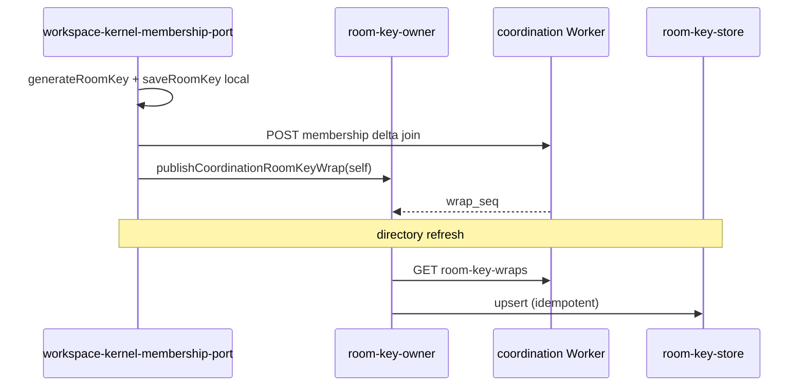
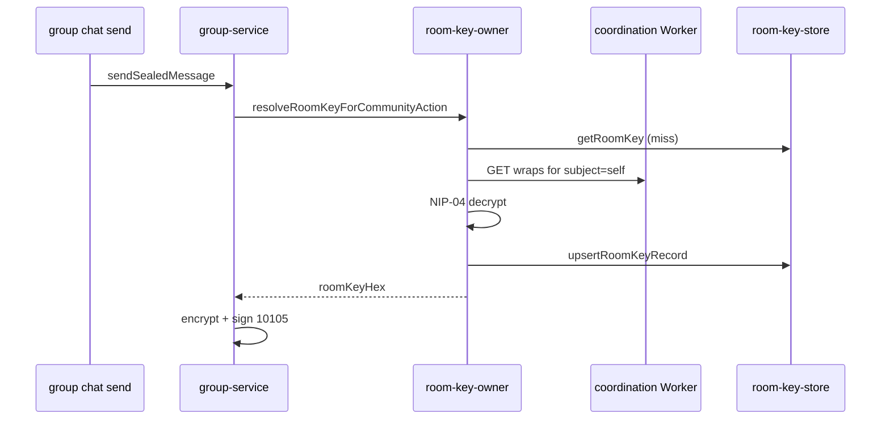

# Design — Phase 1B Slice C: coordination directory room-key wraps

**Status:** Design approved for implementation (charter slice **C**)  
**Date:** 2026-07-03 (UTC)  
**Charter:** [community-membership-redesign-charter-2026-07.md](../../docs/program/community-membership-redesign-charter-2026-07.md)  
**Maps to:** O-4 · group-room-key-missing · COM-RUN-02 ✕ replacement path  
**Prerequisite:** Phase 1A exit (RIW-1 · REL-005)  
**Cancelled bands:** COM-RUN-02 restore/repair · COM-RUN-01 roster patches

---

## Problem

After EBWebView wipe, re-import, or warm fixture drift, membership ledger shows **joined** but `room-key-store` is empty. Send fails at action time with `groups.room_key_missing_send_blocked` (`target_room_key_missing_after_membership_joined`, `localRoomKeyCount: 0`).

**L3 baseline (2026-07-03):** NewTest 2 · Tester1 · `invalidEntries=0` · navigation gates pass · send honest-fail without local key.

Room keys today live only in profile-scoped `localStorage` (`room-key-store.ts`) and unreliable backup snapshots. Path B **coordination directory** already owns membership roster truth but carries **no crypto material**.

---

## Goal

Align **Layer 2 crypto material** with Path B membership authority:

1. Each active member has an **E2E-wrapped** room-key blob stored in coordination (per community, per subject pubkey).
2. Directory sync / join / restore **materializes** decrypted keys into `room-key-store` (cache only).
3. Send and invite flows **resolve keys at action time** from cache-or-coordination — no navigation gates on missing key.
4. **One canonical owner** for wrap publish and materialize; no COM-RUN-02 repair loops.

---

## Non-goals (this slice)

| Item | Reason |
|------|--------|
| COM-RUN-01 roster read convergence | PAUSED · separate R2 band |
| Plaintext room keys in coordination D1 | Violates privacy model |
| COM-RUN-02 backup repair / health auto-repair | Cancelled |
| Full invite-matrix L4 (COM-RUN-11) | Separate band; C unblocks send after re-import |
| Key rotation / steward forced re-wrap policy | Follow-on slice C2 |
| Slice B (derivation from genesis) | Not chosen |

---

## Architecture

### Truth layers (after C)

```
┌─────────────────────────────────────────────────────────────┐
│  Coordination D1 — membership deltas + room_key_wrap rows   │  ← network authority (wrap ciphertext)
└────────────────────────────┬────────────────────────────────┘
                             │ directory sync / join publish
                             ▼
┌─────────────────────────────────────────────────────────────┐
│  community-coordination-room-key-owner (NEW)                  │  ← single materialize + publish owner
└────────────────────────────┬────────────────────────────────┘
                             │ decrypt (NIP-04) · upsert
                             ▼
┌─────────────────────────────────────────────────────────────┐
│  room-key-store (profile-scoped localStorage cache)           │  ← fast read; not sole recovery
└────────────────────────────┬────────────────────────────────┘
                             │
                             ▼
┌─────────────────────────────────────────────────────────────┐
│  group-service.sendSealedMessage · invite distributeRoomKey   │  ← action-time resolve
└─────────────────────────────────────────────────────────────┘
```

Membership **ledger** (`community-membership-mutation-owner`) unchanged — REL-005 still owns lifecycle writes.

---

## Wire format — `obscur.coordination.room_key_wrap.v1`

Wrap record is **separate from** membership delta signature (avoids breaking existing delta ACL/sign payload).

### D1 table — `community_member_room_key_wraps`

| Column | Type | Notes |
|--------|------|-------|
| `wrap_id` | TEXT PK | UUID |
| `community_id` | TEXT | Same encoding as membership deltas |
| `subject_pubkey` | TEXT | Recipient (lower hex) |
| `wrap_seq` | INTEGER | Monotonic per `(community_id, subject_pubkey)` |
| `scheme` | TEXT | `obscur.nip04_room_key_wrap.v1` |
| `ciphertext` | TEXT | NIP-04 payload (hex room key inside JSON) |
| `actor_pubkey` | TEXT | Signer of wrap record |
| `created_at_unix_ms` | INTEGER | Client timestamp |
| `signature` | TEXT | Schnorr over canonical sign payload |

**Unique:** `(community_id, subject_pubkey, wrap_seq)`

**Plaintext policy:** Coordination stores **ciphertext only**. Worker MUST reject bodies containing raw `roomKeyHex` / 64-char hex key patterns in cleartext fields.

### Sign payload (wrap publish)

```json
{
  "communityId": "<trimmed>",
  "subjectPubkey": "<lower hex>",
  "wrapSeq": <int>,
  "scheme": "obscur.nip04_room_key_wrap.v1",
  "ciphertext": "<nip04 string>",
  "actorPubkey": "<lower hex>",
  "createdAtUnixMs": <int>
}
```

Canonical JSON, SHA-256 hash, Schnorr sign — same pattern as [membership-delta.ts](../../packages/dweb-coordination-contracts/src/membership-delta.ts).

### Ciphertext inner JSON

```json
{
  "v": 1,
  "groupId": "<groupId>",
  "roomKeyHex": "<64-char hex>"
}
```

Encrypted with NIP-04: `recipient = subjectPubkey`, `sender = actorPrivkey` (self-wrap on join) or steward key on invite.

---

## HTTP API (coordination Worker)

| Method | Path | Purpose |
|--------|------|---------|
| `POST` | `/communities/:id/membership/room-key-wrap` | Append wrap (signed) |
| `GET` | `/communities/:id/membership/room-key-wraps?sinceSeq=0` | List wraps (paginated, limit 200) |

Responses follow existing `{ ok, data }` envelope. CORS same as membership directory.

**Migration:** `apps/coordination/migrations/0003_member_room_key_wraps.sql`

---

## ACL (wrap publish)

| Actor | May publish wrap for subject | Conditions |
|-------|------------------------------|------------|
| Subject | Self (`actor === subject`) | Subject is **active** in materialized membership OR publishing alongside valid **join** delta in same session window (create/join flow) |
| Bootstrap steward | Any active member | Actor is bootstrap steward (seq-1 join subject per existing ACL) |
| Other members | Deny | `wrap_publish_forbidden` |

**Re-wrap:** New row with `wrap_seq + 1`. Clients use highest `wrap_seq` for subject. Old wraps retained for audit.

**Leave / expel:** Do not delete wraps (historical). Materializer ignores wraps when subject not in `activeMemberPubkeys`.

---

## Client owners (new)

### `community-coordination-room-key-owner.ts`

| Export | Responsibility |
|--------|----------------|
| `COMMUNITY_COORDINATION_ROOM_KEY_OWNER_ID` | Diagnostic owner id |
| `wrapRoomKeyForCoordination(...)` | Build NIP-04 ciphertext + sign wrap |
| `publishCoordinationRoomKeyWrap(...)` | POST to Worker |
| `fetchCoordinationRoomKeyWrapsSince(...)` | GET wraps |
| `materializeRoomKeysFromCoordinationWraps(...)` | Decrypt wraps for **local pubkey** → `roomKeyStore.upsertRoomKeyRecord` |
| `resolveRoomKeyForCommunityAction(...)` | **Action-time:** local store → fetch+materialize if member active → return hex or null |

**Must not** import UI. **Must** accept explicit `profileId`, `publicKeyHex`, `privateKeyHex` (or native sentinel via existing signing resolver).

### Integration points (callers only — no duplicate logic)

| Caller | When |
|--------|------|
| `workspace-kernel-membership-port.ts` | After successful create/join coordination publish — publish self-wrap |
| `community-workspace-activation.ts` | Same path for `publishWorkspaceCoordinationJoinEvidence` completion hook |
| `community-coordination-membership-directory-store.ts` | After `saveCoordinationMembershipDirectory` — run materializer for changed community |
| `group-service.ts` | `sendSealedMessage` — call `resolveRoomKeyForCommunityAction` before fail |
| `invite-connections-dialog.tsx` | Before `distributeRoomKey` — resolve or generate+publish wrap |

---

## Flow diagrams

### Create / join (managed_workspace)



### Re-import / empty localStorage



---

## Subtraction / forbidden patterns

| Forbidden | Replacement |
|-----------|-------------|
| `room-key-restore-repair.ts` | **Removed** — do not reintroduce |
| Health / UI gates blocking chat on missing key | Diagnostic only (Phase 1A) |
| Backup-only recovery for joined groups | Coordination wrap is primary; backup is secondary cache |
| Direct `roomKeyStore` writes from UI components | Via room-key-owner or workspace create path only |
| Parallel wrap publishers outside room-key-owner | Extend owner with new `reason` codes |

---

## `community-sendability-guard` (Phase 1B deliverable #3)

**Keep** guard logic; **wire** at composer send boundary only:

1. `checkCommunitySendability` remains source of `no_room_key` reason codes.
2. Before returning `no_room_key`, caller MUST invoke `resolveRoomKeyForCommunityAction` once (async).
3. If resolve succeeds, re-run check → `ready`.
4. **Do not** disable navigation or invite buttons on missing key (FLS INV-COMM-001).

---

## Account backup interaction

| Layer | Role after C |
|-------|----------------|
| Coordination wraps | **Primary** recovery for Path B communities |
| Backup `roomKeys[]` | Secondary — merged on restore but not required for send if coordination reachable |
| Chat-state reconstruction | Tertiary — unchanged; do not expand |

Restore path: after ledger apply, run materializer (not COM-RUN-02 repair).

---

## Implementation slices (ordered)

Implement **one vertical at a time**; each slice has L1 before L3.

| Slice | Scope | Proof |
|-------|-------|-------|
| **C1** | D1 migration + Worker handlers + `@dweb/coordination-contracts` wrap sign/verify | `apps/coordination` unit tests |
| **C2** | `room-key-owner` publish + fetch + materialize (headless) | Vitest with mock fetch + nip04 roundtrip |
| **C2b** | Hook create/join in `workspace-kernel-membership-port` | L1 integration test |
| **C3** | Directory store post-refresh materialize hook | Materializer test + log `groups.coordination_room_key_materialized` |
| **C4** | `group-service` action-time resolve | Extend `group-service.test.ts` |
| **C5** | Invite steward publish for invitee pubkey | Invite dialog + L3 two-profile (deferred if fixture blocked) |

**First L3 exit (C4):** Tester1 unlock on NewTest 2 → send succeeds **without** pre-existing local key after coordination wrap backfill for fixture.

### Fixture backfill (maintainer / C2b)

NewTest 2 warm fixture has joined ledger but no local key. Before first L3 pass:

- One-time: Tester1 (bootstrap steward) publishes wrap for self via new API, **or**
- Dev script: `scripts/publish-coordination-room-key-wrap-fixture.mjs` reading steward key from dev accounts doc.

Document in runbook; not product code path.

---

## Telemetry

| Event | When |
|-------|------|
| `groups.coordination_room_key_wrap_published` | Wrap POST success |
| `groups.coordination_room_key_materialized` | Decrypt + upsert to store |
| `groups.coordination_room_key_resolve` | Action-time resolve result (`hit_local`, `hit_coordination`, `miss`) |
| `groups.room_key_missing_send_blocked` | Still emitted on true miss after resolve attempt |

Digest: `group-room-key-missing` symptom should clear when resolve hits coordination.

---

## Threat model (summary)

| Threat | Mitigation |
|--------|------------|
| Coordination operator reads room keys | Only ciphertext stored; NIP-04 to member pubkey |
| Operator withholds wraps | Send fails honestly; member requests steward re-wrap (future C5) |
| Forged wrap | Schnorr signature + ACL (active member / steward) |
| Replay old wrap | `wrap_seq` monotonic; client prefers latest |
| Cross-profile bleed | Materializer uses explicit `profileId` + `publicKeyHex` |
| Public relay exposure | Wraps on coordination only — not Nostr kinds |

**Not in v1:** Forward secrecy on rotation; HPKE/NIP-44 upgrade — note as C2 follow-on.

---

## Proof plan

| Layer | Requirement |
|-------|-------------|
| **L1** | Wrap sign/verify · ACL · materializer · group-service resolve |
| **L2** | Worker integration test: join + wrap + fetch |
| **L3** | Desktop CDP: unlock → NewTest 2 → send after local key cleared · `localRoomKeyCount: 0` before first resolve |
| **L4** | COM-MEM-2 steps 3–4, 7–8 (after invite band unblocked) |

**Phase 1B exit:** C4 L3 pass + sendability guard wired + no new navigation gate violations (`pnpm verify:fls-alignment`).

---

## References

- [community-membership-mutation-owner-map-2026-07.md](./community-membership-mutation-owner-map-2026-07.md)
- [groups-ledger-validation-investigation-2026-07.md](./groups-ledger-validation-investigation-2026-07.md)
- [obscur-subtraction-register-2026-07.md](../../docs/program/obscur-subtraction-register-2026-07.md)
- [06-coordination-path-b-workspace.md](../../docs/exploration/modules/06-coordination-path-b-workspace.md)
- L3 rerun: [phase1a-l3-round-rerun-2026-07-03.json](../../test-results/phase1a-l3-round-rerun-2026-07-03.json)
- FLS: `.codactrl/logic/obscur-community-membership.v1.json`

---

## Handoff — next atomic step after this spec

**Implement C1** — coordination migration `0003` + wrap POST/GET handlers + contract tests. No PWA changes until C1 is green.
